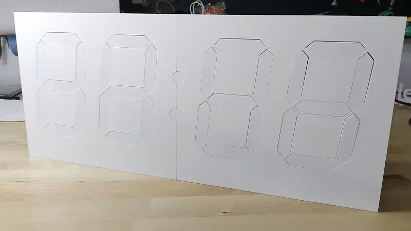

# kinetic-display

The Kinetic display is a unique and entertaining way to view the current time, date, indoor temperature and humidity, and outdoor temperature and humidity. The robotic device is a seven-segment clock-like display with 4 digits and 2 colons, totalling 30 actuators that extend and retract the segments. Each segment lights up when extended then turns off when retracted. A clacking sound is made each time the actuator extends or retracts the segment, making satisfying percussive sound tapistry while in operation. The display is robust and designed to last for years when made properly by following the extensive and detailed assembly documentation at [https://gobbyo.github.io/kinetic-display/](https://gobbyo.github.io/kinetic-display/). Below is a short clip of the prototype that has been running 24x7 without issue since its birth in April of 2024.

**Feature Summary**

**First Prototype**

