# Actuator Assembly

There are 30 actuators in the display, 7 per digit and 2 for the colons (4 digits x 7 segments + 2 colons = 30 total actuators). The diagrams below identify the various parts and composition of the actuator.

Fully assembled actuator with segment and back stopper.

Actuator rack and pinion gear assembly.

## Shaft Gear

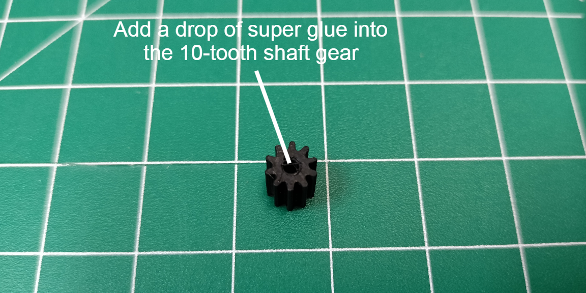
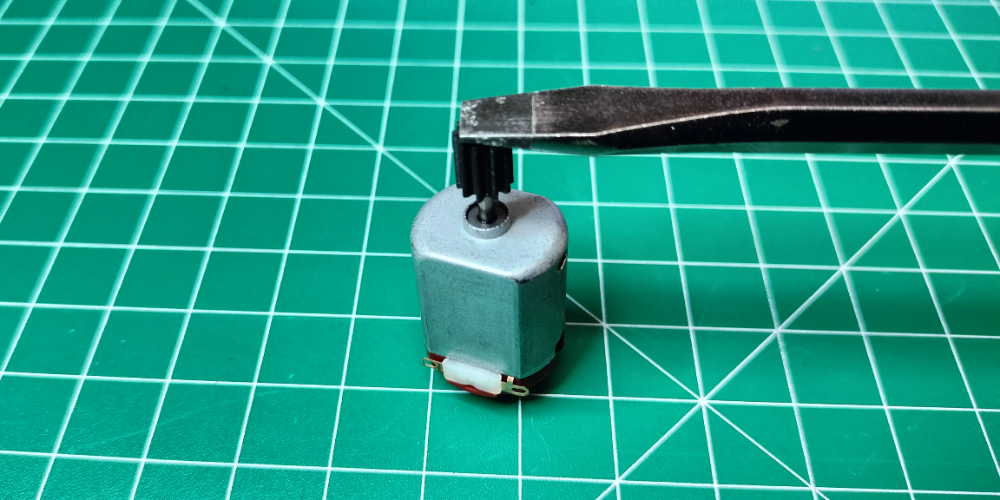

## Wires

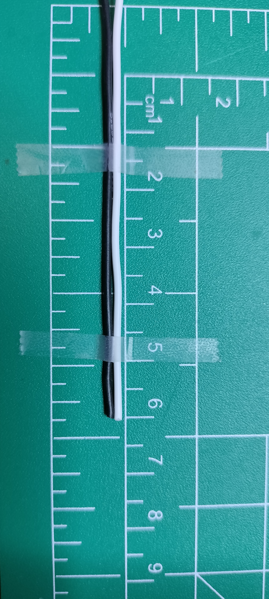
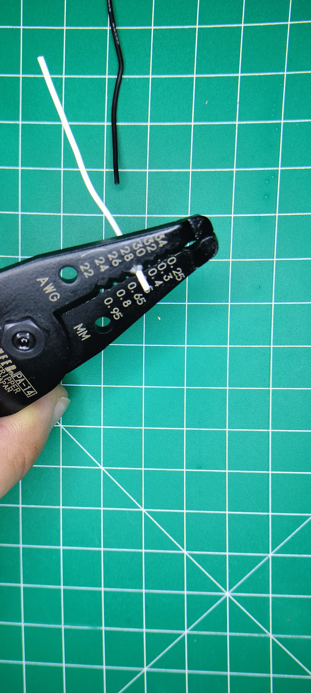
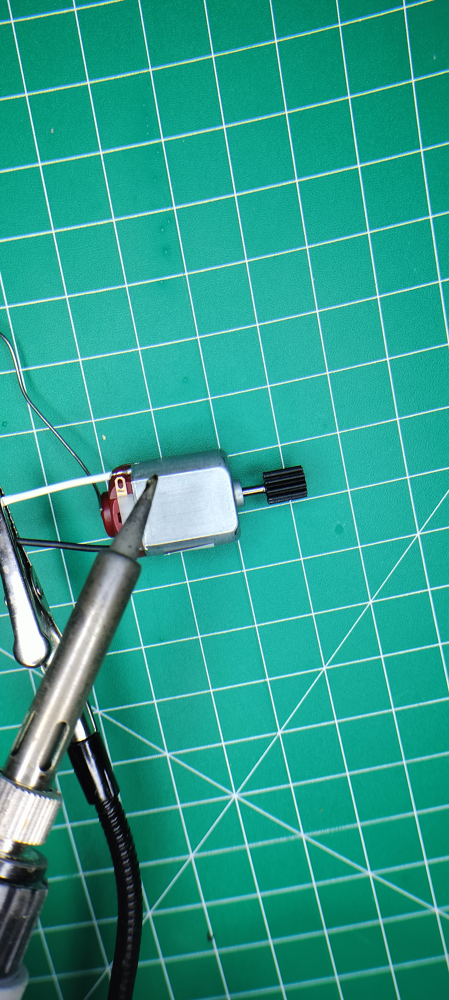
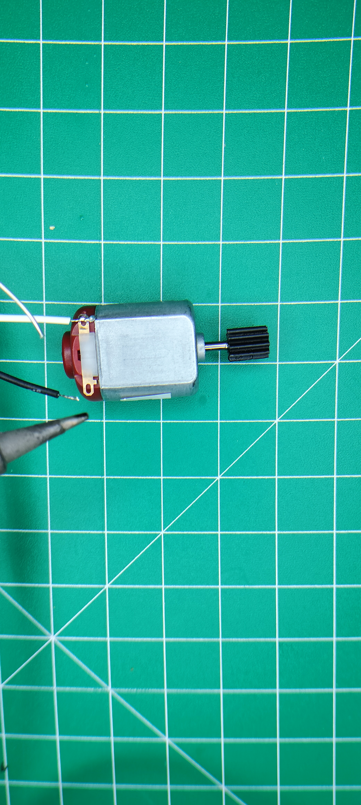

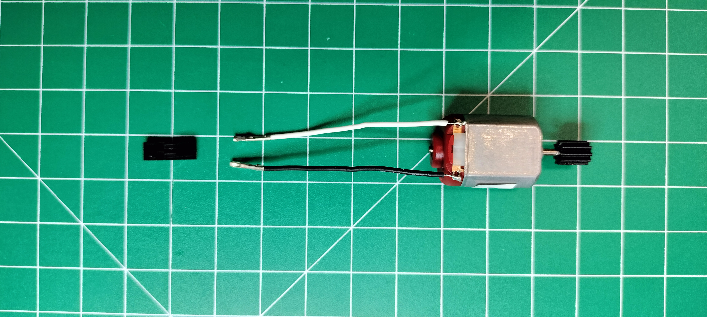
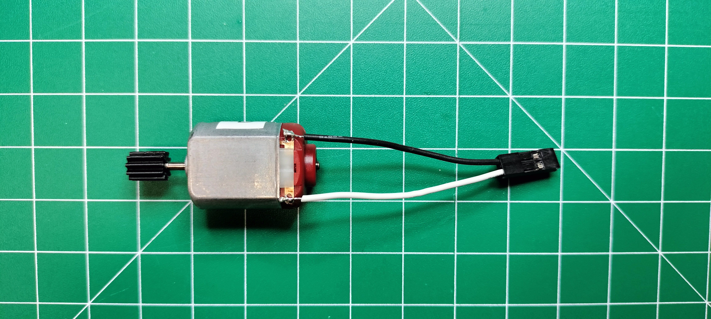

## Actuator

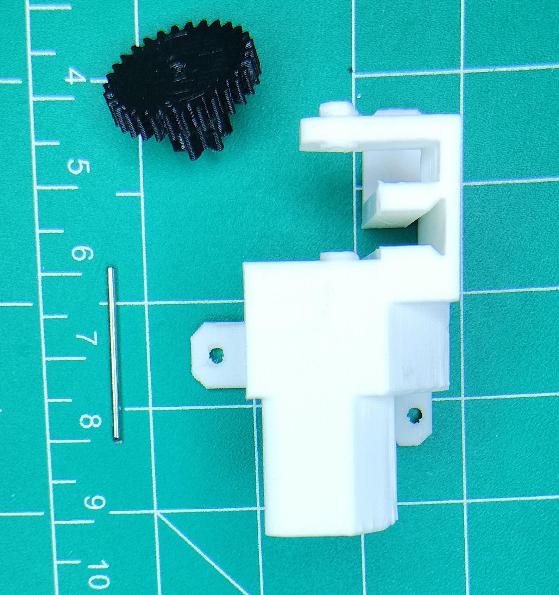
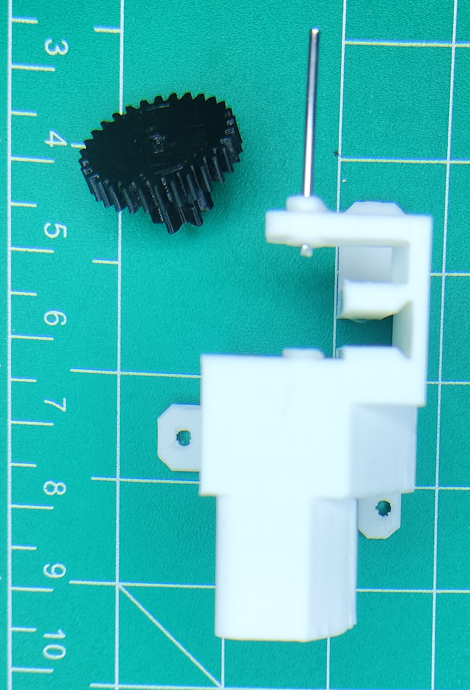
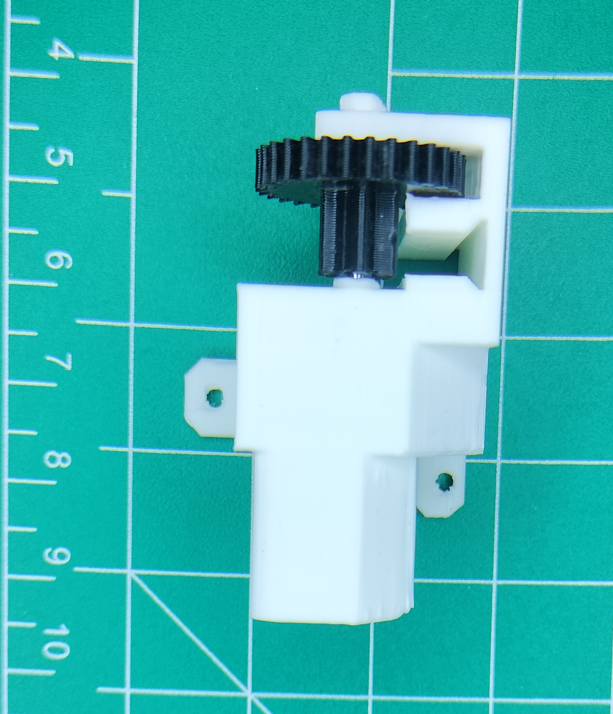
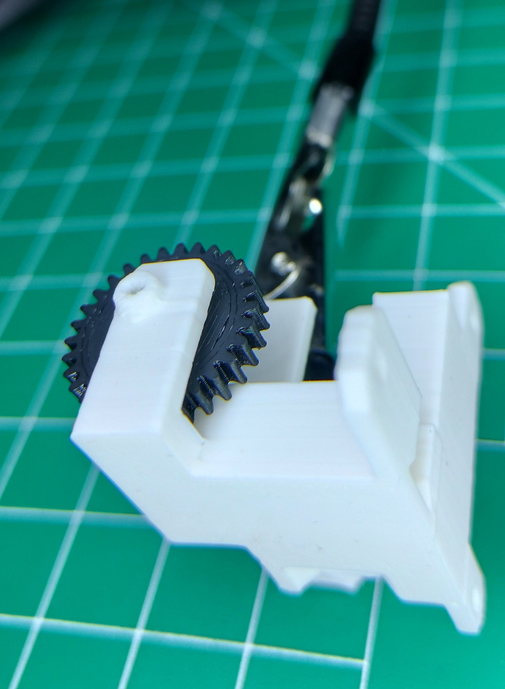
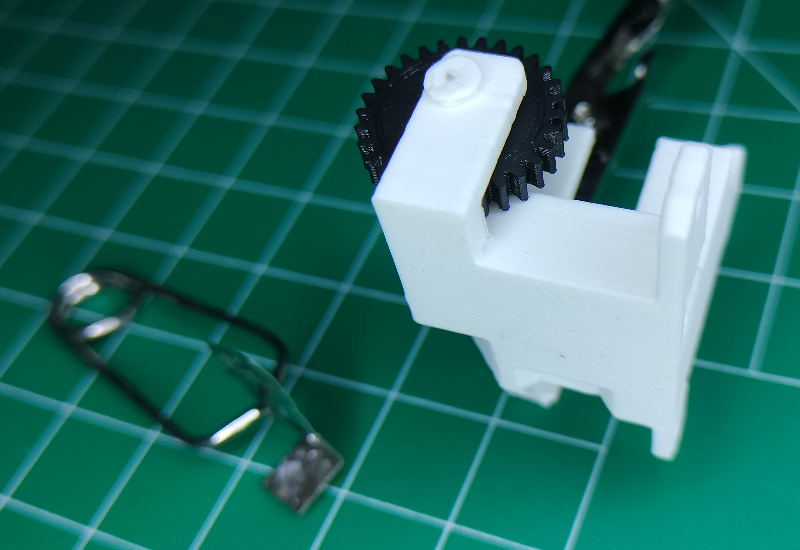
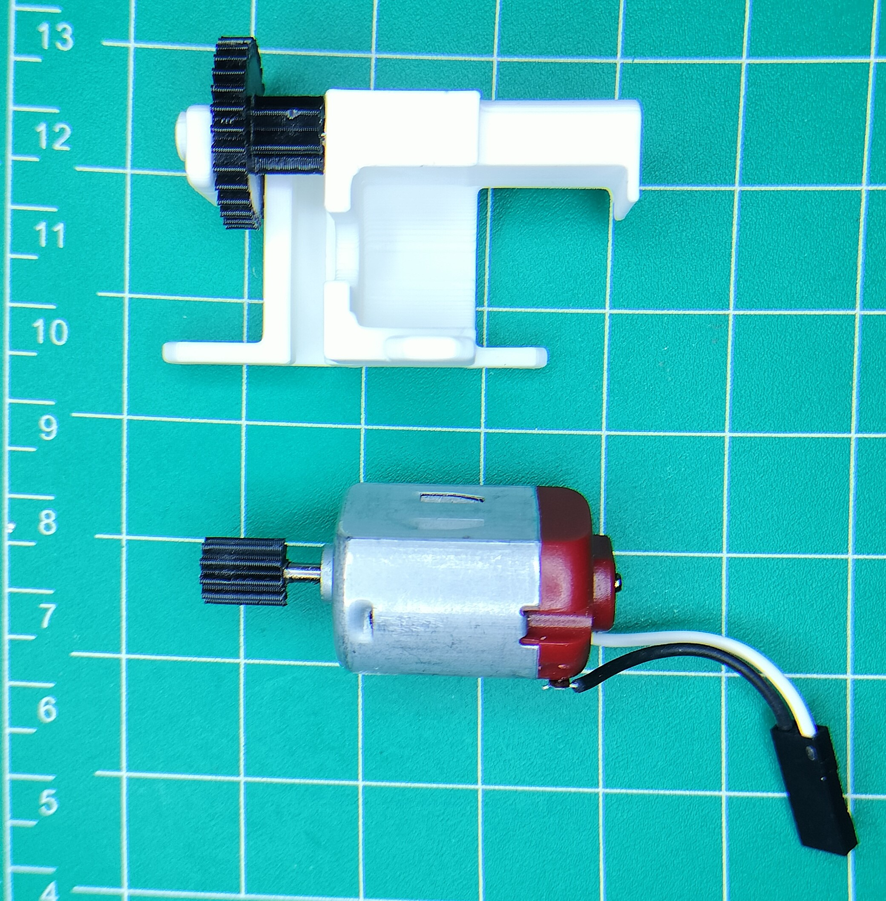
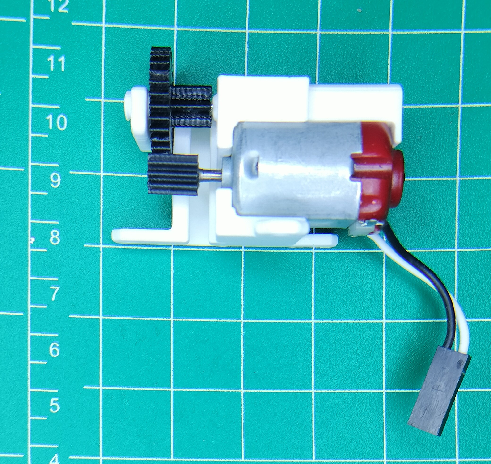
