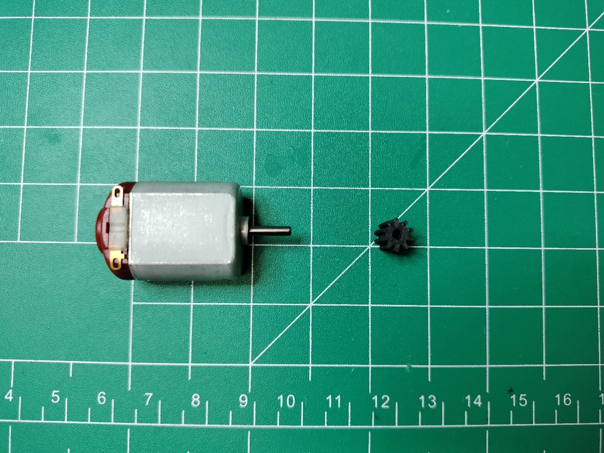
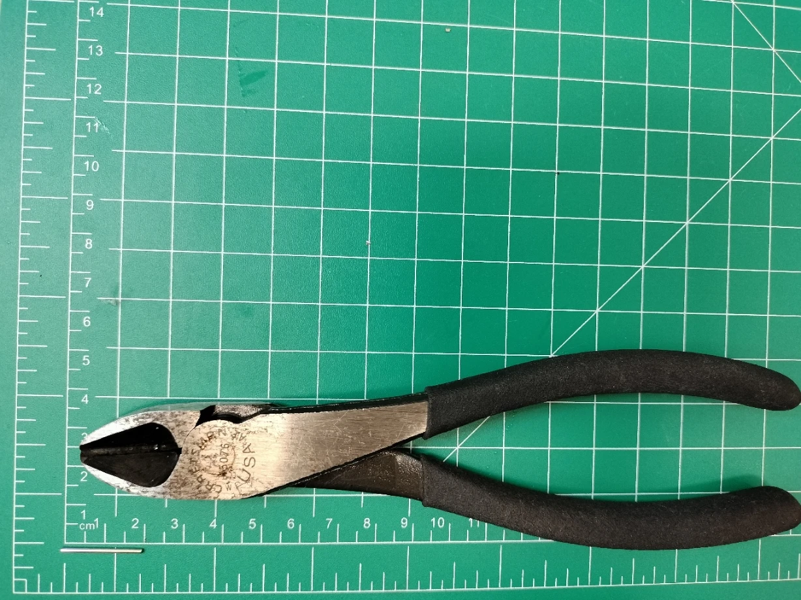
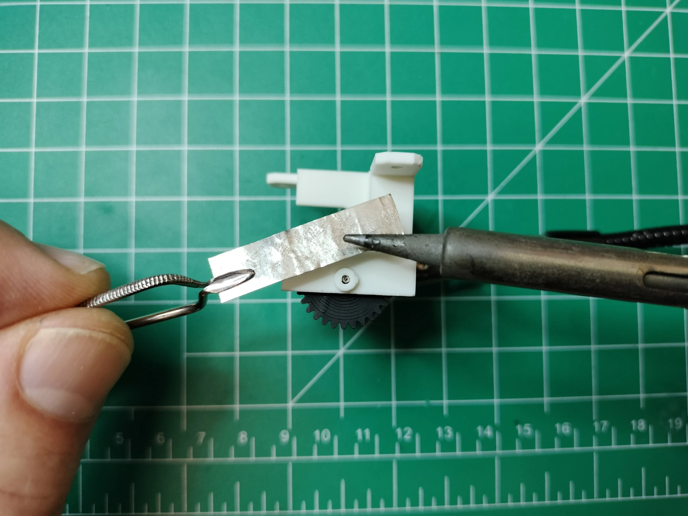
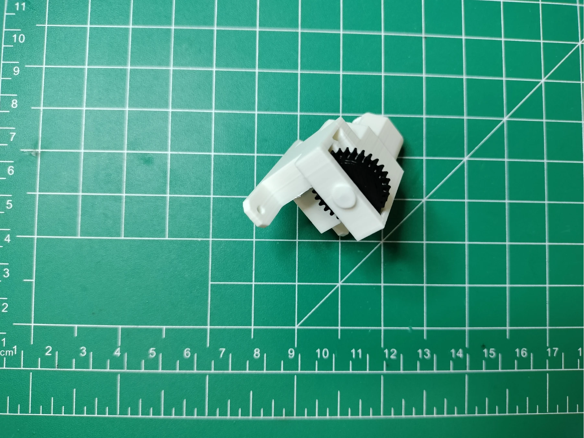
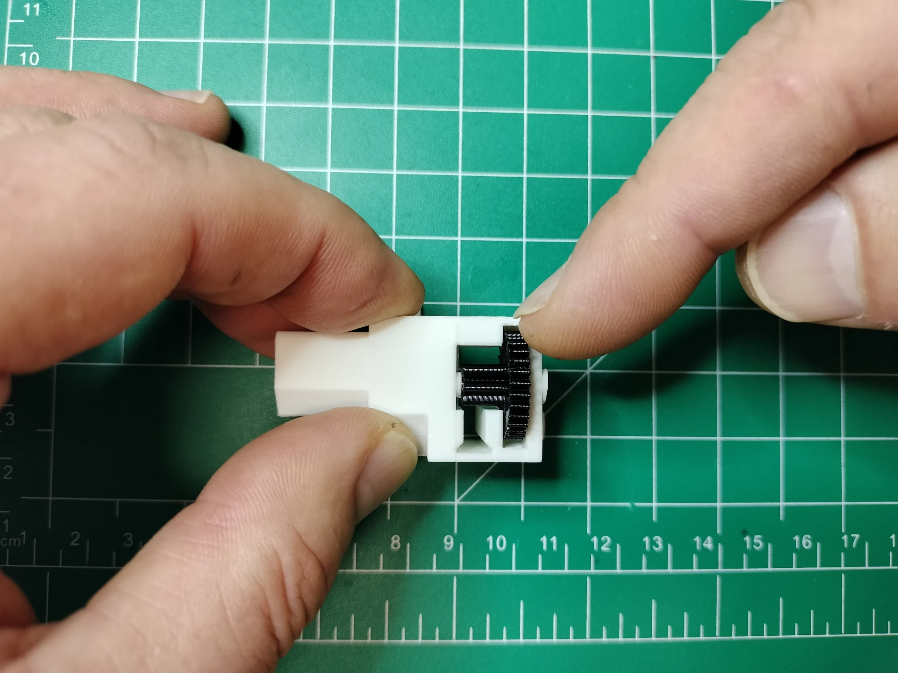

# Actuator Assembly

There are 30 actuators in the display, 7 per digit and 2 for the colons (4 digits x 7 segments + 2 colons = 30 total actuators). The diagrams below identify the various parts and composition of the actuator.

Fully assembled actuator with segment and back stopper.

Actuator rack and pinion gear assembly.

The actuator assembly includes installing the shaft gear onto the DC brushed motor, preparing and adding the wires to the motor, assembling the motor mount, pinion gear and shaft, then adding the DC brushed motor to the assembled motor mount.

## Shaft Gear

In this section you'll glue the shaft gear onto the shaft to avoid slippage. The shaft gear must be made from rigid filament like PLA or ABS.

### Shaft Gear Installation Steps

1. The tools and parts needed to install the shaft gear include: a regular tipped screwdriver, super glue, motor shaft 10-toothed gear, and DC brushed toy motor.

1. Add a drop of super glue to attach the shaft gear. Note the shaft gear is 10mm high and the hole is 5mm.

1. Position the DC toy motor vertically so the bottom of the DC motor shaft sits on a hard surface. Use the regular tipped screwdriver to press the 10-toothed gear onto the shaft. Be sure to push the 10-toothed gear 5mm down into the shaft.

1. Repeat the steps in this section for the remaining 29 motors.

## Wires

After the actuator is assembled, it will be connected to the digit PCB. The white 28 AWG wire provides the clockwise (CW) motion that extends the segment, the black wire provides the counter clockwise (CCW) motion that retracts the segment.

### Wire Cutting and Soldering Steps

In this section you'll create 21 unlabelled motors with 4 centimeter wires with Dupont connectors, 4 motors labelled "C", 4 motors labelled "D", and one labelled "UC" (upper colon), totalling 9 motors having 6 centimeter wires with dupont connectors.

1. The tools and parts needed to prepare and add the wires to the DC motor includes: black and white 28 AWG stranded wire, wire strippers for 28 AWG wire, and a soldering station with 0.8mm 1.76g flux core solder.

2. Cut 9 white and 9 black wires of 6 centimeter lengths for segment actuators C and D and the upper colon. Cut 21 white and 21 black wires of 4 centimeter lengths for the remaining actuators.

1. Strip about 3mm off one end of each black and white wire.

1. Position the DC motor so the shaft is facing upward and the terminals are on the top. Set your soldering iron to 350°C then add solder to each motor terminal.

1. Solder the white wire onto the left motor lead and the black wire onto the right motor lead. Be sure to label the motors with 6 centimeter wire as C, D, and the upper colon.

### Dupont Connections

1. The tools and parts needed to add the 2.54mm Dupont connectors to each wire include: the DC motor with shaft gear and wires (as prepared in the previous steps), a Dupont connector crimping tool, 60 female Dupont pin connectors and 30 1x2p Dupont connector housings.

1. Strip 3mm off the DC motor wire and crimp each female Dupont pin connector to each wire.

1. Crimp the female connectors onto each wire.

1. Crimp the female connectors onto each wire.

1. Repeat the previous steps for all remaining motors. Be sure to place your label on the black side of the motor for the nine, 6 centimeter wire length actuators with C, D or UC (upper colon). No need to label the 21 other actuators with 4 centimeter lengths

## Motor Mount

1. The tools and parts needed to assemble the motor mount include: 3d printed motor mount in PLA and Nylon pinion reduction gear, a 20mm metal shaft made from a jumbo paper clip, a soldering station capable of a heat setting of 250° C, clamping tweezers with a thin piece of metal. Verify the shaft can easily slide through the pinion gear before assembling the motor. If you cannot easily rotate the pinion gear on the shaft, then you'll need a 1/16" drill bit and drill to widen the pinion gear shaft hole.

1. Cut the off the straight sections from the Jumbo paper clip. 

1. Measure 2 cm from each Jumbo paper clip straight section.

1. Use a large wire cutter to cut the shaft.

1. With a 1/16" drill bit, bore out the shaft hole in the pinion gear.

1. Insert the 2 cm shaft about 1 millimeter into the motor mount.

1. Add the pinion gear to the motor mount as shown in the diagram. Insert the shaft by aligning the pinion gear shaft hole with the metal shaft, then slide the metal shaft all the way into the motor mount.

1. Heat your soldering iron to 250°C and prepare your clamping tweezer and zinc strip as shown in the picture.

1. Hold the zinc strip over the shaft collar and press down on the zinc strip with your soldering iron. Melt the collar and flatten it onto the motor mount.

1. When finished, the melted collar will only protrude about a half millimeter out from the motor mount.

1. Hold the main body of the motor mount so the pinion gear faces left. Avoid touching or putting any pressure onto the motor mounting tabs used the screw the motor onto the display. With your other hand, hold the prepared motor with the shaft pointed left and the terminals downward, insert the prepared motor into the motor mount. 

1. Repeat the process for the remaining 29 motors.

