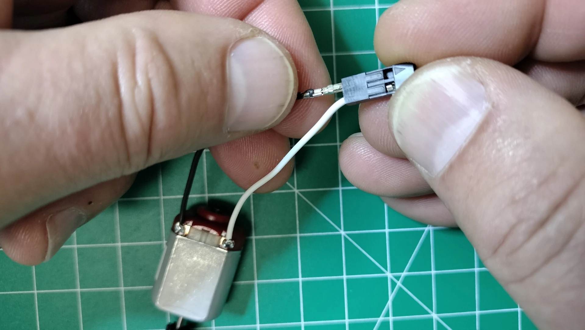
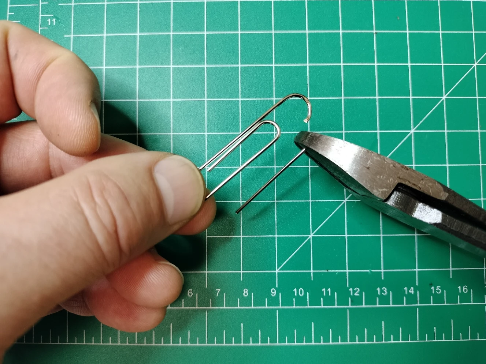
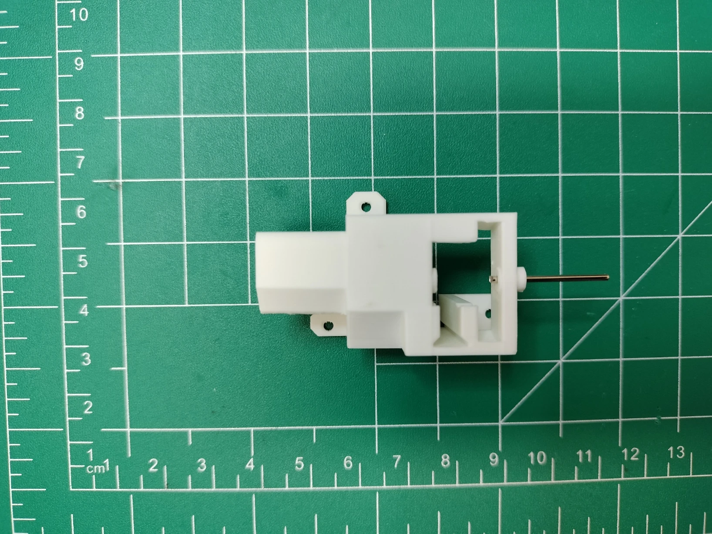
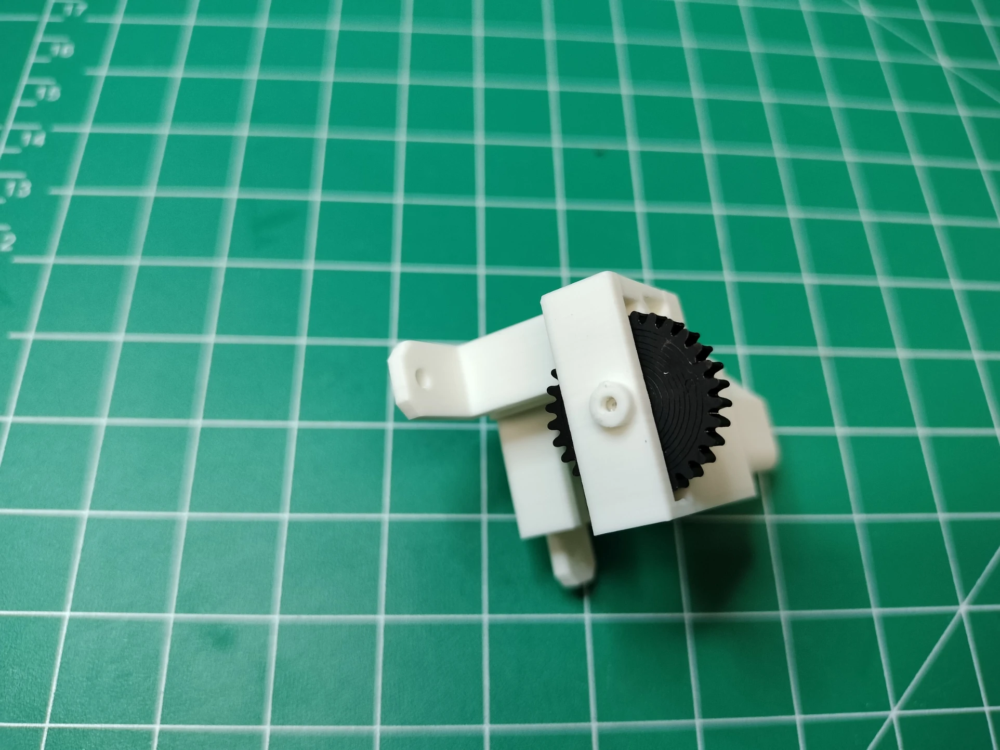

# Actuator Assembly

This guide ensures the actuators function reliably and integrate seamlessly into the display system.

There are 30 actuators in the display, 7 per digit and 2 for the colons (4 digits x 7 segments + 2 colons = 30 total actuators). The actuator assembly includes installing the shaft gear onto the DC brushed motor, preparing and adding wires to the motor, assembling the motor mount, pinion gear, and shaft, then adding the DC brushed motor to the assembled motor mount. The picture below shows a fully assembled actuator.

## Prerequisites

- Nylon pinion gear 30, `digit-gear30.stl`
- Black Matte PLA shaft gear 10, `digit-gear10.stl`
- White Matte PLA motor mount, `digit-motor-mount.stl`

!!! tip
    Ensure all 3D-printed parts are free of defects and printed with the recommended settings for optimal fit and durability.

***Table of components***

| Quantity | Component | Image |
| :--: | :------| :-----: |
| 30 | 130 Strong Magnetic Toy Motor |  |
| 150 cm | 28 AWG Stranded Wire (white) |  |
| 150 cm | 28 AWG Stranded Wire (black) |  |
| 60 | DuPont 2.54mm Pitch Female Connector Pin |  |
| 30 | DuPont 2.54mm Pitch Terminal Connector Single Row Housing 2 Pin |  |
| 10 | Jumbo Metal Paperclip (smooth) |  |

***Table of tools***

| Required | Tool | Image |
| :---: | :------- | :---: |
| Yes | Soldering station    |  |
| Yes | 0.8mm 1.76oz RoHS flux core solder |  |
| Yes | Large regular tipped screwdriver |  |
| Yes | Super glue |  |
| Yes | 22-34 AWG Wire Stripper and Cutter |  |
| Yes | Pin Crimp Tool for 2.54mm Dupont Connectors |  |
| Yes | Heavy Duty Wire Cutter Pliers |  |
| Yes | Heavy Duty Cross Locking or Clamping Tweezers |  |
| Yes | 10cm zinc strip |  |
| No | Label Maker (optional for labeling wires) |  |

!!! warning
    Always work in a well-ventilated area when soldering or using super glue to avoid inhaling fumes.

## Shaft Gear

In this section, you'll glue the shaft gear onto the motor shaft to prevent slippage. The shaft gear must be made from rigid filament like PLA or ABS.

### Shaft Gear Installation Steps

The tools and parts needed include: a regular tipped screwdriver, super glue, `digit-gear10.stl`, and a DC brushed toy motor.

1. **Apply Glue**: Add a drop of super glue to the shaft gear. Ensure the gear is 10mm high with a 5mm hole. Avoid excess glue to prevent it from seeping into the motor shaft.
   
1. **Attach the Gear**: Position the DC motor vertically so the bottom of the shaft rests on a hard surface. Use the screwdriver to press the gear 5mm down onto the shaft. Ensure the gear is aligned and does not wobble.
   
1. **Repeat**: Follow these steps for the remaining 29 motors. Allow the glue to cure for at least 10 minutes before proceeding.
   

## Wires

The white 28 AWG wire provides clockwise (CW) motion to extend the segment, while the black wire provides counterclockwise (CCW) motion to retract it.

### Wire Cutting and Soldering Steps

1. **Cut Wires**: Cut 9 white and 9 black wires to 6cm for actuators labeled "C", "D", and "UC" (upper colon). Cut 21 white and 21 black wires to 4cm for the remaining actuators. Use a ruler for precise measurements.
   
1. **Strip Wires**: Strip 3mm of insulation from one end of each wire. Avoid nicking the wire strands.
   
1. **Prepare Terminals**: Position the motor with the shaft pointing away and terminals facing up. Heat the soldering iron to 350°C and tin each terminal with a small amount of solder.
   
1. **Solder Wires**: Solder the white wire to the left terminal and the black wire to the right terminal. Ensure the solder joints are clean and secure.
   

!!! tip
    Use a helping hand tool to hold the motor steady while soldering.

!!! note
    Label the black-wire side of the 6cm actuators ("C", "D", and "UC"). No labels are needed for the 4cm actuators.

### Dupont Connections

1. **Strip Wires**: Strip 3mm of insulation from the free end of each wire.
   
1. **Crimp Connectors**: Attach female Dupont connectors to each wire.
   
1. **Attach Housing**: Slide the wires into the Dupont connector housing until the pins lock in place.
   
1. **Repeat**: Complete this process for all motors. Ensure labeled actuators are correctly marked.
   

!!! tip
    Test each connection with a multimeter to ensure continuity before proceeding.

## Motor Mount

Properly assembling the motor mount is critical to avoid issues like jamming or sticking. The motor mount consists of:
- **(A)** Motor mount (`digit-motor-mount.stl`)
- **(B)** Pinion reduction gear (`digit-gear30.stl`)
- **(C)** Pinion gear shaft (cut from a jumbo paperclip)

Discard the red support section.

### Motor Mount Assembly Steps

1. **Cut Shaft**: Cut straight sections from a jumbo paperclip into 2cm pieces. Use heavy-duty wire cutter pliers for clean cuts.
   
1. **Insert Shaft**: Insert the 2cm shaft into the motor mount until it protrudes 1mm into the pinion gear space. Ensure the shaft is straight.
   
1. **Attach Pinion Gear**: Align the pinion gear hole with the shaft and slide it into the motor mount. Verify the gear rotates freely.
   
1. **Melt Collar**: Heat the soldering iron to 250°C. Use a zinc strip to melt and flatten the collar onto the motor mount. Work carefully to avoid damaging the mount.
   
1. **Verify Fit**: Ensure the shaft rotates freely in the pinion gear. Reprint the gear if necessary to avoid jamming. Lubricate lightly if needed.
   
1. **Install Motor**: Insert the prepared motor into the mount with the shaft pointing left and terminals downward. Secure the motor firmly.
   
1. **Repeat**: Assemble the remaining 29 motors. Perform a final inspection to ensure all assemblies are consistent.

!!! warning
    Avoid overtightening or forcing components, as this may cause damage or misalignment.
