# Backplate and Stand Assembly

Back of the display when the backplates and stand are assembled.

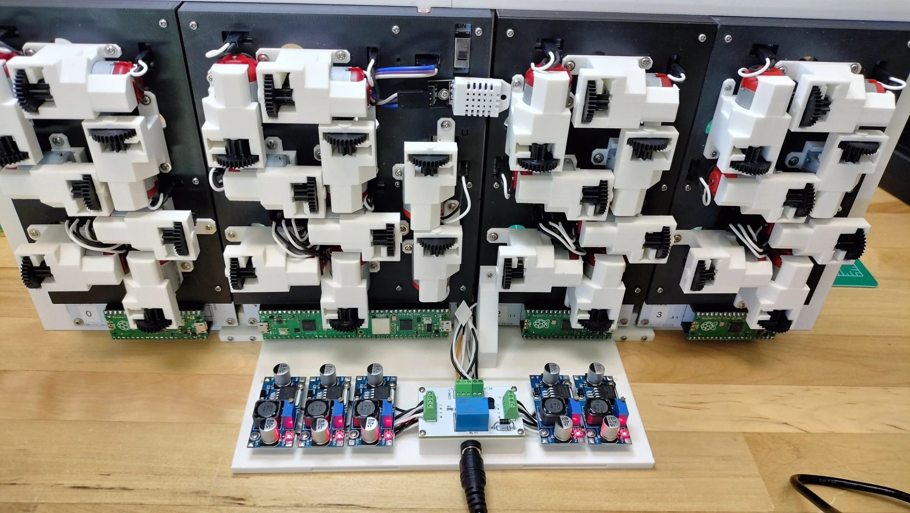

## Prerequisites

- Completed all the guides previous to this assembly guide, which include the digit PCBs, conductor and digit 1 PCB, power management PCB, and mounting the buck modules.
- `digit-back-plate.stl`
- `digit2-back-plate.stl`
- `digit1-back-plate.stl`

## Digit Backplate Assembly

The picture below shows the digit 0 and 3 backplates in an upright position. Note the segment characters, **A** through **G**, engraved onto the backplate. The round port holes allow the motor's rack gear to protrude into the face of the display. The rectangular holes allow the motor's white and black wires to plug into their respective `CW` and `CCW` pins on the PCB.

**digit-back-plate.stl**

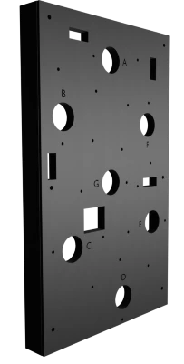

The picture below shows the digit 2 backplate. Digit 2 backplate is nearly the same as the backplates for digits 0 and 3 except for the stand mount hole as highlighted by the white box.

**digit2-back-plate.stl**

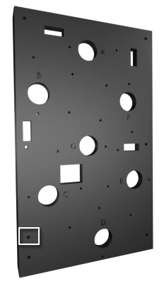

1. Each motor is mounted to the backplate using three M1.7x8mm screws. Use a small philips tip screwdriver to install the motors. A larger philips tip screwdriver is prone to overtighten and may cause the head of the screw to shear off. The picture below shows the order the actuator motors should be installed.

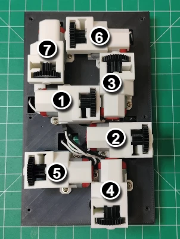

1. Repeat the install for digits 2 and 3.

## Conductor and Digit One Backplate Assembly

The picture below shows the conductor and digit one backplate in an upright position. The backplate has engraved segment characters **A** through **G** and colons **U** and **L**. The large rectangular hole above the **U** label is where the on/off switch is mounted. Also note the top edge of the backplate has a slot for the LDR to fit into.

**digit1-back-plate.stl**

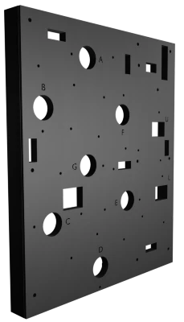

The picture below shows the order the actuator motors should be installed.

## Install the Backplates onto the Face

1. With the digit face pointing down, place the backplates into the slots on the back of the digit face.
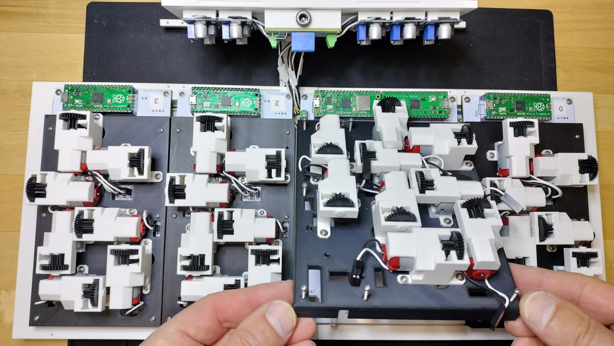
1. Each backplate is mounted to the face using M2x15mm screws. Use a medium sized philips tip screwdriver to install the backplates. The picture below shows the installation of the backplates onto the face.
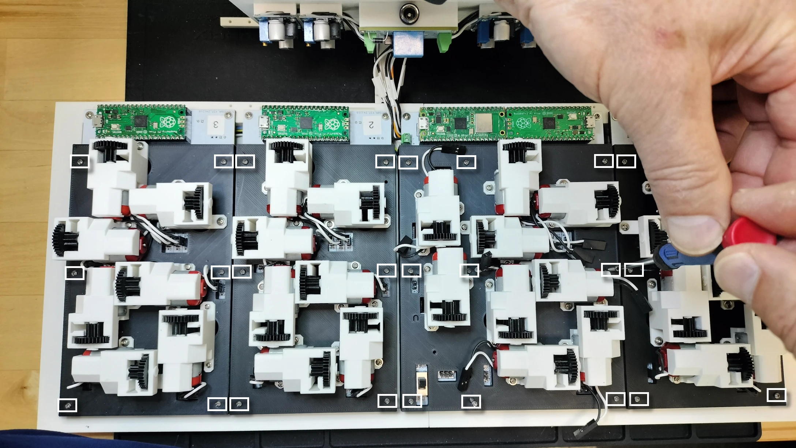
1. Using needlenose pliers, connect each of the motor's Dupont connector to their respective CW (white wire) and CCW (black wire) pins on the PCB.
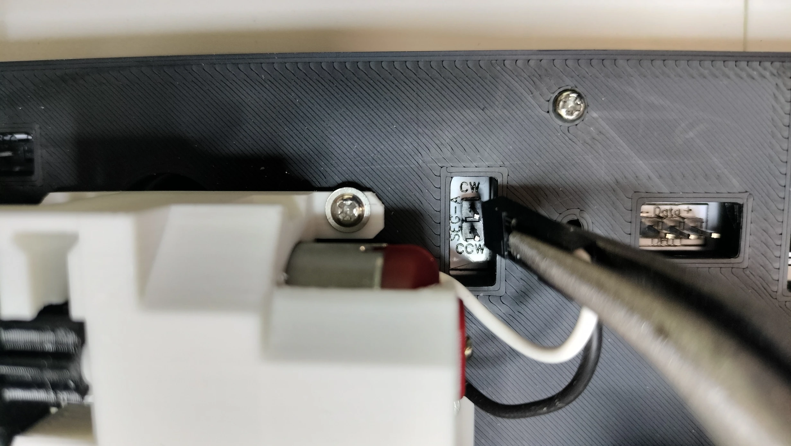
1. Trim the 3 wires that come with the DHT22 to a suitable size, then connect the Dupont connections to the appropriate sensor pins. Verify the wires connecting the `+ Data -` pins on the PCB are connected to the sensor's `+ Data -` pins.
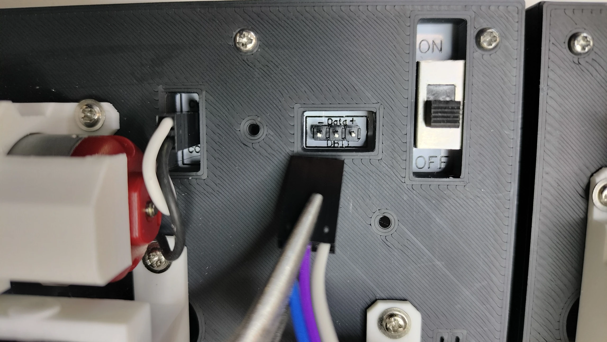
1. Using an M1.7x8mm self tapping screw, mount the DHT22 as shown in the picture below.
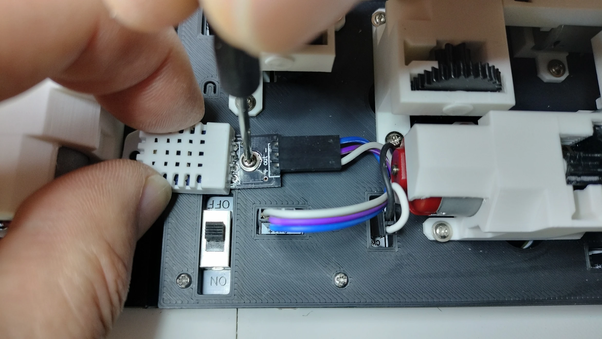

## Install the Stand onto the Face

1. Place the notches in the stand into the groove on the face as shown in the picture below. Be sure not to pinch any of the power management wires while mounting the stand.
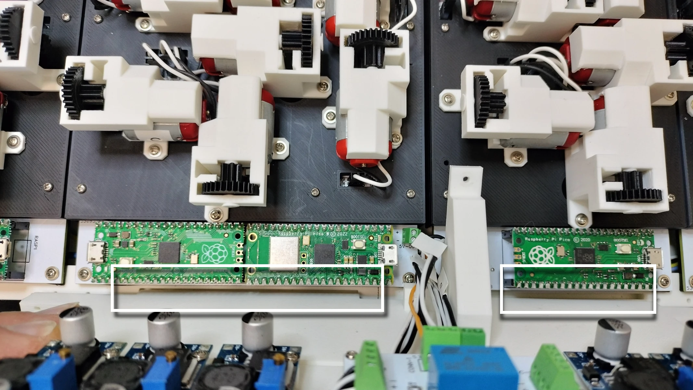
1. Following the picture below, **(A)** attach the stand's vertical holder to the digit 2 backplate with an M1.7x8mm self tapping screw. **(B)** Attach the stand's side mounting tabs with M2x15mm self tapping screws.
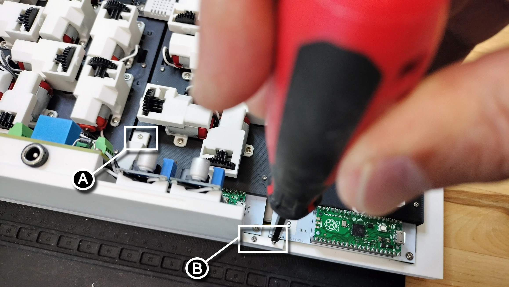
1. Set the digit upright on the stand. See be picture at the beginning of this guide to verify the completed assembly of the backplates and stand.
