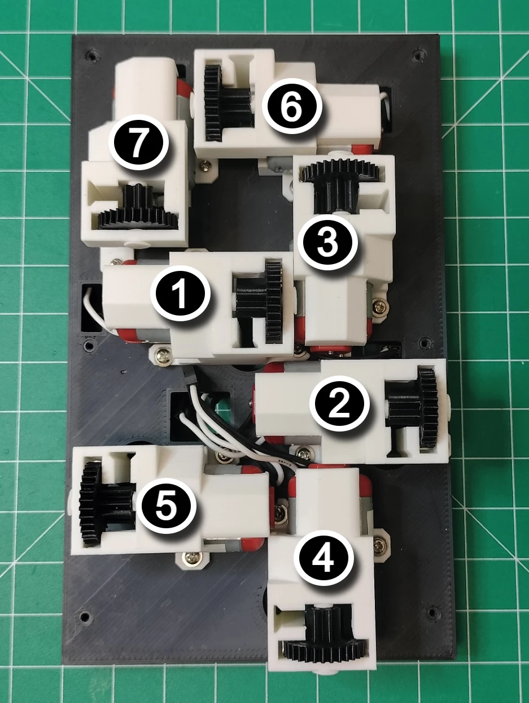
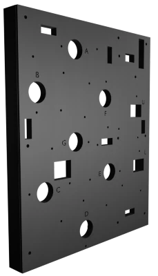

# Backplate Assembly

## Prerequisites

## Digit Backplate Assembly

The picture below shows the digit 0, 2, and 3 backplates in an upright position. Note the segment characters, **A** through **G**, engraved onto the backplate. The round port holes allow the motor's rack gear to protrude into the face of the display. The rectangular holes allow the motor's white and black wires to plug into the `CW` and `CCW` pins on the PCB.

1. Each motor is mounted to the backplate using three M1.7x6mm screws. Use a small philips tip screwdriver to install the motors. A larger philips tip screwdriver is prone to overtighten and may cause the head of the screw to shear off. The picture below shows the order the actuator motors should be installed.

| order | segment |
| :--: | :---: |
|   1  | A |
|   2  | B |
|   3  | C |
|   4 | D |
|   5  | E |
|   6  | F |
|   7  | G |

2. Repeat the install for digits 2 and 3.

## Conductor and Digit One Backplate Assembly

The picture below shows the conductor and digit one backplate in an upright position. The backplate has engraved segment characters **A** through **G** and colons **U** and **L**. The large rectangular hole above the U label is where the on/off switch is mounted. Also note the top edge of the backplate has a slot for the LDR to fit into.

