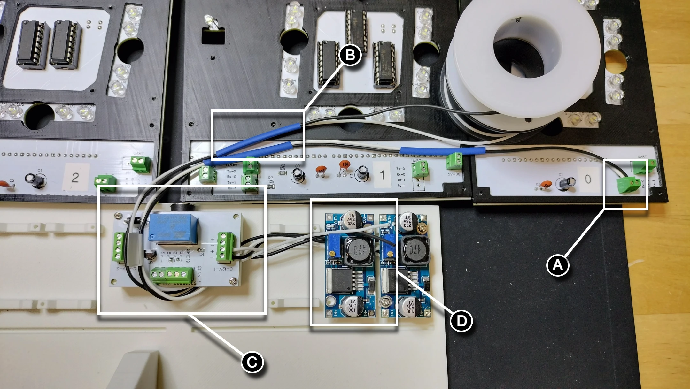

# Buck Modules and Wiring

## Prerequisites

- 3D print the digit and controller TPU gaskets

## PCB and Stand Layout

This section ensures wiring for the PCBs are oriented for the mounting of the buck modules and wiring.

1. Remove the Raspberry Pi Pico and Pico W 2040 from the PCBs. We'll add these later when it is safe to do so.
1. Lay the PCBs face up with digit 0 on the far right and digit 3 on the far left. Position the stand below the PCBs so the barrel jack is between the controller/digit 1 PCB and digit 2 PCB.

1. Place the TPU gaskets on the PCBs. Note the TPU gasket for digit 2 differs slightly from digit 0 and 3 gaskets.

## Wiring the Buck Modules

!!! warning
    Use anti static mats and ESD wristband and grounding wire for the remainder of the Kinetic Display electronics assembly.

This section details wiring the buck converter to the PCBs. Each module must be calibrated to have a 5.0v to 5.1v output. The wiring of the buck module starts with digit 0 on the far right, digit 1, the colons/controller, then digit 3 on the far left followed by digit 2.

