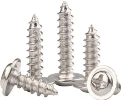
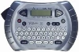

# Buck Module Wiring

Buck converters are essential for converting 12V DC to 5V DC because they efficiently step down the voltage while minimizing energy loss. Unlike linear regulators, which dissipate excess voltage as heat, buck converters use high-frequency switching and inductors to transfer energy more efficiently. This makes them ideal for powering sensitive electronics like microcontrollers and LEDs, as they provide stable output voltage, reduce heat generation, and improve overall system reliability. 

This guide provides detailed instructions for assembling and wiring DC to DC variable buck converter modules in a Kinetic Display system. Also included is a list of required components and tools, step-by-step guidance for wiring and securing the modules, and calibration instructions to ensure proper voltage output.

1. **Correct Wiring**: Proper routing and connection of wires are critical to ensure the display functions correctly. Incorrect wire lengths or connections can lead to assembly issues or electrical faults.
1. **Voltage Calibration**: The buck converters step down the input voltage from 12V to a stable 5.0-5.1V output. Calibration ensures the modules provide the correct voltage to prevent damage to connected components or malfunctions.
1. **Safety Measures**: The document emphasizes using anti-static precautions and proper tools to avoid damaging sensitive electronics during assembly.

This guide is essential for ensuring the reliability and safety of the Kinetic Display system.

## Prerequisites

- 3D print the Digit and controller TPU gaskets
- 3D print the Display stand

***Table of components***

| Quantity | Component | Image |
| :--: | :------| :-----: |
| 5 | DC to DC variable buck converter module | |
| 10M | White 28 AWG Gauge Flexible Silicone Rubber Electric Wire |   |
| 10M | Black 28 AWG Gauge Flexible Silicone Rubber Electric Wire |   |
| 50cm | (optional) 28 AWG Gauge heat shrink |   |
| 10 | M1.7x6mm Cross Round Head with Washer Self Tapping Screw 304 Stainless Steel Screws |  |

***Table of tools***

| Required | Tool | Image |
| :---: | :------- | :---: |
| Yes | Multimeter    | |
| Yes | Soldering station    | |
| Yes | 0.8mm 1.76oz RoHS flux core solder | |
| Yes | Mini flush cutters   | |
| Yes | Wire stripper   | |
| No  | Label maker |  |

## PCB and Stand Layout

This section ensures wiring for the PCBs are oriented for the mounting of the buck modules and wiring.

1. Remove the Raspberry Pi Pico and Pico W 2040 from the PCBs. We'll add these later when it is safe to do so.
1. Lay the PCBs face up with Digit 0 on the far right and Digit 3 on the far left. Position the stand below the PCBs so the barrel jack is between the controller/Digit 1 PCB and Digit 2 PCB.

1. Place the TPU gaskets on the PCBs. Note the TPU gasket for Digit 2 differs slightly from Digit 0 and 3 gaskets.

## Wiring the Buck Modules

This section details wiring the buck converter to the PCBs. Be sure to follow the instructions in this section to get the wire lengths correct. Otherwise you are likely to have the wires be too short or too long for the display face to correctly fit. The buck converter module has an `In +` and `In -` on one side for the 12v input, and an `Out +` and `Out -` on the opposite side for the converted 5v output. This section will also cover how to calibrate the variable buck module to provide 5.0v to 5.1v output.

The picture below is the wiring diagram for the buck converter modules.

The picture below is the completed wiring of the buck converter modules. The order of install is **1, 2, 3** on the right, followed by **4** and **5** on the left.

!!! warning
    Use anti static mats and ESD wristband and grounding wire for the remainder of the Kinetic Display electronics assembly.

### Digits and Controller

1. Following the picture below, place a buck converter module for Digit 0 on the rightmost support on the display stand. Strip 3mm of insulation from the black and white 28 AWG wire while on the roll starting then tin the stripped end with solder. **(A)** Route the two wires from the 5v terminal block connector on the Digit 0 PCB. **(B)** Slide two 3cm sections of heat shrink on the two wires but DO NOT APPLY HEAT, then **(C)** continue routing the wire around the relay, under the power management PCB and through the port on the PCB stand. **(D)** Finish unwinding the wire when you reach the end of buck module as shown in the picture. Now that the length of wire is known from its route, snip off the wires next to the terminal block connector. **(A)** Strip 3mm of insulation then tin the stripped end with solder. Connect the white wire to the `+` on the `5v` terminal block connector and the black wire onto the `-`.

1. Following the picture below, turn the Digit 0 buck module over to its backside and solder the white wire onto the `Out +` pad and the black wire onto the `Out -` pad.

1. Following the picture below, turn the Digit 0 buck module 180 degrees while having its backside facing up. Strip 3mm of insulation from the black and white 28 AWG wire while on the roll starting then tin the stripped end with solder. Solder the white wire onto the buck module's `In +` pad and the black wire onto the `In -` pad.

1. Turn the Digit 0 buck module over and secure it with M1.7x6mm self tapping screws onto the rightmost module supports on the display stand.

1. Route the Digit 0 white and black wire to the power management PCB `C-12v-1` terminal block connector, provide about 10mm extra length in the wire before cutting them. Strip 3mm of insulation then tin the stripped end with solder. Connect the white wire to the `+` on the `C-12v-1` and the black wire onto the `-`.

1. Following the picture below, place a buck converter module for Digit 1 to the left of the Digit 0 module. Strip 3mm of insulation from the black and white 28 AWG wire while on the roll starting then tin the stripped end with solder. Starting with the Digit 1 PCB, **(A)** Route the two wires from the 5v terminal block connector. **(B)** Slide one 3cm section of heat shrink on the two wires but DO NOT APPLY HEAT, then **(C)** continue routing the wire around the relay, under the power management PCB and through the port on the PCB stand. **(D)** Finish unwinding the wire when you reach the end of second buck module as shown in the picture. Now that the length of wire is known from its route, snip off the wires next to the terminal block connector **(A)**. Strip 3mm of insulation then tin the stripped end with solder. Connect the white wire to the `+` on the `5v` terminal block connector and the black wire onto the `-`.

1. Following the picture below, turn the Digit 1 buck module over to its backside and solder the white wire onto the `Out +` pad and the black wire onto the `Out -` pad.

1. Follow the previous steps 3-5 for the Digit 1 buck module then connect the 12v black and white wire into the next available block terminals on `C-12v-1`. See the picture below for the assembled Digit 1 buck module.

1. Place a buck converter module for the Colon/controller to the left of the Digit 1 module. Strip 3mm of insulation from the black and white 28 AWG wire while on the roll starting then tin the stripped end with solder. On the backside of the Colon/controller buck module, **(A)** solder the white wire onto the `Out +` pad and the black wire onto the `Out -` pad. Route the wire around the power management relay and **(B)** to the 5v terminal block connector.

1. Clip the white and black wires, strip 3mm of insulation then tin the stripped end with solder. Connect the white wire to the `+` on the 5v terminal block connector and the black wire onto the `-`.

### Calibrate the Buck Module Voltage

Follow using the picture above and start with the Digit 0 buck module furthest right. **(A)** Disconnect the black and white wire from the 5v terminal block and connect the probes from the multimeter set to measure DC voltage. **(B)** Plug the 12v power supply into the power management PCB barrel jack. **(C)** Turn the screw on the top of the potentiometer on the Digit 0 buck module counterclockwise until **(D)** the voltage measures between 5.0 and 5.1 volts. Note you'll have to turn the screw on the top of the potentiometer several times counterclockwise before the voltage begins to drop.

Repeat the steps above to calibrate Digit 1 and the Conductor buck modules to 5v.

## Continue Wiring the Remaining Buck Modules

1. Following the picture below, place a buck converter module for Digit 3 to the far left mounting location. Strip 3mm of insulation from the black and white 28 AWG wire while on the roll starting then tin the stripped end with solder. **(A)** Unroll the two wires starting at the 5v terminal block connector on Digit 3 PCB. **(B)** Slide one 3cm section of heat shrink on the two wires but DO NOT APPLY HEAT, then **(C)** route the wire around the relay, under the power management PCB, and through the port on the PCB stand. **(D)** Finish unwinding the wire when you reach the end of the buck module as shown in the picture. Strip 3mm of insulation then solder the white wire to the buck module `Out +` pad and the black wire to the `Out -` pad. Now that the length of wire is known from its route, snip off the wires next to the terminal block connector **(A)**. Strip 3mm of insulation then tin the stripped end with solder. Connect the white wire to the `+` on the `5v` terminal block connector and the black wire onto the `-`.

1. Following the diagram below, **(A)** solder the white wire onto the buck module's `In +` pad and the black wire onto the `In -` pad. Secure the module with two M1.7x6mm self tapping screws. **(B)** Route the Digit 0 white and black wire to the power management PCB `C-12v-1` terminal block connector, provide about 10mm extra length in the wire before cutting them. Strip 3mm of insulation then tin the stripped end with solder. Connect the white wire to the `+` on the `C-12v-1` and the black wire onto the `-`.

1. Following the picture below, place a buck converter module for Digit 2 to the right of Digit 3. Strip 3mm of insulation from the black and white 28 AWG wire while on the roll starting then tin the stripped end with solder. Starting with the Digit 2 PCB, **(A)** unroll the two wires starting at the 5v terminal block connector. **(B)** route the wire around the relay, under the power management PCB, and through the port on the PCB stand. **(C)** Finish unwinding the wire when you reach the end of the buck module as shown in the picture. Strip 3mm of insulation then solder the white wire to the buck module `Out +` pad and the black wire to the `Out -` pad. Now that the length of wire is known from its route, snip off the wires next to the terminal block connector **(A)**. Strip 3mm of insulation then tin the stripped end with solder. Connect the white wire to the `+` on the `5v` terminal block connector and the black wire onto the `-`.

1. Following the diagram below, **(A)** solder the white wire onto the buck module's `In +` pad and the black wire onto the `In -` pad. Secure the module with two M1.7x6mm self tapping screws. **(B)** Route the Digit 0 white and black wire to the power management PCB `C-12v-1` terminal block connector, provide about 10mm extra length in the wire before cutting them. Strip 3mm of insulation then tin the stripped end with solder. Connect the white wire to the `+` on the `C-12v-1` and the black wire onto the `-`.

1. Position the heat shrink as per the picture of the completed wiring of the buck converter modules at the beginning of this document. Apply heat from your heat gun to complete the assembly of all the heat shrink.
1. Following the picture below with the Digit 3 buck module, **(A)** disconnect the black and white wire from the 5v terminal block, and connect the probes from the multimeter set to measure DC voltage. **(B)** Plug the 12v power supply into the power management PCB barrel jack. **(C)** Turn the screw on the top of the potentiometer on the Digit 3 buck module counterclockwise until **(D)** the voltage measures between 5.0 and 5.1 volts. Note you'll have to turn the screw on the top of the potentiometer several times counterclockwise before the voltage begins to drop.

Repeat the steps above to calibrate Digit 2 buck module to 5v.

