# Controller and Digit 1 PCB Assembly

Digit 1 and the colons are on a single PCB. Digit 1 is identical to digits 0, 2, and 3 except it is contained on a single PCB with the colons. The Raspberry Pi Pico W microcontroller operates the colons and serves as the central command and control for the display performing the following functions:

- Sends commands to digits as to what to display (i.e. 0-9, A-F)
- Sends commands for the brightness of the digits
- When in Admin mode, it will transmit its own wifi service to wirelessly change the display settings from a cell phone or computer.
- Manages the scheduler, which is the mechanism for displaying time, date, external temperature and humidity, and interior temperature and humidity.
- When connected to a wifi network, it will obtain its public facing IP address, look up the time zone it is located in, and set the display to the local time
- When connected to a wifi network, it will obtain the closest weather station and, depending on the scheduler, may display the external temperature and humidity.
- Manages the low power consumption mode by turning off the power to digits 0-3.  When awakened, it will turn on the power to digits 0-3.

Front face of the controller PCB fully assembled.
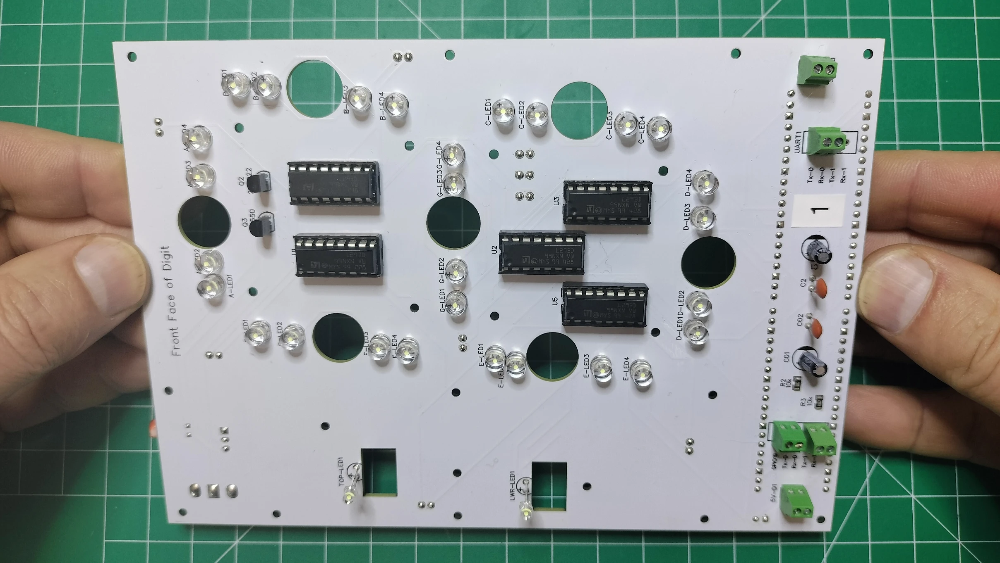
Back side of the controller PCB fully assembled.
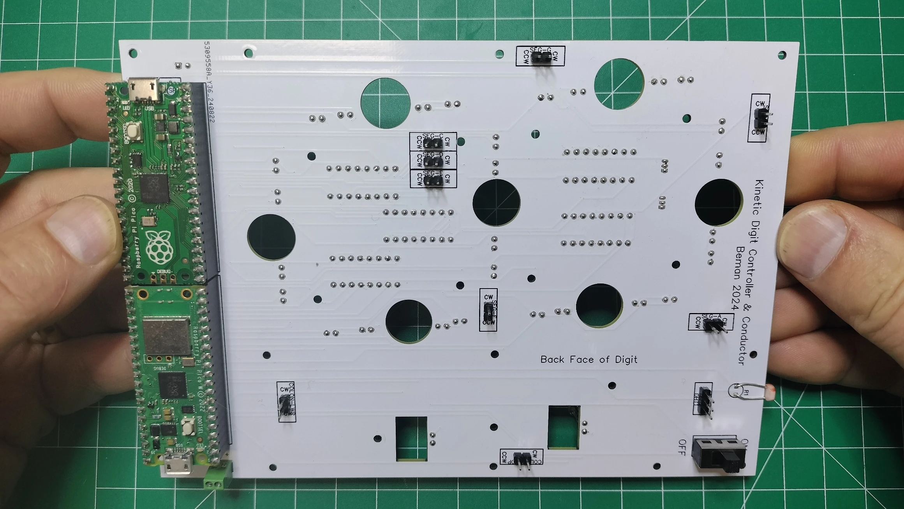

## Prerequisites

- [Fabrication of the controller and digit one PCB](../createandorder/pcb.md)
- 3D print of the upper and lower colons

***Table of components***

| Quantity | Component | Image |
| :--: | :------ | :-----: |
| 5 | 16 pin IC socket | |
| 5 | L293D stepper motor driver | 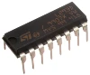|
| 4 | 20 pin female header connector | 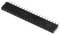|
| 1 | 20 pin single row breakaway male connector | 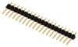|
| 1 | Vertical Slide Switch Micro High Knob 3 Pin 2 Position 1P2T SPDT Panel Mount | |
| 6 | 2 Port PCB Mount Screw Terminal Block Connector Straight Pin | 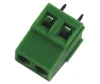|
| 2 | 0.1μ farad ceramic capacitor | 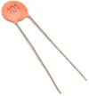|
| 2 | 1μ farad electrolytic capacitor | 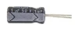|
| 1 | 5mm 0.5 Ω ohm Photoresistor Resistor 5516 GL5516 | 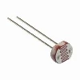 |
| 1 | S8550 TO-92 TH PNP Transistor | 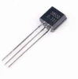 |
| 1 | 2N2222 TO-92 TH NPN Transistor | 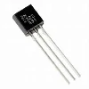 |
| 2 | 10K ohm 0805 Resistor 1/2w Metal Film Fixed Resistor | 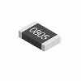 |
| 28 | 5mm Flat top LED, anode long lead (your choice of color) | 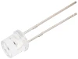|
| 2 | 3mm Flat top LED, anode long lead (your choice of color) | 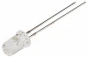|
| 1 | Raspberry Pi Pico 2040 with Headers | 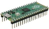|
| 1 | Raspberry Pi Pico W 2040 with Headers | 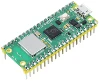|
| 1 | Controller PCB | See next section |

***Table of tools***

| Required | Tool | Image |
| :------: | :------- | :---: |
| Yes | Soldering station    | 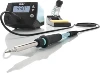|
| Yes | 0.8mm 1.76oz RoHS flux core solder | |
| Yes | Mini flush cutters   | |
| Yes | Isopropyl Alcohol | |
| Yes | Cotton Facial Pads | |

## Assemble Digit One

On the controller PCB, follow the instructions from the digit PCB assembly to assemble digit one.

1. On the front face of the controller PCB, [add the 16 pin headers](digitpcbassembly.md#add_the_16_pin_headers) as previously completed for the digit PCBs. Note the highlighted sections in the picture below that you'll add an additional (5th) 16 pin header to the controller PCB. Don't forget to snip all the pins flush on the back side of the controller PCB, resolder each snipped pin to a smooth bead, then remove the flux with a cotton dabbed with isopropyl alcohol.
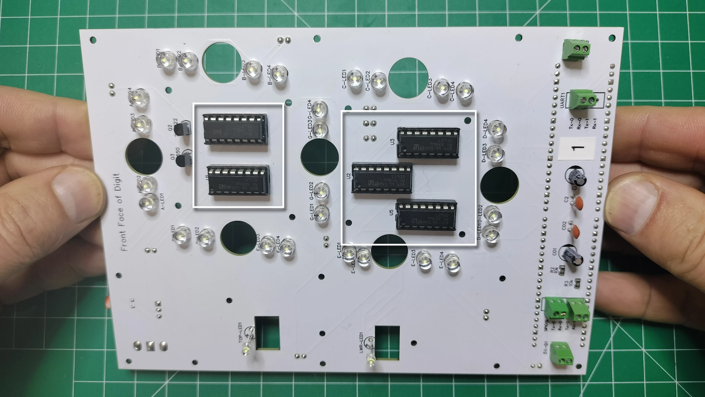
1. On the front face of the controller PCB, [add the 28 5mm LEDs](digitpcbassembly.md#add_the_28_leds) as previously completed for the digit PCBs. Be sure to insert the LED anode (long pin) into the through hole marked with a **+**. Do not solder the 5mm LED into the **Top-LED1** or **LWR-LED1** location on the controller PCB. Instructions later in this section will detail how to install the 3mm LEDs into the "Top-LED1" and "LWR-LED1" locations. Finish soldering the 28 5mm LEDs by snipping all the pins flush on the back side of the controller PCB, resolder each snipped pin into a smooth bead, then remove the flux with a cotton dabbed with isopropyl alcohol.
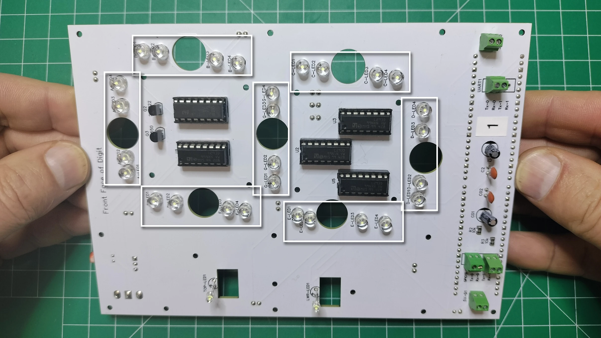
1. On the back face of the controller PCB, [add the motor pins](digitpcbassembly.md#add_the_motor_pins). Note the highlighted sections in the picture below that there are two additional motor pins (pairs) you'll need to add, and an additional 3-pin connector for the Digital Humidity Temperature (DHT) sensor. Don't forget to snip all the pins flush on the back side of the controller PCB, resolder each snipped pin to a smooth bead, then remove the flux with a cotton dabbed with isopropyl alcohol.
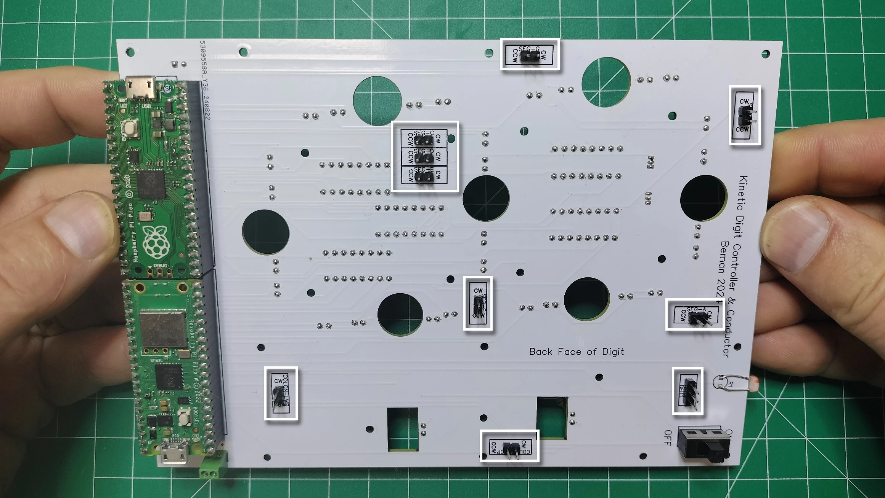

## Colon Segments LEDs

In addition to the soldering equipment you needed when previously mounting the 5mm flat top LEDs, you'll need the two 3D printed colon segments, label **A** in the diagram below, as fabricated in the [3D print the display parts](../createandorder/3dprints.md) document.

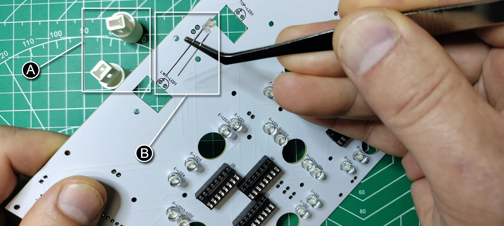

1. Following label **B** in the diagram above, insert the 3mm flat top LEDs into **Top-LED1** and **LWR-LED1** on the front face of the controller PCB. Follow the same 5mm LED install process and be sure to insert the long lead anode of the LED into the **+** through hole.
2. Following the diagram below, slide the colon segments over the 3mm LED. Note the lower base of the LED lense may need to be lightly sanded with 300 grid sandpaper if it does not easily slide into the colon segment.
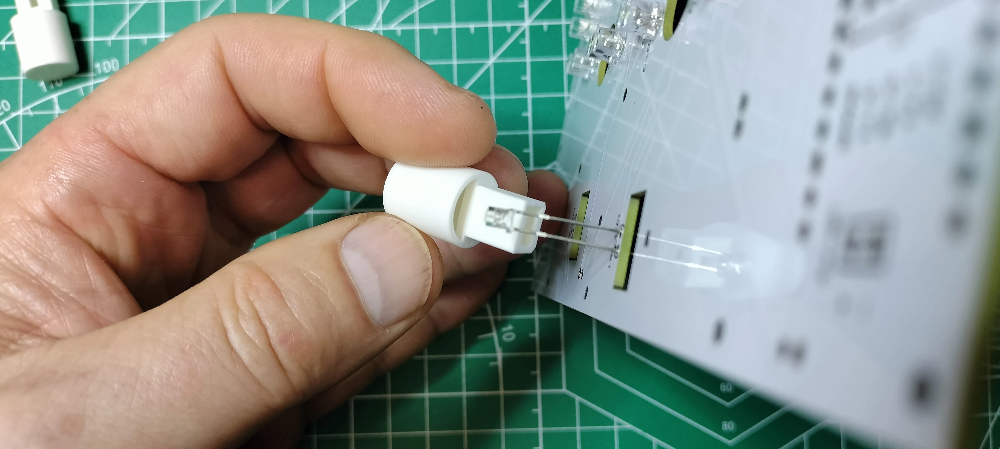
3. On the back side of the controller PCB, align the colon segment so its square base is positioned into the square hole of the PCB.
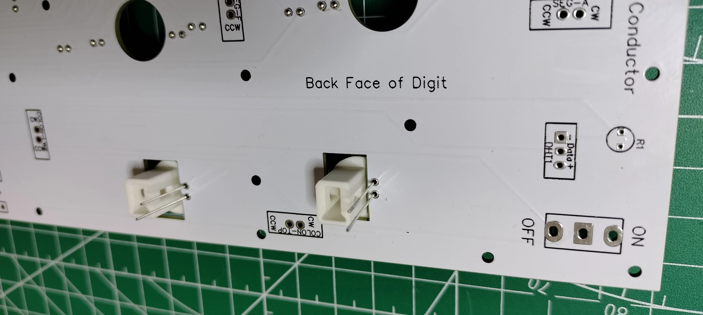
4. Solder the 3mm LEDs into place.
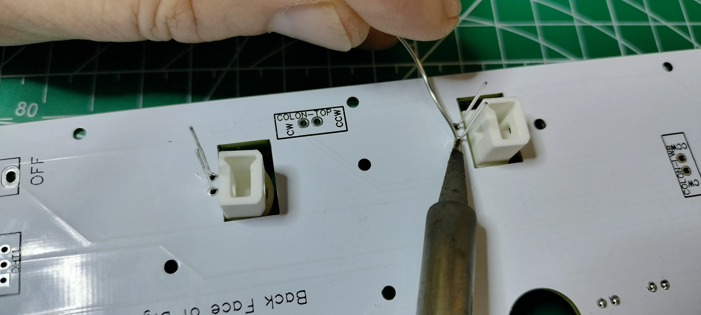
5. Optionally you can use a metric ruler to verify the LEDs protrude perpendicular from the PCB and are 14mm from the PCB to the top of the lens of the LED. This optional step insures the proper length of the 3mm LEDs.
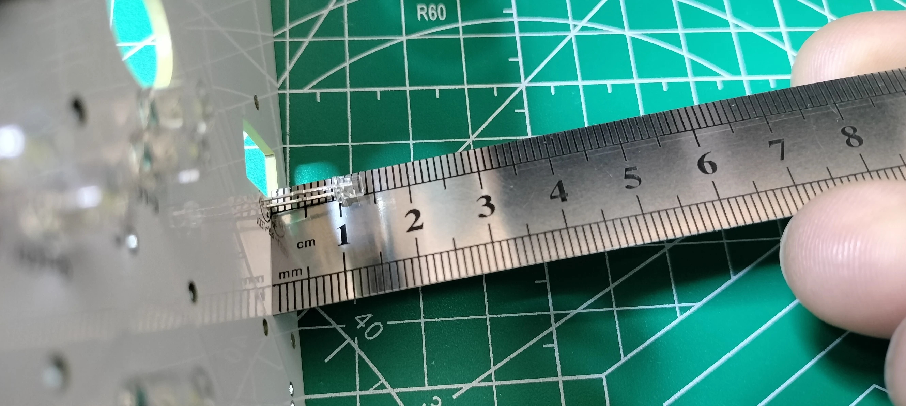

## PNP and NPN transistors

1. Following the diagram below, solder the s8550D PNP transistor into the through hole (mis-) labelled 2N8550 on the front face of the controller PCB. When inserting the transistor's pins into the through holes, be sure to orient the transistors so the flat face matches the silk screen on the PCB as held by the tweezers in the picture.
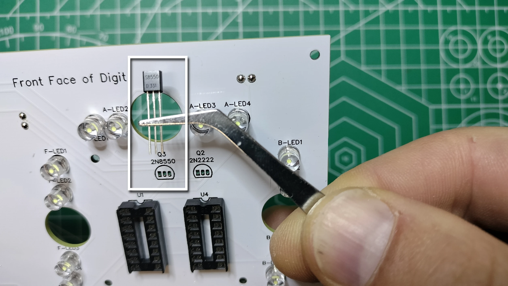
1. Following the diagram below, solder the 2N2222A PNP transistor into the though hole labelled 2N2222 on the front face of the controller PCB.

## Headers for the Pico and PicoW

On the back side of the PCB, place the four 20 pin headers into the through holes for **RASP1** and **RASP2**. Carefully turn over the PCB while keeping the 20 pin headers in the through holes. Level the PCB and adjust the two 20 pin headers so they are perpendicular to the PCB. To keep the headers perpendicular to the PCB, you can provide a temporary solder onto a pin or use a jig. Solder the pins once in place. Snip all the pins flush, resolder each to a smooth bead, then remove the flux with a cotton dabbed with isopropyl alcohol.
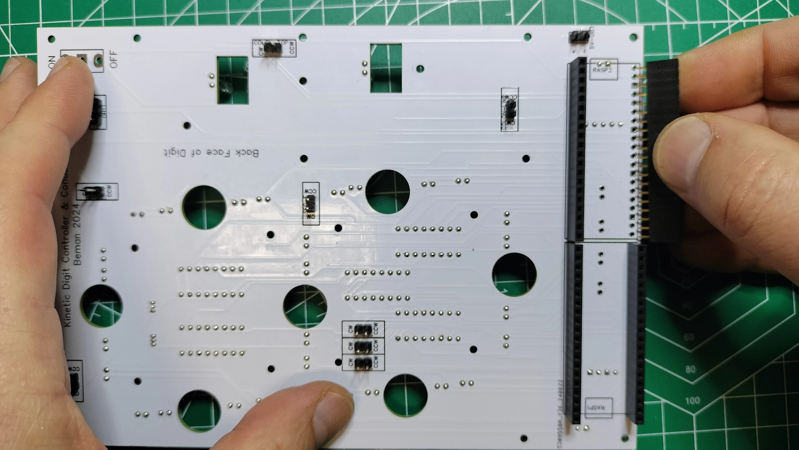

## Surface mount resistors

On the back side of the PCB, solder the two 10kΩ resistors onto the pads marked **R2 10k** and **R3 10k** located between the top and bottom rows of the 20-pin headers. Soldering surface mount components require a slightly different skill than through hole soldering as you'll need to use tweezers to center the resistor over the pads and apply a minimal amount of solder. There are several online tutorials on how to solder surface mount compontents using a soldering iron and tweezers.
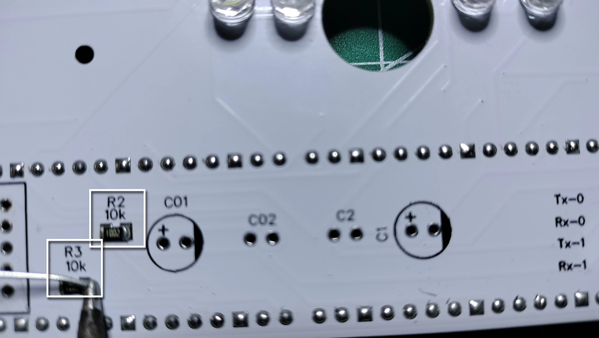

## Install Six, two port (2P) Terminal Block Connectors

There are five 2P terminal block connectors on the front face of the PCB, and one on the back side.
The diagram below shows a completed install of the terminal block connectors on the front face of the controller PCB. Note the arrows pointing in the direction of the terminal block connector where the wires are inserted into the ports. To follow the steps below, you'll position the front face of the controller PCB up, then work your way from the bottom left corner **1**, to the bottom right corner **5**.
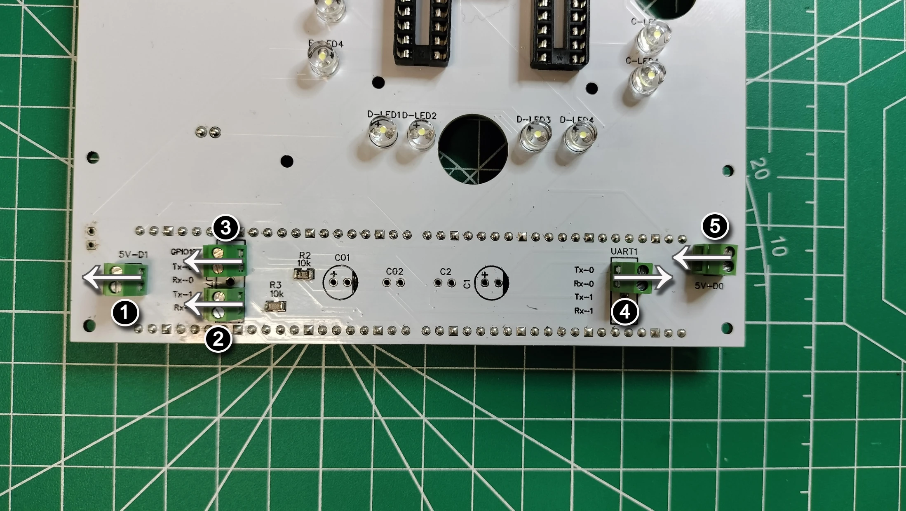

1. Follow the diagram below and insert the 2P terminal block connector into the **5v-D1** through holes with the connector facing LEFT, then solder it into place.
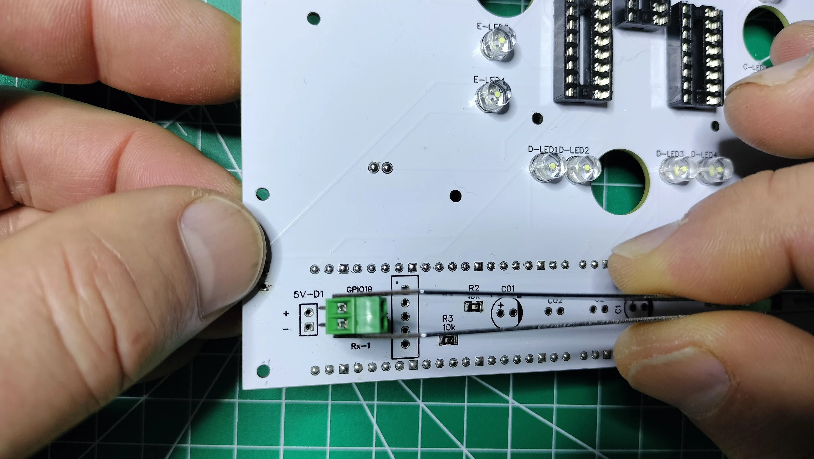
1. Follow the diagram below and insert the 2P terminal block connector into the **U7, Tx-1 Rx-1** through holes with the connector facing LEFT, then solder it into place.
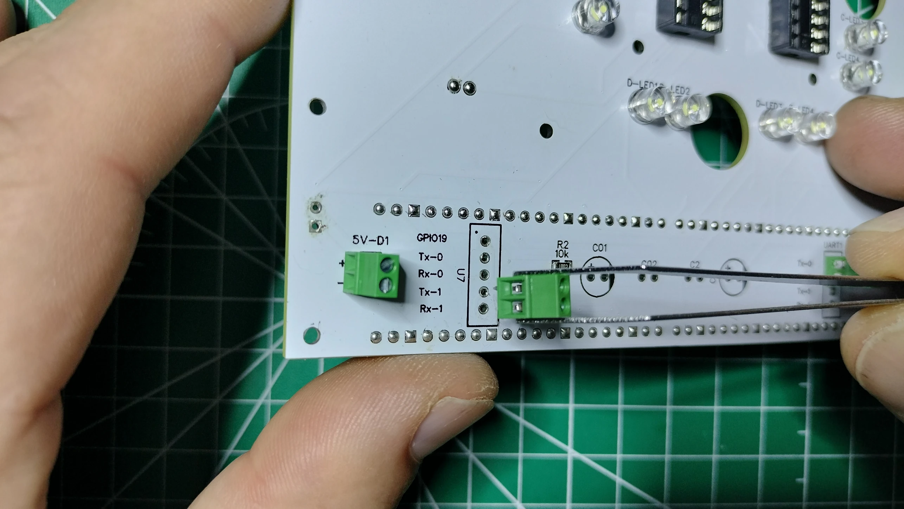
1. Follow the diagram below and insert the 2P terminal block connector into the **U7, GPIO19 Tx-0** through holes with the connector facing LEFT, then solder it into place.
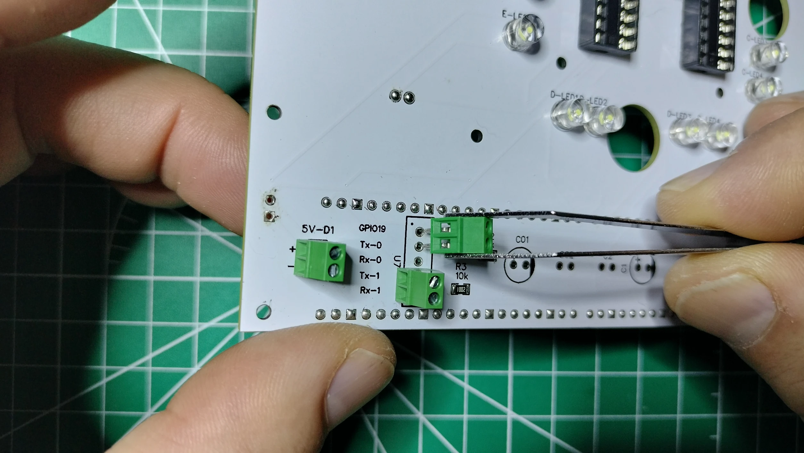
1. Follow the diagram below and insert the 2P terminal block connector into the **UART1, Tx-0 Rx-0** through holes with the connector facing RIGHT, then solder it into place.
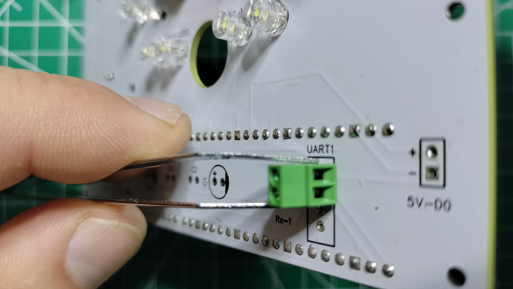
1. Follow the diagram below, insert the 2P terminal block connector into the **5v-D0** through holes with the connector facing LEFT, then solder it into place.
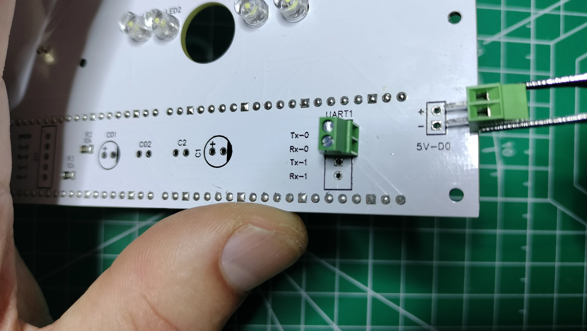
1. Position the back face of the PCB up and insert the 2P terminal block connector into the **5v-OUT** through holes with the connector facing RIGHT, then solder it into place.
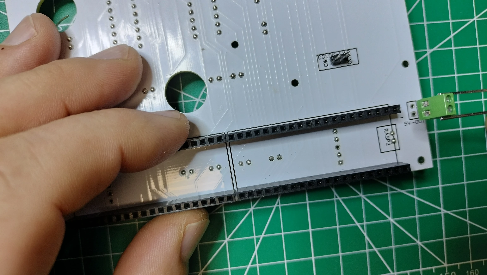

## Electrolytic and Ceramic Capacitors

1. On the front of the controller PCB, align the electrolytic capacitor "-" sign opposite the "+" printed on the PCB for capacitor **c01** and **c1**, see the picture below. Insert the pins into the through holes, then turn the controller PCB over to the back side and solder the capacitors.
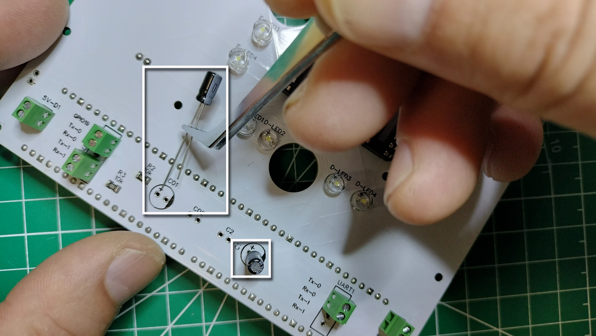
1. On the front of the controller PCB, insert the ceramic capacitor pins into the through holes titled **c02** and **c2**. Ceramic capacitors are non-polarized and can be inserted in either direction. Turn the controller PCB over to the back and solder the capacitors.
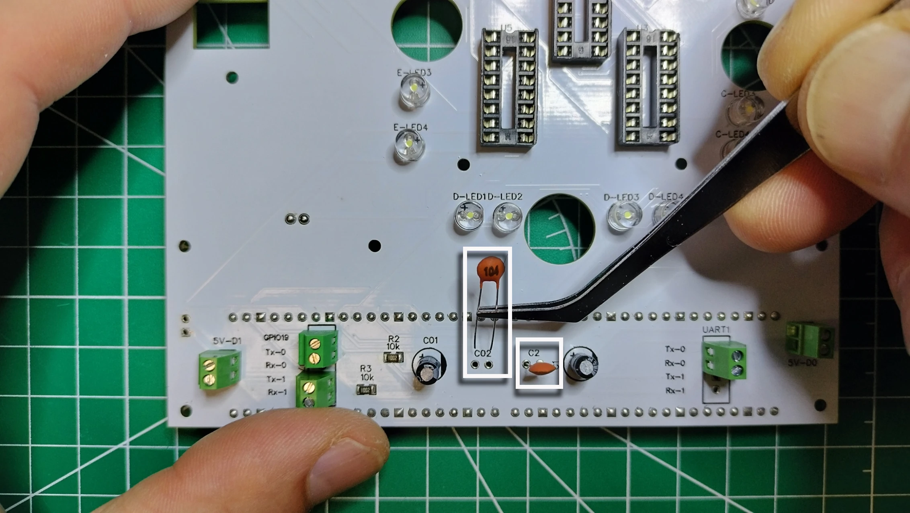

## Mount the Motor Drivers

On the front face of the controller PCB, [mount the L293D 16-pin IC Stepper Motor Drivers](digitpcbassembly.md/#mount_the_motor_drivers) as previously completed for the digit PCBs.
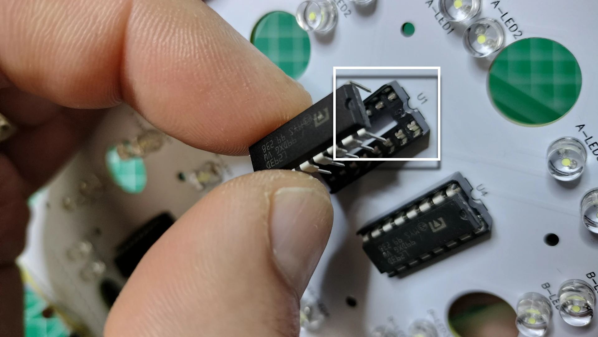

## Vertical Slide SPDT Switch

On the back face of the controller PCB, insert the SPDT vertical slide switch pins into the **ON/OFF** through holes found on the top right hand corner, then solder into place.
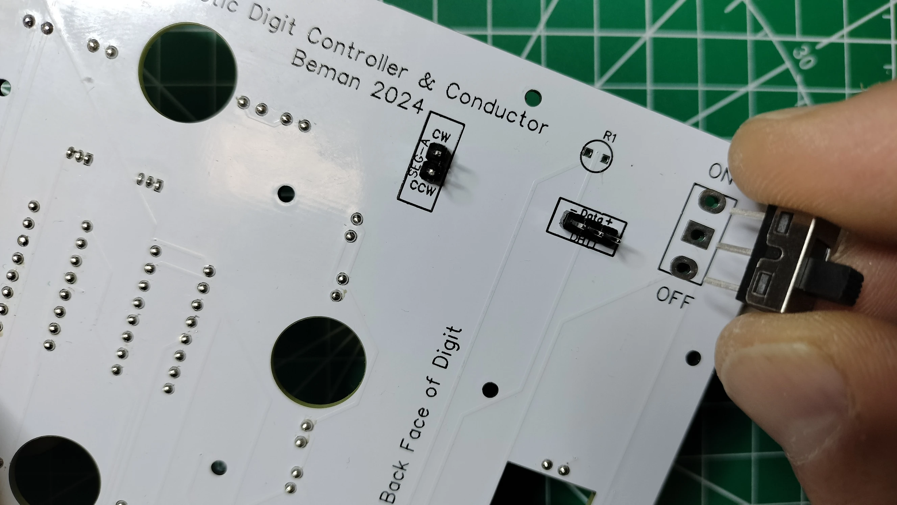

## Light Dependent Resistor (LDR)

Following the picture below and from the back face of the controller PCB, place the two LDR pins into the **R1** through holes. Bend the pins of the LDR upward so the head of the LDR fits tightly on the top of controller PCB. Solder the LDR in place once properly positioned.

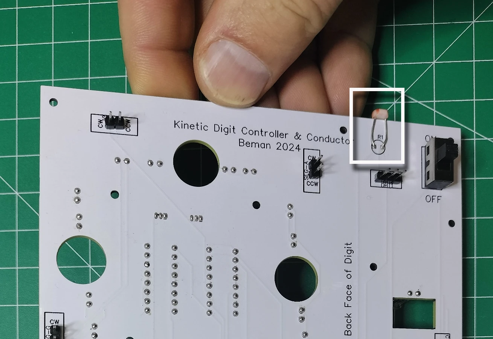

Congratulations, you've completed assembling the controller and digit 1 PCB!

## Controller and Digit 1 Schematics

The schematic in this section represents the **Colons & Display Microcontroller** portion of the circuit for the controller and digit 1 PCB. Below is an explanation of the various components, their purpose, and how the circuitry functions:

### **Key Components and Their Purpose**

1. **Raspberry Pi Pico W (Microcontroller)**:
   - **Purpose**: Acts as the central processing unit for the display. It controls the colons and communicates with the digits.
   - **Functions**:
     - Sends commands to the digits (e.g., what to display, brightness levels).
     - Manages Wi-Fi connectivity for remote control and time synchronization.
     - Handles scheduling for displaying time, date, and environmental data.
     - Controls power-saving modes by turning off unused digits.

2. **4-Pin UART (U7) and Low Power mode pin connector**:
   - **Purpose**: Provides communication between the microcontroller and the digits via UART (Universal Asynchronous Receiver-Transmitter).
   - **Pins**:
   - `Tx-0`, `Rx-0`, `Tx-1`, `Rx-1`: Used for transmitting and receiving data to/from the digits.
   - `GPIO19`: is used to turn on and off the power to the buck converters to Digits 0, 2, and 3.

3. **L293D Motor Driver IC (U5)**:
   - **Purpose**: Drives the colon motors (top and lower colons) to control their movement.
   - **Pins**:
     - `ENABLE1` and `ENABLE2`: Enable the motor driver channels.
     - `INPUT1`, `INPUT2`, `INPUT3`, `INPUT4`: Control the direction of the motors.
     - `OUTPUT1`, `OUTPUT2`, `OUTPUT3`, `OUTPUT4`: Provide the output signals to the motors.
   - **Functionality**: Allows the microcontroller to control the colon motors for precise positioning.

4. **2-Port Terminal Block Connectors**:
   - **Purpose**: Provide connections for external components like power, UART communication, and sensors.
   - **Examples**:
     - `5V-D1`, `5V-D0`: Power connections for the digits.
     - `UART1`, `Tx-0`, `Rx-0`: UART communication lines.
     - `5V-OUT`: Power output for external components.

5. **PNP and NPN Transistors (S8550 and 2N2222)**:
   - **Purpose**: Act as switches or amplifiers for controlling various components.
   - **S8550 (PNP)**: Used for switching power to specific components.
   - **2N2222 (NPN)**: Used for driving loads or amplifying signals.

6. **Light Dependent Resistor (LDR)**:
   - **Purpose**: Measures ambient light levels to adjust the brightness of the display dynamically.
   - **Placement**: Connected to `R1` and works with the microcontroller to sense light intensity.

7. **Electrolytic and Ceramic Capacitors (C01, C1, C02, C2)**:
   - **Purpose**: Provide power filtering and decoupling to ensure stable operation of the circuit.
   - **Electrolytic Capacitors**:
     - Polarized, used for smoothing power supply fluctuations.
   - **Ceramic Capacitors**:
     - Non-polarized, used for high-frequency noise filtering.

8. **Vertical Slide SPDT Switch (SW1)**:
   - **Purpose**: Acts as an on/off switch for the entire circuit where off may be **Low Power** or **Admin** mode. When the switch is turned off and the 12v power supply is connected and plugged into wall power, the Pico W provides its own wifi and web service allowing you to connect to its web page and remotely change the display settings. When the switch is changed to the off position while the display is actively running, then the display will retract all the segments and enter low power mode.
   - **Placement**: Connected to the power input to control the flow of power to the PCB.

9. **Resistors (R2, R3)**:
   - **Purpose**: Limit current and set voltage levels in the circuit.
   - **R2 and R3 (10kΩ)**: Pull-up or pull-down resistors for stabilizing signals.

10. **LEDs (TOP-LED1, LWR-LED1)**:
    - **Purpose**: Indicate the status of the colons.
    - **Placement**: Positioned on the PCB to align with the colon segments.

11. **DHT22 Sensor Connector**:
    - **Purpose**: Provides a connection for the Digital Humidity and Temperature (DHT) sensor.
    - **Functionality**: Allows the microcontroller to read environmental data for display.

### **How the Circuitry Works**

1. **Power Supply**:
   - Power is supplied by buck converters through the `5V-OUT` and `5V-D1/D0` terminal blocks.
   - Capacitors (C01, C1, C02, C2) stabilize the power supply and filter noise for the microcontrollers.

2. **Microcontroller Control**:
   - The Raspberry Pi Pico W serves as the brain of the circuit, controlling all components.
   - It communicates with the digits via UART (U7) and controls the colon motors through the L293D motor driver (U5).

3. **Colon Motor Control**:
   - The L293D motor driver receives control signals from the microcontroller to drive the colon motors.
   - The `ENABLE` and `INPUT` pins determine the speed and direction of the motors.

4. **Display Brightness Adjustment**:
   - The LDR (R1) measures ambient light levels and sends the data to the microcontroller.
   - The microcontroller adjusts the brightness of the LEDs accordingly.

5. **Wi-Fi and Scheduler**:
   - The Raspberry Pi Pico W connects to a Wi-Fi network to synchronize time and fetch weather data.
   - The scheduler manages the display of time, date, and environmental data.

6. **Low Power Mode**:
   - The microcontroller uses the S8550 and 2N2222 transistors to switch off power to the DHT22 in low-power mode.

7. **User Interaction**:
   - The SPDT switch (SW1) allows the user to turn the circuit on or off.
   - The LEDs provide visual feedback for the status of the colons.

### **Summary**

This circuit is designed to control the colons of the display, acting as the central hub for communication, power management, and environmental data integration. The Raspberry Pi Pico W microcontroller orchestrates all operations, while the supporting components ensure stable and efficient functionality.

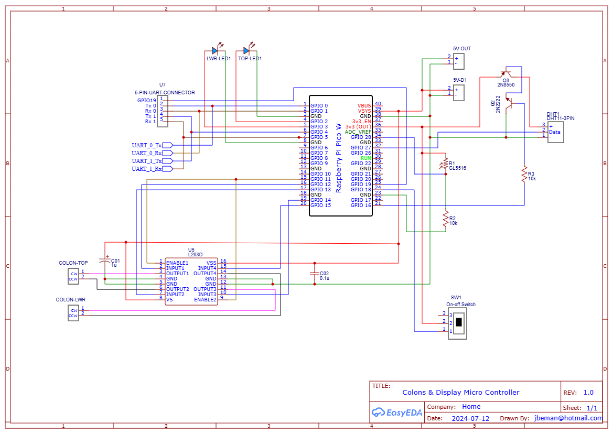
