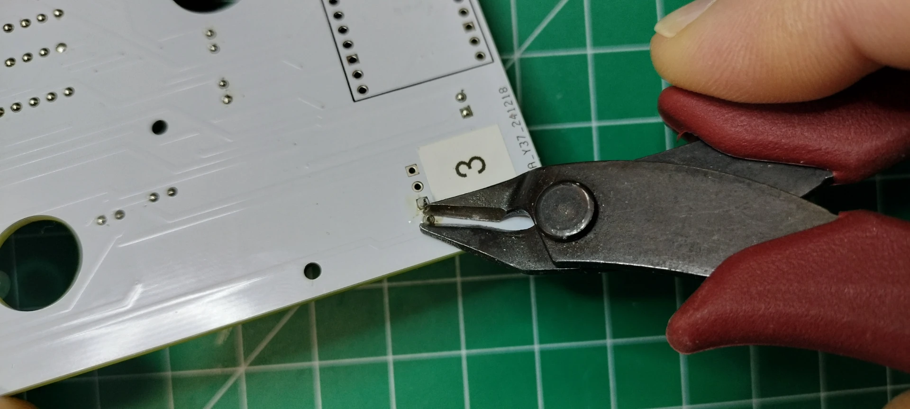

# Controller and Digit 1 PCB Assembly

Digit 1 and the colons are on a single PCB. Digit 1 is identical to digits 0, 2, and 3 except it is contained on a single PCB with the colons. The controller operates the colons and is the central command and control for the display performing the following functions:

- Sends commands to digits as to what to display (i.e. 0-9, A-F)
- Sends commands for the brightness of the digits
- When in the Admin mode, it will transmit its own wifi service that provides a way to change the display settings
- Manages the scheduler, which is the mechanism for displaying time, date, external temperature and humidity, and interior temperature and humidity.
- When connected to a wifi network, it will obtain its public facing IP address, look up the time zone it is located in, and set the display to the local time
- When connected to a wifi network, it will obtain the closest weather station and, depending on the scheduler, may display the external temperature and humidity.
- Manages the low power consumption mode by turning off the power to digits 0-3.  When awakened, it will turn back on the power to digits 0-3.

Below is the fully assembled, front face of the controller PCB.

Below is the fully assembled, back side of the controller PCB.

## Prerequisites

- [Fabrication of the digit PCBs](../createandorder/pcb.md)
- Table of components and tools

***Table of components***

| Quantity | Component | Image |
| :--: | :------| :-----: |
| 5 | 16 pin IC socket | |
| 5 | L293D stepper motor driver | |
| 4 | 20 pin female header connector | |
| 1 | 20 pin single row breakaway male connector | |
| 6 | 2 Port PCB Mount Screw Terminal Block Connector Straight Pin | |
| 2 | 0.1μ farad ceramic capacitor | |
| 2 | 1μ farad electrolytic capacitor | |
| 28 | 5mm Flat top LED, anode long lead (any color) | |
| 2 | 3mm Flat top LED, anode long lead (any color) | |
| 1 | Raspberry Pi Pico 2040 with Headers | |
| 1 | Raspberry Pi Pico W 2040 with Headers | |
| 1 | Controller PCB | See next section |

***Table of tools***

| Required | Tool | Image |
| :---: | :------- | :---: |
| Yes | Soldering station    | |
| Yes | 0.8mm 1.76oz RoHS flux core solder | |
| Yes | Mini flush cutters   | |
| Yes | Isopropyl Alcohol | |
| Yes | Cotton Facial Pads | |

## Assemble Digit 1

On the controller PCB, follow the instructions from the digit PCB assembly to assemble digit one.

1. [Add the 16 pin headers](digitpcbassembly.md#add-the-16-pin-headers). Note **"A"** in the picture below that you'll add an additional (5th) 16 pin header to the controller PCB.

1. [Add the 28 5mm LEDs](digitpcbassembly.md#add-the-28-leds). Do not solder the 5mm LED into the "Top-LED1" or "LWR-LED1" location on the controller PCB. Instructions later in this section will detail how to install the 3mm LEDs into the "Top-LED1" and "LWR-LED1" locations.

1. [Add the motor pins](digitpcbassembly.md#add-the-motor-pins). There are two additional motor pins (pairs) you'll need to add, on the back face of the PCB titled "Colon-Top" and "Colon-LWR"

## Mount the L293D 16-pin IC Stepper Motor Drivers

1. From the front of the digit PCB, orient the motor driver so the notch (or pin 1) is aligned with the 16 pin header.

1. CAREFULLY insert the motor driver into the 16 pin header and ensure none of the pins on the motor driver are bent or protruding from the 16 pin header.

1. Repeat the install for the remaining motor drivers.

## Add the PCB Mount, Two port (2P) Terminal Block Connectors

1. On the front of the digit PCB, insert the PCB two port terminal block connector into the 5v through holes so the face of the connector where the wires are inserted points toward the LEDs on the PCB.

1. Solder the block terminal connector pins on the back of the digit PCB.

1. On the front of the digit PCB position the 2 port terminal block connector facing away from the LEDs. For PCBs labelled "2" & "3", insert the connector pins into the UART Tx-1/Rx-1 through holes. For the digit PCB labelled "0", insert the connector into the Tx-0/Rx-0 through holes.

1. On the back of the digit PCB, solder the remaining connector pins, cut the pins flush, resolder to a smooth bead, then remove the flux wth a cotton dabbed with isopropyl alcohol.

## Add the Electrolytic and Ceramic Capacitors

1. On the front of the digit PCB, align the electrolytic capacitor "-" sign opposite the "+" printed on the PCB for capacitor "c1", see the picture below. Insert the pins into the through holes, then turn the digit PCB over to the back side and solder the capacitor.

1. On the front of the digit PCB, insert the ceramic capacitor pins into the through holes titled "c2". Turn the digit PCB over to the back and solder the capacitor.
!!! note
    Ceramic capacitors do not have polarity and can be inserted in any direction.

4. On the back of the digit PCB, cut the pins flush, resolder to a smooth bead, then remove the flux with a cotton dabbed with isopropyl alcohol.

## Add the 20 pin Headers and Install the Microcontroller

1. On the back side of the PCB, place the two 20 pin headers into the through holes for "RASP1". Carefully turn over the PCB while keeping the 20 pin headers in the through holes.

1. Level the PCB and adjust the two 20 pin headers so they are perpendicular to the PCB. Solder the pins once in place. Snip all 40 of the pins flush, resolder each to a smooth bead, then remove the flux with a cotton dabbed with isopropyl alcohol.

1. Orient the Raspberry Pi Pico 2040 microcontroller so the USB port is facing in the same direction as the PCB silk screen, then gently mount the microcontroller onto the header.

Congratulations for assembling a digit PCB! Be sure to test the digit PCB before assembling the next one.

## Digits 0, 2, & 3 Schematics

