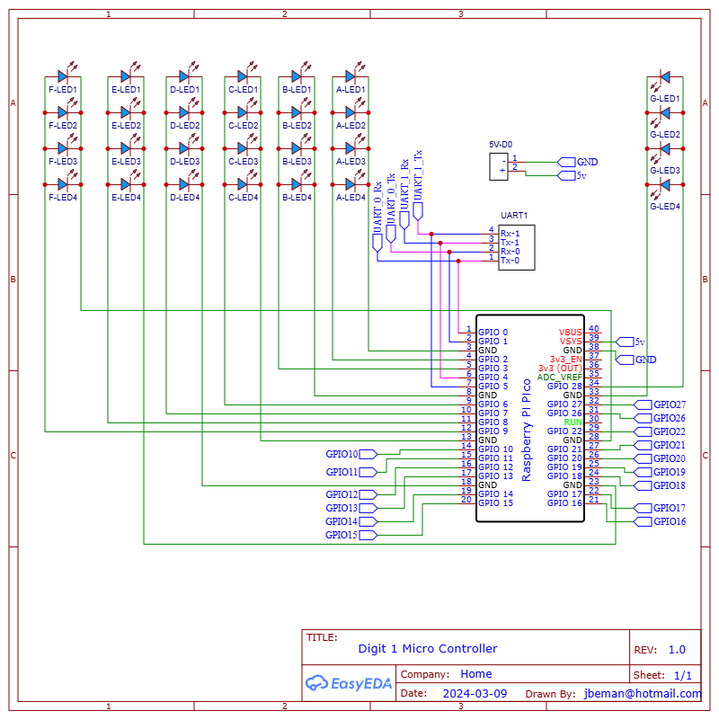

# Controller and Digit 1 PCB Assembly

Digit 1 and the colons are on a single PCB. Digit 1 is identical to digits 0, 2, and 3 except it is contained on a single PCB with the colons. The Raspberry Pi Pico W microcontroller operates the colons and is the central command and control for the display performing the following functions:

- Sends commands to digits as to what to display (i.e. 0-9, A-F)
- Sends commands for the brightness of the digits
- When in the Admin mode, it will transmit its own wifi service that provides a way to change the display settings
- Manages the scheduler, which is the mechanism for displaying time, date, external temperature and humidity, and interior temperature and humidity.
- When connected to a wifi network, it will obtain its public facing IP address, look up the time zone it is located in, and set the display to the local time
- When connected to a wifi network, it will obtain the closest weather station and, depending on the scheduler, may display the external temperature and humidity.
- Manages the low power consumption mode by turning off the power to digits 0-3.  When awakened, it will turn back on the power to digits 0-3.

Front face of the controller PCB fully assembled.

Back side of the controller PCB fully assembled.

## Prerequisites

- [Fabrication of the controller and digit one PCB](../createandorder/pcb.md)
- 3D print of the upper and lower colons

***Table of components***

| Quantity | Component | Image |
| :--: | :------ | :-----: |
| 5 | 16 pin IC socket | |
| 5 | L293D stepper motor driver | |
| 4 | 20 pin female header connector | |
| 1 | 20 pin single row breakaway male connector | |
| 1 | Vertical Slide Switch Micro High Knob 3 Pin 2 Position 1P2T SPDT Panel Mount | |
| 6 | 2 Port PCB Mount Screw Terminal Block Connector Straight Pin | |
| 2 | 0.1μ farad ceramic capacitor | |
| 2 | 1μ farad electrolytic capacitor | |
| 28 | 5mm Flat top LED, anode long lead (any color) | |
| 2 | 3mm Flat top LED, anode long lead (any color) | |
| 1 | Raspberry Pi Pico 2040 with Headers | |
| 1 | Raspberry Pi Pico W 2040 with Headers | |
| 1 | Controller PCB | See next section |

***Table of tools***

| Required | Tool | Image |
| :------: | :------- | :---: |
| Yes | Soldering station    | |
| Yes | 0.8mm 1.76oz RoHS flux core solder | |
| Yes | Mini flush cutters   | |
| Yes | Isopropyl Alcohol | |
| Yes | Cotton Facial Pads | |

## Assemble Digit One

On the controller PCB, follow the instructions from the digit PCB assembly to assemble digit one.

1. On the front face of the controller PCB, [add the 16 pin headers](digitpcbassembly.md#add_the_16_pin_headers) as previously completed for the digit PCBs. Note the highlighted sections in the picture below that you'll add an additional (5th) 16 pin header to the controller PCB.

1. On the front face of the controller PCB, [add the 28 5mm LEDs](digitpcbassembly.md#add_the_28_leds) as previously completed for the digit PCBs. Do not solder the 5mm LED into the **Top-LED1** or **LWR-LED1** location on the controller PCB. Instructions later in this section will detail how to install the 3mm LEDs into the "Top-LED1" and "LWR-LED1" locations.

1. On the back face of the controller PCB, [add the motor pins](digitpcbassembly.md#add_the_motor_pins). Note the highlighted sections in the picture below that there are two additional motor pins (pairs) you'll need to add, and an additional 3-pin connector for the Digital Humidity Temperature (DHT) sensor.

## Colon Segments LEDs

In addition to the soldering equipment you needed when previously mounting the 5mm flat top LEDs, you'll need the two 3D printed colon segments, label **A** in the diagram below, as fabricated in the [3D print the display parts](../createandorder/3dprints.md) document.

1. Following label **B** in the diagram above, insert the 3mm flat top LEDs into **Top-LED1** and **LWR-LED1** on the front face of the controller PCB. Follow the same 5mm LED install process and be sure to insert the long lead anode of the LED into the **+** through hole.
2. Following the diagram below, slide the colon segments over the 3mm LED. Note the lower base of the LED lense may need to be lightly sanded with 300 grid sandpaper if it does not easily slide into the colon segment.

3. On the back side of the controller PCB, align the colon segment so its square base is positioned into the square hole of the PCB.

4. Solder the 3mm LEDs into place.

5. Optionally you can use a metric ruler to verify the LEDs protrude perpendicular from the PCB and are 14mm from the PCB to the top of the lens of the LED. This optional step insures the proper length of the 3mm LEDs.

## PNP and NPN transistors

1. Following the diagram below, solder the s8550D PNP transistor into the through hole (mis-) labelled 2N8550 on the front face of the controller PCB.

1. Following the diagram below, solder the 2N2222A PNP transistor into the though hole labelled 2N2222 on the front face of the controller PCB.

## Headers for the Pico and PicoW

On the back side of the PCB, place the four 20 pin headers into the through holes for **RASP1** and **RASP2**. Carefully turn over the PCB while keeping the 20 pin headers in the through holes. Level the PCB and adjust the two 20 pin headers so they are perpendicular to the PCB. Solder the pins once in place. Snip all 40 of the pins flush, resolder each to a smooth bead, then remove the flux with a cotton dabbed with isopropyl alcohol.

## Surface mount resistors

On the back side of the PCB, solder the two 10kΩ resistors onto the pads marked **R2 10k** and **R3 10k** located between the top and bottom rows of teh 20-pin headers.

## Install Six, two port (2P) Terminal Block Connectors

There are five 2P terminal block connectors on the front face of the PCB, and one on the back side.
The diagram below shows a completed install of the terminal block connectors on the front face of the controller PCB. Note the arrows pointing in the direction of the terminal block connector where the wires are inserted into the ports. To follow the steps below, you'll position the front face of the controller PCB up, then work your way from the bottom left corner **1**, to the bottom right corner **5**.

1. Follow the diagram below and insert the 2P terminal block connector into the **5v-D1** through holes with the connector facing LEFT, then solder it into place.

1. Follow the diagram below and insert the 2P terminal block connector into the **U7, Tx-1 Rx-1** through holes with the connector facing LEFT, then solder it into place.

1. Follow the diagram below and insert the 2P terminal block connector into the **U7, GPIO19 Tx-0** through holes with the connector facing LEFT, then solder it into place.

1. Follow the diagram below and insert the 2P terminal block connector into the **UART1, Tx-0 Rx-0** through holes with the connector facing RIGHT, then solder it into place.

1. Follow the diagram below, insert the 2P terminal block connector into the **5v-D0** through holes with the connector facing LEFT, then solder it into place.

1. Position the back face of the PCB up and insert the 2P terminal block connector into the **5v-OUT** through holes with the connector facing RIGHT, then solder it into place.

## Electrolytic and Ceramic Capacitors

1. On the front of the controller PCB, align the electrolytic capacitor "-" sign opposite the "+" printed on the PCB for capacitor **c01** and **c1**, see the picture below. Insert the pins into the through holes, then turn the controller PCB over to the back side and solder the capacitors.

1. On the front of the controller PCB, insert the ceramic capacitor pins into the through holes titled **c02** and **c2**. Turn the controller PCB over to the back and solder the capacitors.

## Mount the L293D 16-pin IC Motor Drivers

On the front face of the controller PCB, [mount the L293D 16-pin IC Stepper Motor Drivers](digitpcbassembly.md#mount_the_l293d_16_pin_ic_stepper_motor_drivers) as previously completed for the digit PCBs.

## Vertical Slide SPDT Switch

On the back face of the controller PCB, insert the SPDT vertical slide switch pins into the **ON/OFF** through holes found on the top right hand corner, then solder into place.

## Light Dependent Resistor (LDR)

## Controller and Digit 1 Schematics

