# Conductor PCB Test

Run the tests in this section after assembling the conductor PCB to ensure all the components on the PCB are soldered and functional. Any defective electronic component on the conductor PCB will need to be replaced before completing the project.

## Prerequisites

- [Completed Conductor and Digit 1 PCB ready for actuators](controllerpcbassembly.md).
- Computer and microcontroller with the [prerequisite software](../prerequisitesoftware.md).
- [Deployed the Conductor Project to the Conductor PCB](deploycontrollerproject.md)
- [Completed the digit PCB test](digitpcbtest.md) for digit 1 on the conductor PCB.

## Test the LED and Motor Segments

1. From Visual Studio Code, **(A)** select the File->Open Folder menu, **(B)** select the conductor folder, then **(C)** click the **Select Folder** button.
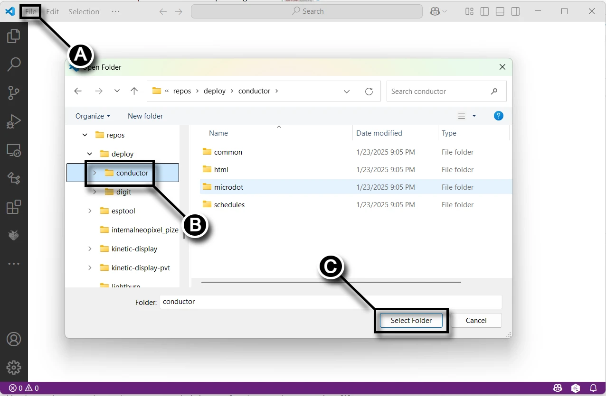
1. On the Conductor and Digit 1 PCB, **(A)** plug the USB cable from your computer into the USB port on the Raspberry Pi Pico W 2040. **(B)** Connect a motor actuator to the `TOP-LED1` with the white wire dupont connector plugged into `CW` pin and the black wire plugged into the `CCW` pin.
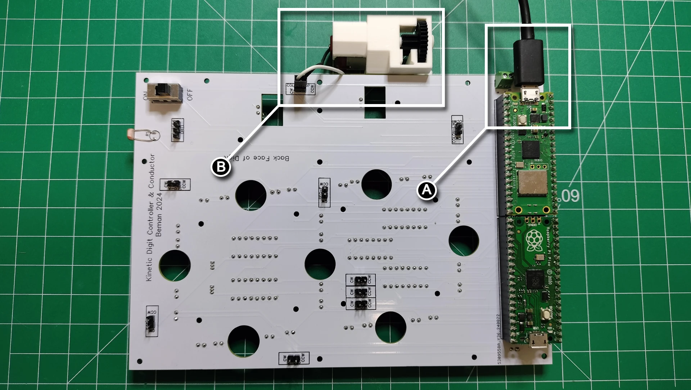
1. From Visual Studio Code, **(A)** select the `digit_colon.py` file, then **(B)** select **MicroPico vREPL** from the terminal pane menu.
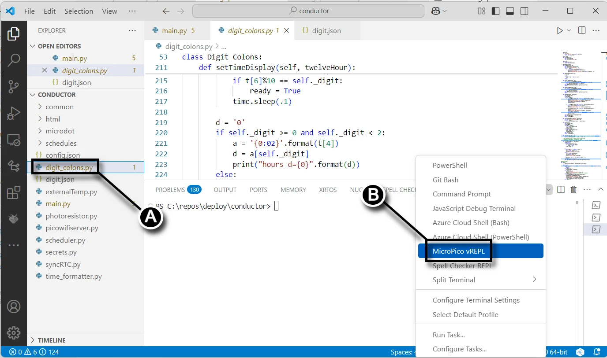
1. From the Visual Studio Code status bar, **(A)** verify the Raspberry Pi Pico W is connected. **(B)** Click the `Run` button to start the conductor PCB test application.
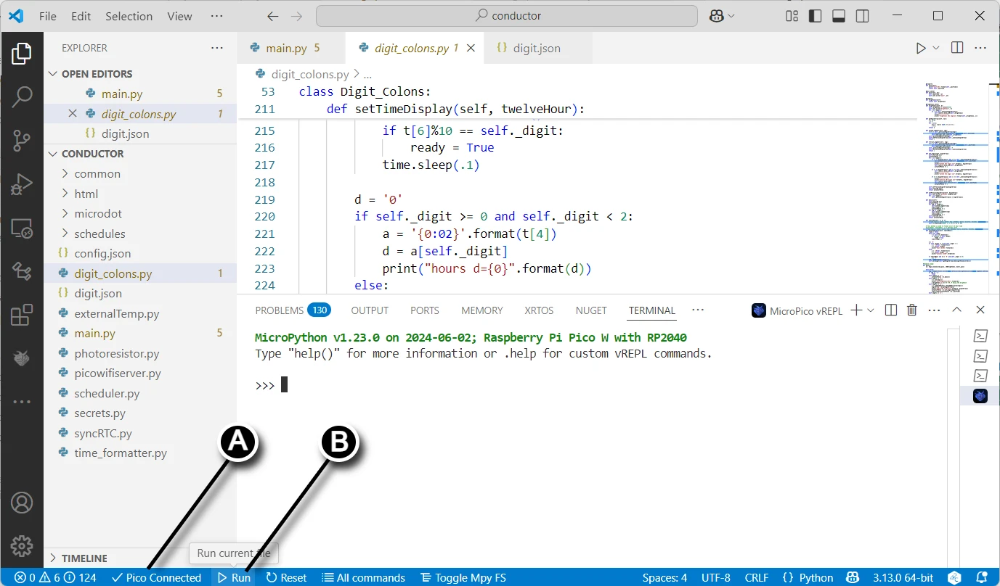
1. The console test application shows various options that relate to the top or bottom colon: the `TOP-LED1` is 0 and the `LWR-LED1` is 1. Extend `TOP-LED1` by typing **e0** in the console.
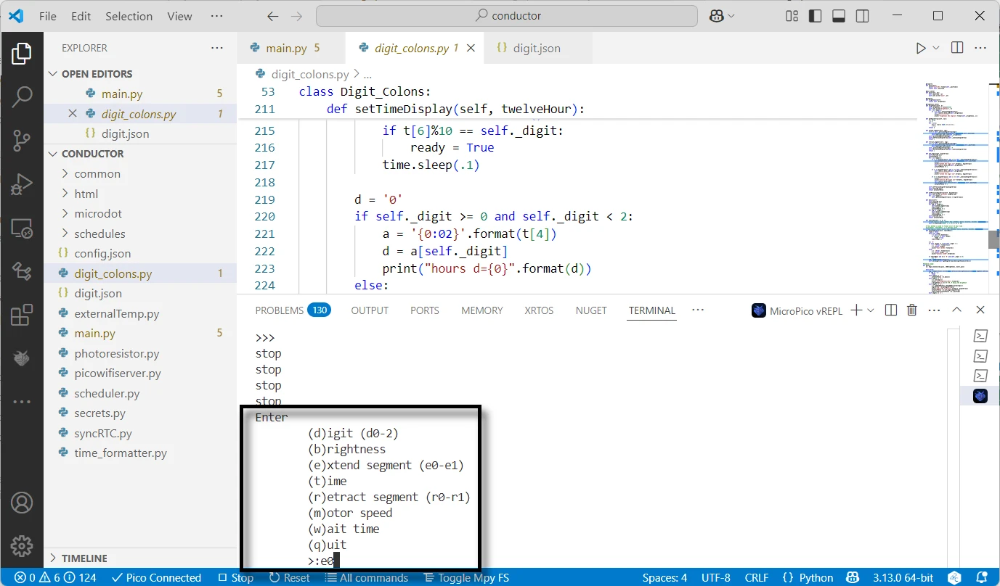
1. Following the picture below, the `TOP-LED1` LED light up and the motor briefly turns on. From the terminal session, type **r0** to retract the the `TOP-LED1`.
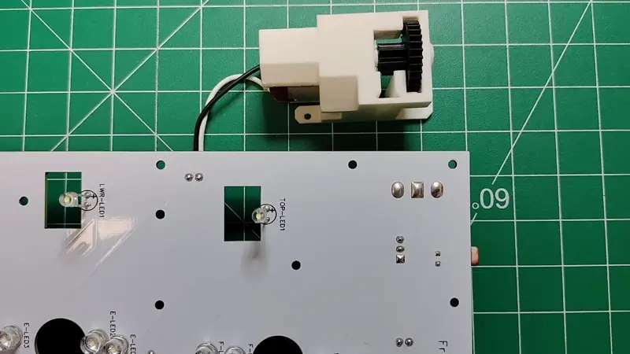
1. Repeat steps 5 and 6 to `COLON-LWR`.
1. Unplug the USB from the Raspberry Pi Pico W 2040 upon completion

## Test the Light Detection

1. On the Conductor and Digit 1 PCB, plug the USB cable from your computer into the USB port on the Raspberry Pi Pico W 2040.
1. From Visual Studio Code **(A)** select the file `photoresistor.py`, then **(B)** click the Run button in the status bar.
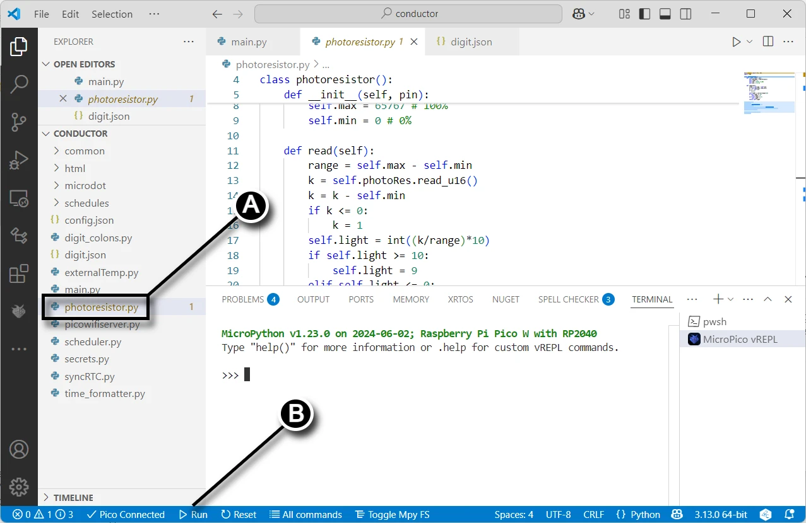
1. The terminal pane will print the light level, between 0 and 9, depending on the brightness of the light as detected by the LDR.
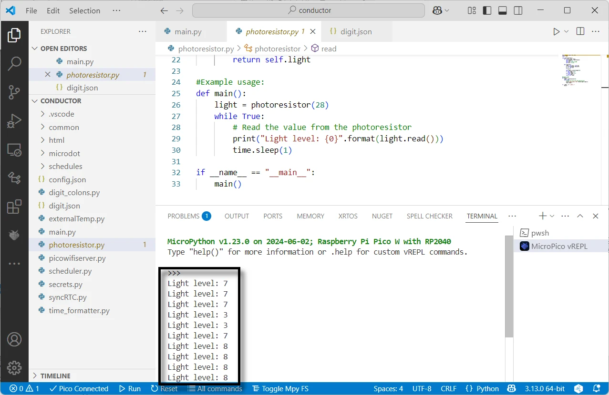
1. Unplug the USB from the Raspberry Pi Pico W 2040 upon completion

## Test the Humidity and Temperature

1. On the Conductor and Digit 1 PCB, **(A)** plug the USB cable from your computer into the USB port on the Raspberry Pi Pico W 2040. **(B)** Connect the DHT22 sensor by ensuring the `- Data +` pins in the `DHT1` silk screen align with the `+ out -` pins on the DHT22 sensor.
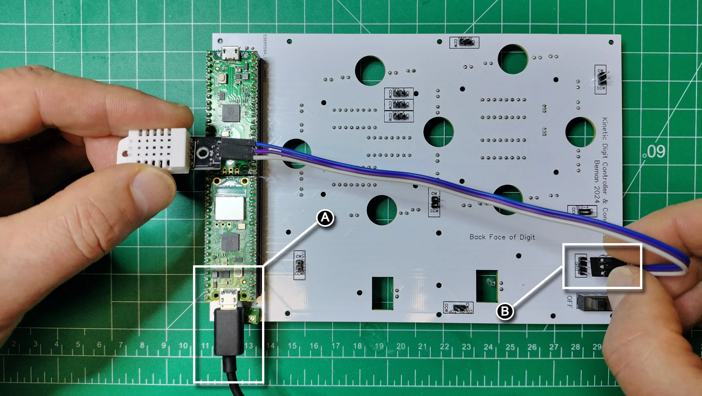
1. From Visual Studio Code **(A)** select the file `dhttest.py`, then **(B)** click the Run button in the status bar.
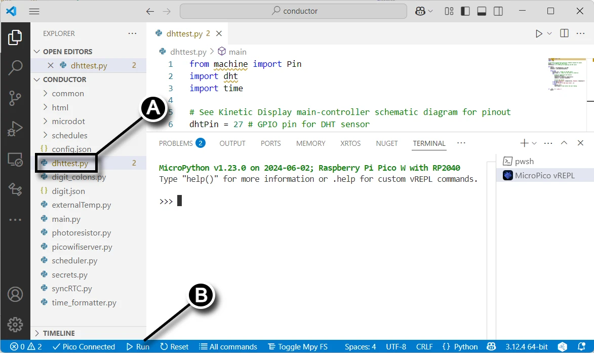
1. Verify the output in the terminal shows the temperature and humidity.
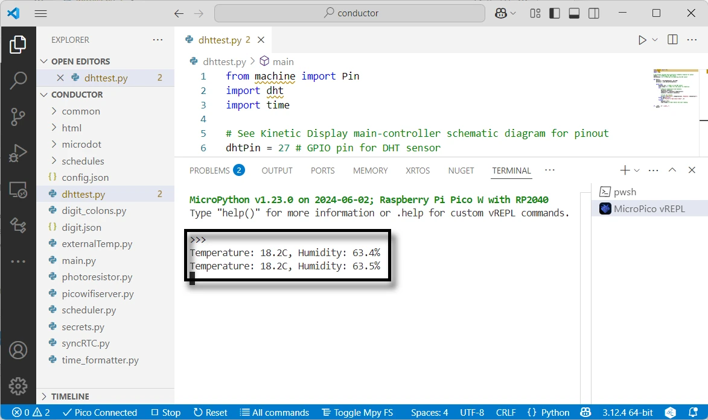
1. Unplug the USB from the Raspberry Pi Pico W 2040 upon completion