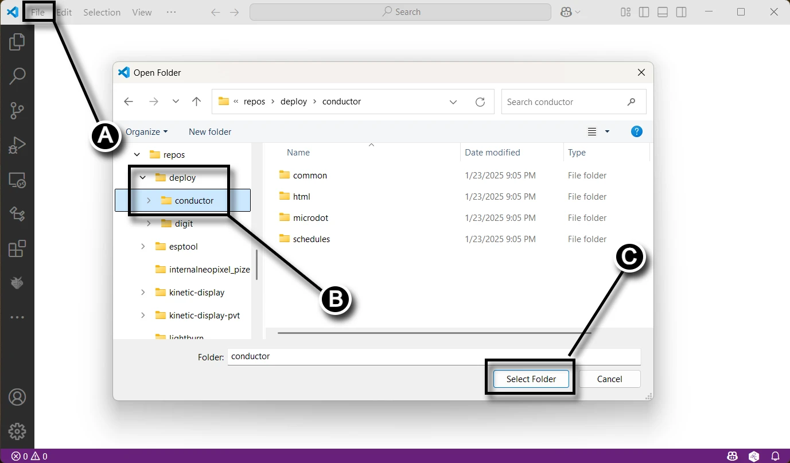
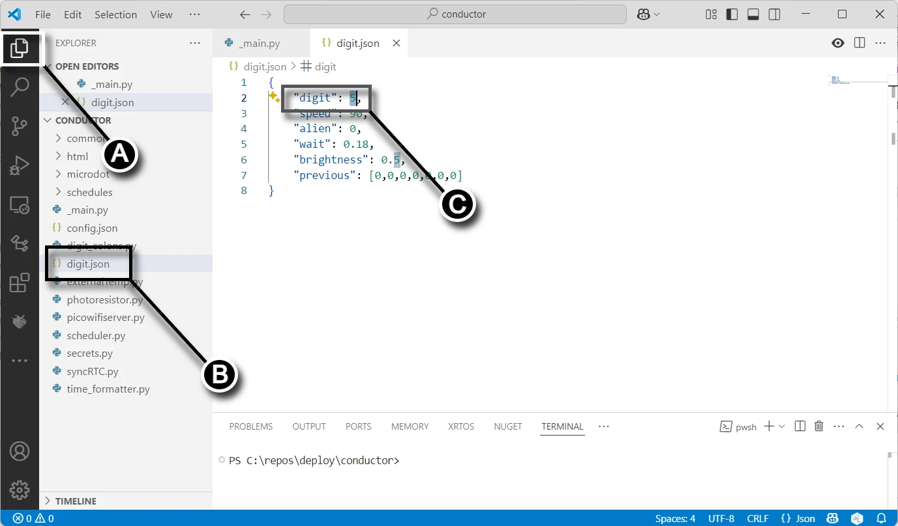
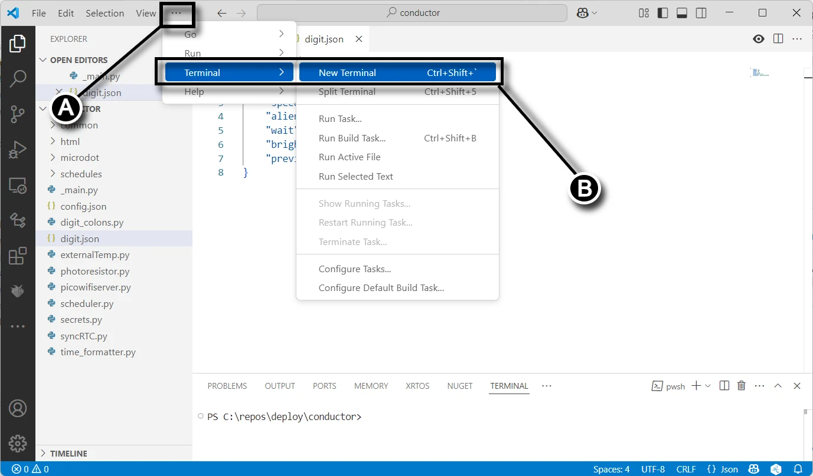
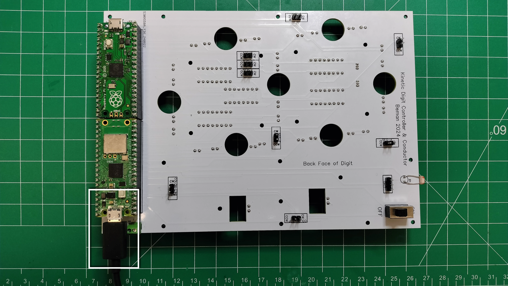
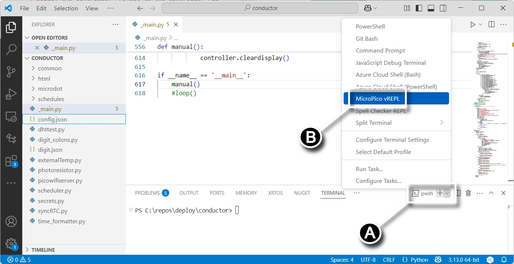
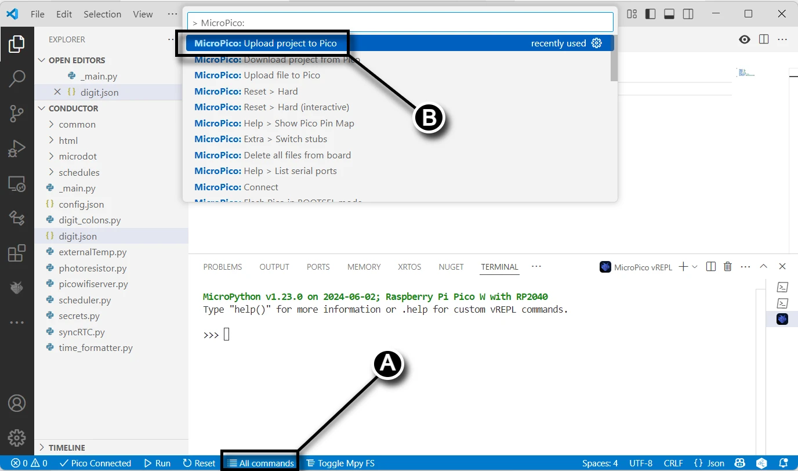

# Deploy the Controller Project to the Controller PCB

In this section you will upload code to your Raspberry Pi Pico W 2040 from your computer.

## Prerequisites

- Completed the assembly and soldering of the [Controller PCB](controllerpcbassembly.md)
- Created a fork of the Kinetic-Display GitHub repository, see [Software and Microcontroller Preparation](../prerequisitesoftware.md)
- Deployed the digit and controller directories, also see [Software and Microcontroller Preparation](../prerequisitesoftware.md)

## Configure and Deploy the Controller Project

1. Connect your Computer to the controller PCB Pico W 2040 per the instructions on [Verify Micropython on your Raspberry Pi Pico](../prerequisitesoftware.md)
2. Following the screen capture below from VS Code, select **(A)** **File->Open Folder...**, **(B)** open the **deploy/conductor** folder you deployed during step 4 in the section [Fork and Clone the Repository](../prerequisitesoftware.md), then **(C)** click the "Select Folder" button.

3. Following the screen capture below, select the Explorer icon (**A**) in the left [Activity bar](https://code.visualstudio.com/docs/getstarted/userinterface#_basic-layout). Click the digit.json file (**B**) in the Explorer pane. Change the **"digit":** value (**C**) to **4**. Don't forget to save the file after changing the value.

4. Following the screen capture below, create a new terminal by **(A) clicking the elipse ...**, then **(B) Terminal->New Terminal** submenu.

5. Connect your computer's USB port to a Digit's Raspberry Pi Pico.

6. Following the screen capture below, **(A) select the drop-down menu** in the terminal pane, then **(B) click the MicroPico vREPL submenu** item.

7. Following the screen capture below, click **All Commands** (**A**) on the [status bar](https://code.visualstudio.com/api/ux-guidelines/status-bar). In the Command text field (**B**), type "**Upload**" after "**> MicroPico:** ", then select the dropdown **MicroPico: Upload project to Pico**.

Congratulations on successfully uploading the code to the Digit's Raspberry Pi Pico W!