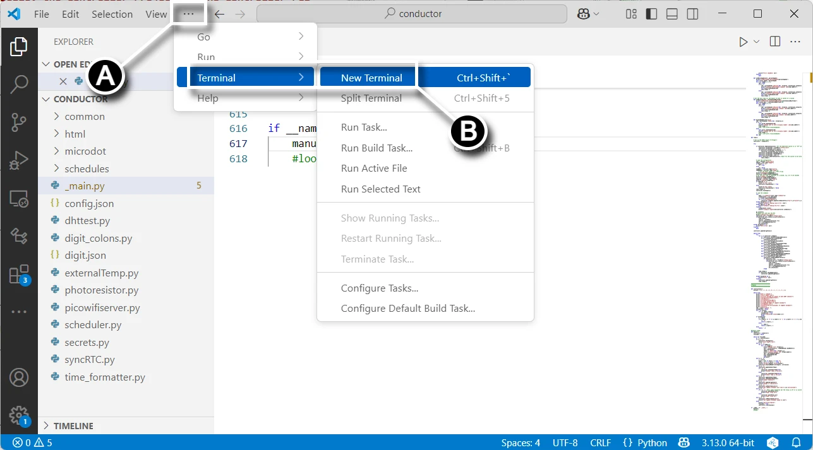

# Deploy the Conductor Project to the Conductor PCB

In this section you will upload code to your Raspberry Pi Pico W 2040 from your computer.

## Prerequisites

- Completed the assembly and soldering of the [conductor PCB](controllerpcbassembly.md)
- Created a fork of the Kinetic-Display GitHub repository, see [Software and Microcontroller Preparation](../prerequisitesoftware.md)
- Deployed the digit and controller directories, also see [Software and Microcontroller Preparation](../prerequisitesoftware.md)

## Configure and Deploy the Conductor Project

1. Connect your Computer to the conductor PCB Pico W 2040 per the instructions on [Verify Micropython on your Raspberry Pi Pico](../prerequisitesoftware.md)
1. Following the screen capture below from VS Code, select **(A)** **File->Open Folder...**, **(B)** open the **deploy/conductor** folder you deployed during step 4 in the section [Fork and Clone the Repository](../prerequisitesoftware.md), then **(C)** click the "Select Folder" button.

1. Following the screen capture below, **(A)** select the `main.py` file, **(B)** then comment out the call to the `loop()` function, and uncomment the `manual()` function. Finally, rename the `main.py` file to `_main.py`. Don't forget to save the file after changing the value.

1. Following the screen capture below, create a new terminal by **(A) clicking the elipse ...**, then **(B) Terminal->New Terminal** submenu.

1. Following the picture below, connect your computer's USB port to the Raspberry Pi Pico W 2040.

1. Following the screen capture below, **(A) select the drop-down menu** in the terminal pane, then **(B) click the MicroPico vREPL submenu** item.

1. Following the screen capture below, click **All Commands** (**A**) on the [status bar](https://code.visualstudio.com/api/ux-guidelines/status-bar). In the Command text field (**B**), type "**Upload**" after "**> MicroPico:** ", then select the dropdown **MicroPico: Upload project to Pico**.

Congratulations on successfully uploading the code to the Digit's Raspberry Pi Pico W!