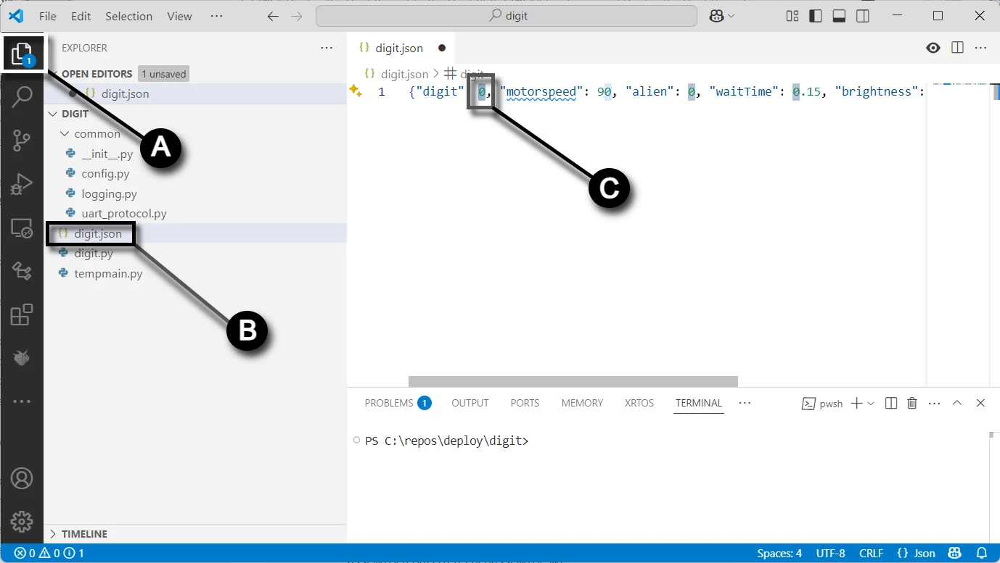
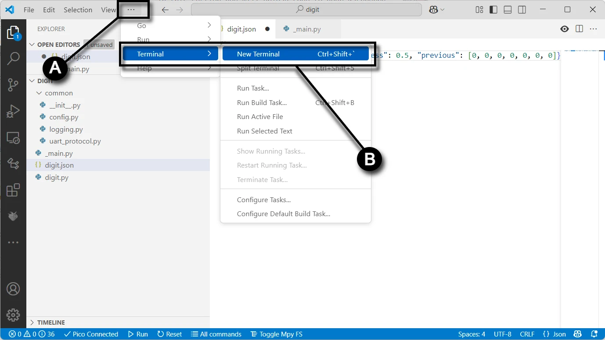
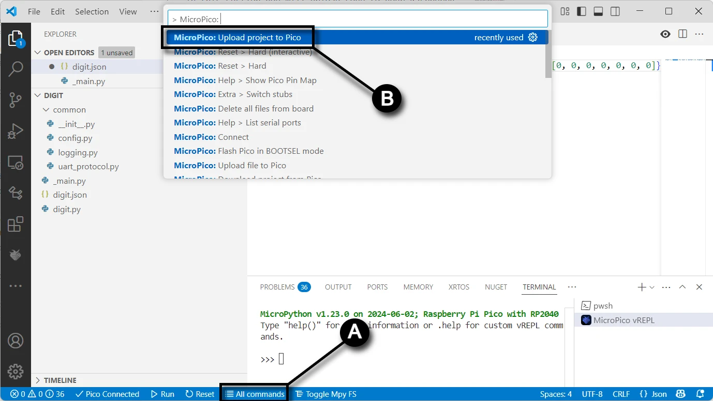

# Deploy the Digit Project to the Digit PCB

In this guide you will upload code from the **digit** folder on your computer to your Raspberry Pi Pico 2040.

## Prerequisites

- Completed the assembly and soldering of the [Digit PCB](digitpcbassembly.md)
- Created a fork of the Kinetic-Display GitHub repository (see [Software and Microcontroller Preparation](../prerequisitesoftware.md))
- Deployed the `digit` directory (see [Software and Microcontroller Preparation](../prerequisitesoftware.md))

## Configure and Deploy the Digit Project

1. **Connect the Digit PCB**: Connect your computer to the digit PCB's Raspberry Pi Pico as described in [Verify Micropython on your Raspberry Pi Pico](../prerequisitesoftware.md).
1. **Open the Deploy Folder**:  
      - In VS Code, select **(A)** **File -> Open Folder...**.  
      - **(B)** Navigate to the **deploy/digit** folder you deployed during step 4 in [Fork and Clone the Repository](../prerequisitesoftware.md).  
      - **(C)** Click the "Select Folder" button.  
      
1. **Update the digit.json File**:  
      - In the Explorer pane, click the **Explorer icon** (**A**) in the left [Activity bar](https://code.visualstudio.com/docs/getstarted/userinterface#_basic-layout).  
      - Open the `digit.json` file (**B**) and change the **"digit":** value (**C**) to match the PCB's labeled number (0-3).  
      - Save the file after making changes.  
      !!! warning
          Ensure the digit value in the `digit.json` file matches the PCB's labeled value to avoid incorrect behavior.  
    
1. **Create a New Terminal**:  
      - **(A)** Click the ellipsis (`...`) in the terminal pane.  
      - **(B)** Select **Terminal -> New Terminal** from the submenu.  
   
1. **Select the MicroPico vREPL**:  
      - Connect your computer's USB port to the digit PCB's Raspberry Pi Pico.  
      - In the terminal pane, **(A)** select the drop-down menu and **(B)** click the **MicroPico vREPL** submenu item.  
   
1. **Upload the Project**:  
      - Click **All Commands** (**A**) on the [status bar](https://code.visualstudio.com/api/ux-guidelines/status-bar).  
      - In the Command text field (**B**), type "**Upload**" after "**> MicroPico:**".  
      - Select the dropdown option **MicroPico: Upload project to Pico**.  
   

Congratulations on successfully uploading the code to the digit PCB's Raspberry Pi Pico!
