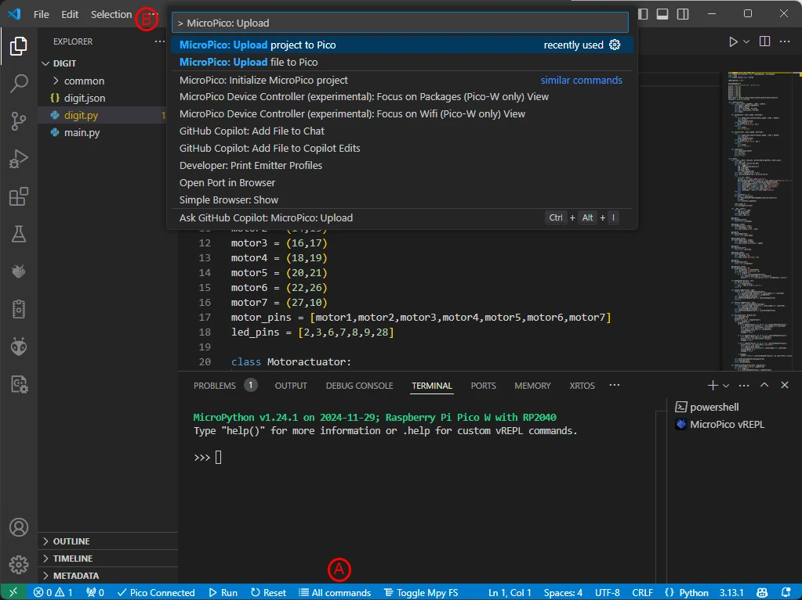
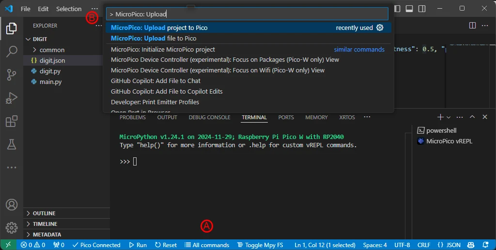
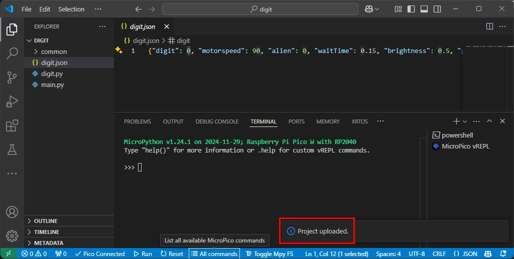

# Deploy the Digit Project to the Digit PCB

In this section you will deploy the software necessary to make the digit PCB work.

## Prerequisites

- Completed the assembly and soldering of the [Digit PCB](digitpcbassembly.md)
- Created a fork of the Kinetic-Display GitHub repository, see [Software and Microcontroller Preparation](../prerequisitesoftware.md#install-git-fork-and-clone-the-repository)
- Deployed the digit directory, also see [Software and Microcontroller Preparation](../prerequisitesoftware.md#install-git-fork-and-clone-the-repository)

## Configure and Deploy the Digit Project

1. Connect your Computer to the digit PCB Pico per the instructions on [Verify Micropython on your Raspberry Pi Pico](../prerequisitesoftware.md#verify-micropython-on-your-raspberry-pi-pico)
1. From VS Code, select **File->Open Folder...** and open the **deploy/digit** folder you deployed during step 4 in the section [Install Git, Fork and Clone the Repository](../prerequisitesoftware.md#install-git-fork-and-clone-the-repository)
1. Following the screen capture below, select the Explorer icon (**A**) in the left [Activity bar](https://code.visualstudio.com/docs/getstarted/userinterface#_basic-layout). Click the digit.json file (**B**) in the Explorer pane. Change the **"digit":** value (**C**) to match the PCB labelled number 0-3.
!!! warning
    It is very important to have the digit value in the digit.json file match the PCB's labelled value.

4. Following the screen capture below, click **All Commands** (**A**) on the [status bar](https://code.visualstudio.com/api/ux-guidelines/status-bar). In the Command text field (**B**), type "**Upload**" after "**> MicroPico:** ", then select the dropdown **MicroPico: Upload project to Pico**.

5. Verify the project was uploaded into the Pico.

