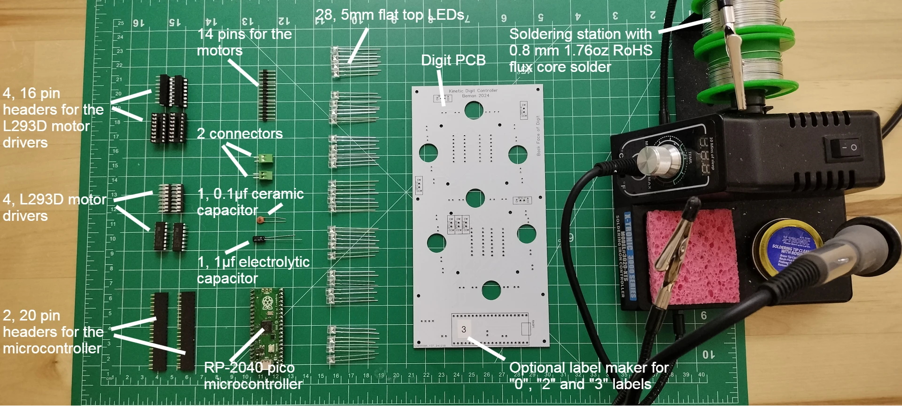
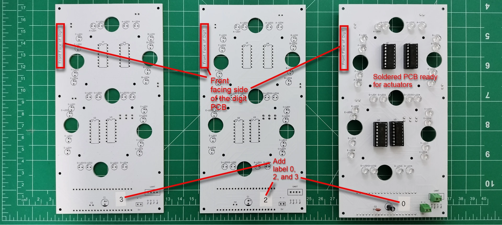
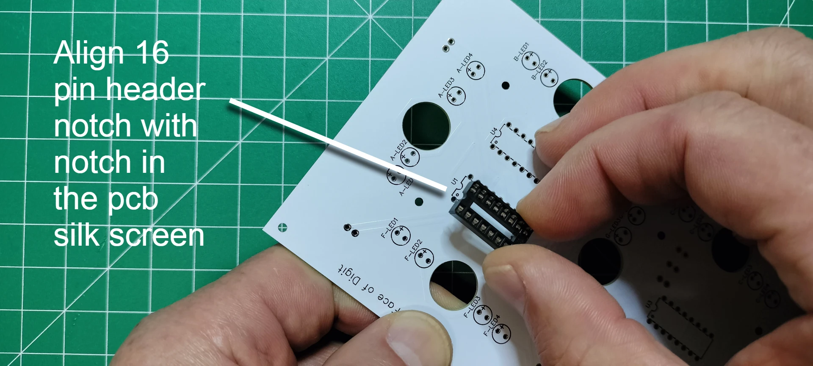
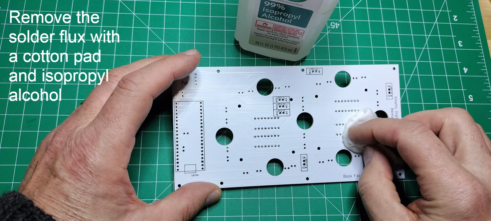
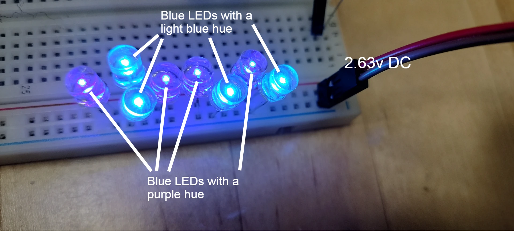
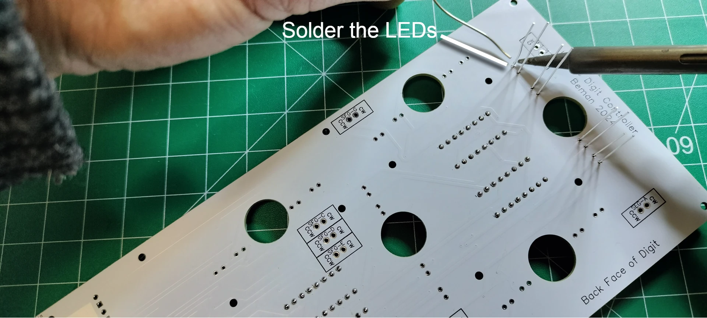
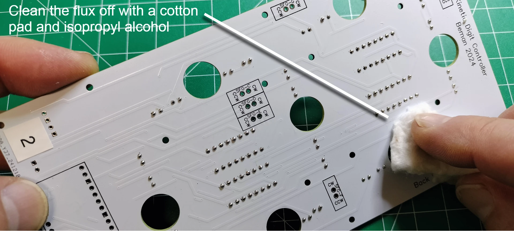

# Digit PCB Assembly

The display has 4 digits. The digits are numbered from right to left, 0-3, when looking at the front of display. The digit PCBs are digits 0, 2, and 3 whereas the controller PCB is digit 1 and includes the colons. This section details the building of digits 0, 2, and 3.

Components needed for this section.

## Label the front and back sides of the digit PCB
1. Using a label maker or piece of tape and pen, create two sets of 3 labels: "0", "2", and "3". Add the label to the FRONT FACING SIDE of each of the 3 digit PCBs as placed in the picture below. Note digit 0 is a completed digit PCB that is ready for the actuators.

2. Add the label to the BACK FACING SIDE of each of the 3 digit PCBs as placed in the picture below.

## Solder the four, 16 pin headers for the L293D motor drivers

1. From the front facing side of the PCB, insert the 16 pin header into the through holes by aligning the notch with the PCB top silk layer outline of the 16 pins. The notch in the 16-pin header is used to ensure correct orientation when connecting the L293D motor driver. Carefully turn over the PCB while keeping the 16 pin header in the through holes.

1. Solder the 16 pins and repeat the previous step until all 4 of the 16 pin headers are soldered into place.

1. From the back face of the PCB, snip off the soldered pins.

1. Touch up the clipped pins with a small bit of solder to make smooth rounded beads instead of sharp points.

1. Clean up the soldered pins by removing the solder flux using a cotton pad dabbed with isopropyl alcohol. Repeat the previous step if you find your cotton pad is being torn from any protruding pins.

## Solder the 28 LEDs 

BEFORE SOLDERING LEDS ONTO YOUR DIGIT PCB, be sure to test your LEDs on a breadboard and use your phones digital camera to see if there are any variations in color when the LEDs are lit. Below is a photo showing the color variation of blue 5mm LEDs within the same batch using a breadboards power rail with 2.63v.

1. There are seven segments "A" through "G" each with four LEDs. From the front-facing side of the PCB. Start with the four LEDs in segment A by inserting the LED's long lead (anode) into the "+" through hole. 

1. Carefully turn over the PCB and rest it with the back facing up. Solder each of the LED leads onto the PCB.

1. Snip off the excess from the LED leads. Resolder all LEDs into place by repeating the previous step

1. Clean the flux off with a cotton pad soaked in isopropyl alcohol.
