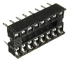
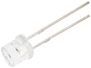
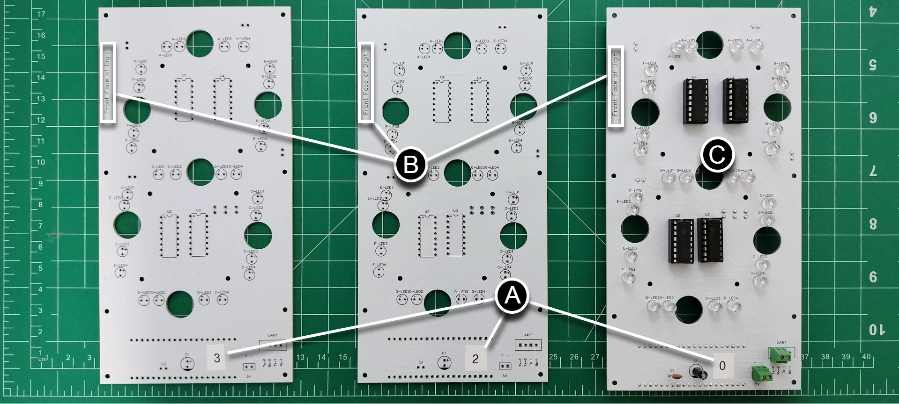
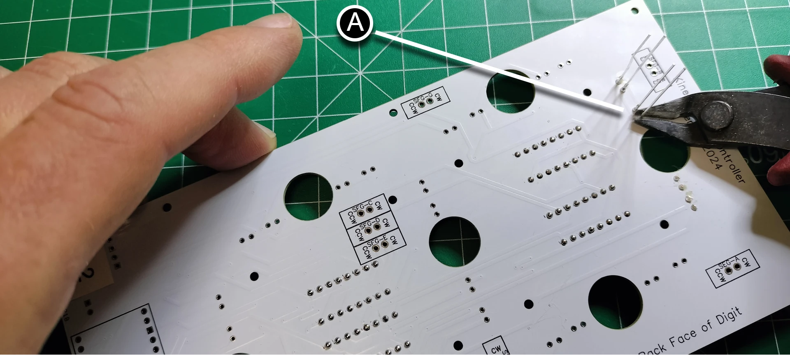
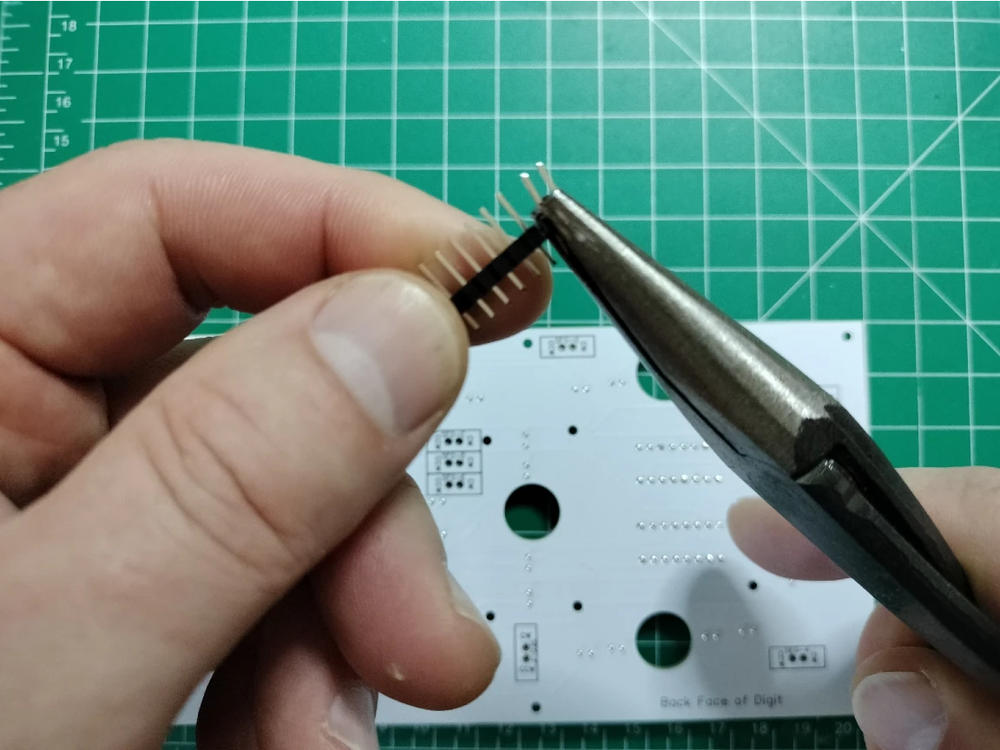
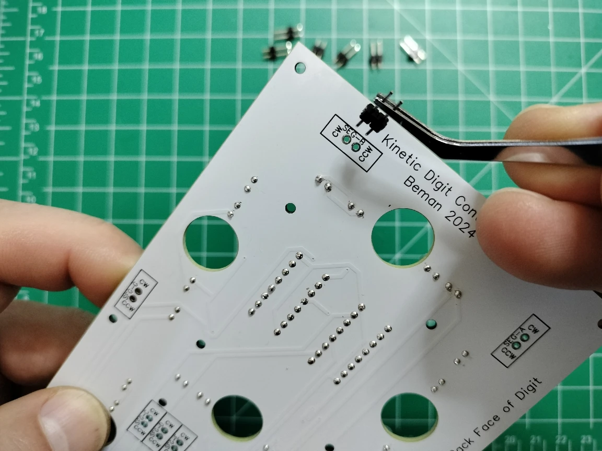
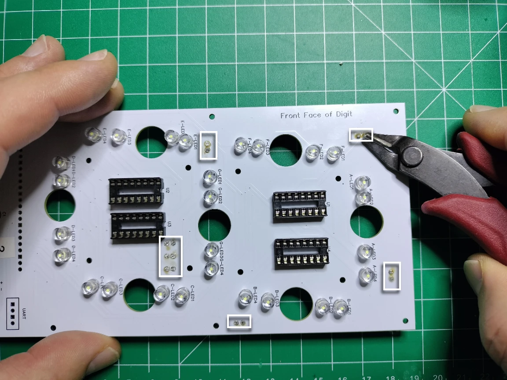
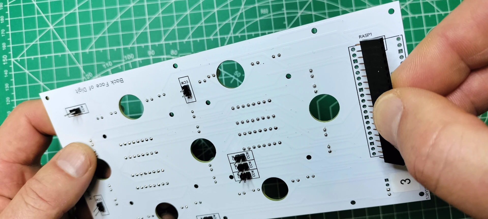

# Digit PCB Assembly

The display has 4 digits, numbered from right to left (0-3) when viewed from the front. The digit PCBs are for digits 0, 2, and 3, while the controller PCB (digit 1) includes the colons. The digit PCBs are the foundation of the display and serve several important functions:

- **Mechanical Backstop**: Provides a sturdy backstop for the actuator's segment when retracting into the display.
- **Uniform Lighting**: Ensures consistent light dispersion for each segment, creating a uniform glow without hotspots.
- **Efficient Circuitry**: Reduces wiring complexity, connects components efficiently, and ensures reliable, cost-effective, and consistent quality.

This guide details the assembly of the digit PCBs. Below are images of the fully assembled PCBs covered in this section.

Front face fully assembled.

Back side fully assembled.

## Prerequisites

- [Fabrication of the digit PCBs](../createandorder/pcb.md)
- Table of components and tools

***Table of components***

| Quantity | Component | Image |
| :--: | :------| :-----: |
| 4 | 16 pin IC socket |  |
| 4 | L293D stepper motor driver |  |
| 2 | 20 pin female header connector |  |
| 1 | 20 pin single row breakaway male connector |  |
| 2 | 2 Pin PCB Mount Screw Terminal Block Connector Straight Pin |  |
| 1 | 0.1μ farad ceramic capacitor |  |
| 1 | 1μ farad electrolytic capacitor |  |
| 28 | 5mm Flat top LED, anode long lead (any color) |  |
| 1 | Raspberry Pi Pico 2040 with Headers |  |
| 3 | Digit PCBs | See [labelling the digit PCBs](#label_the_digit_pcb) |

***Table of tools***

| Required | Tool | Image |
| :---: | :------- | :---: |
| Yes | Soldering station |  |
| Yes | 0.8mm 1.76oz RoHS flux core solder |  |
| Yes | Mini flush cutters |  |
| Yes | Isopropyl Alcohol |  |
| Yes | Cotton Facial Pads |  |
| No  | Label maker |  |

## Label the Digit PCB

1. **Label the Front Side**: Using a label maker or tape and pen, create labels for "0", "2", and "3". Attach the labels to the **front-facing side** of each digit PCB as shown below. Note that digit 0 **(C)** in the image is a completed PCB ready for mounting.
   
1. **Label the Back Side**: Attach the same labels to the **back-facing side** of each digit PCB as shown below.
   

## Add the 16 Pin Headers

1. **Insert the Header**: From the front side of the PCB, align the notch on the 16-pin header with the silk screen outline. Insert the header into the through holes.
   
1. **Solder the Pins**: Turn the PCB over and solder all 16 pins. Repeat for all 4 headers.
   
1. **Trim and Smooth**: From the back, snip the soldered pins flush, then touch up with solder to create smooth rounded beads.
   
1. **Clean the Flux**: Use a cotton pad dabbed with isopropyl alcohol to remove flux residue.
   

## Add the 28 LEDs

!!! note
    Test your LEDs on a breadboard before soldering to ensure consistent color and brightness. Use a digital camera to detect variations.

1. **Insert LEDs**: Start with segment "A". Insert the LED's **long lead (anode)** into the "+" through hole. Repeat for all LEDs in segment "A".
   
1. **Solder and Trim**: Turn the PCB over, solder the LED pins, and snip off the excess. Smooth the clipped pins with solder.
   
1. **Clean the Flux**: Remove flux residue with a cotton pad and isopropyl alcohol.
   
1. **Repeat for All Segments**: Complete the process for segments B through G. The image below shows all LEDs soldered in place.
   

## Add the Motor Pins

1. **Break Out Pins**: Use needle nose pliers to break out 7 pairs of 2.54mm male breakaway pins.
   
1. **Insert Pins**: Place the short end of each pin pair into the actuator segment through holes (seg-A to seg-G) on the back of the PCB.
   
1. **Solder and Trim**: Solder the pins on the front side, snip them flush, and smooth with solder.
   
1. **Clean the Flux**: Remove flux residue with isopropyl alcohol.
   

## Mount the Motor Drivers

1. **Align the Driver**: Orient the motor driver so the notch aligns with the 16-pin header.
   
1. **Insert Carefully**: Insert the motor driver into the header, ensuring no pins are bent.
   
1. Repeat the install for the remaining motor drivers.

## Add the PCB Mount, Two pin (2P) Terminal Block Connectors

1. On the front of the digit PCB, insert the PCB two pin terminal block connector into the 5v through holes so the face of the connector (where the wires are inserted) points toward the LEDs on the PCB.

1. Solder the terminal block connector pins on the back of the digit PCB.

1. On the front of the digit PCB position the 2 pin terminal block connector facing away from the LEDs. For **PCBs labelled "2" & "3"**, insert the connector pins into the `UART Tx-1/Rx-1` through holes. For the digit **PCB labelled "0"**, insert the connector into the `Tx-0/Rx-0` through holes.

1. On the back of the digit PCB, solder the remaining connector pins, cut the pins flush, resolder to a smooth bead, then remove the flux wth a cotton dabbed with isopropyl alcohol.

## Add the Electrolytic and Ceramic Capacitors

1. On the front of the digit PCB, align the electrolytic capacitor `-` sign opposite the `+` printed on the PCB for capacitor `c1`, see the picture below. Insert the pins into the through holes, then turn the digit PCB over to the back side and solder the capacitor.

1. On the front of the digit PCB, insert the ceramic capacitor pins into the through holes titled `c2`. Turn the digit PCB over to the back and solder the capacitor.
!!! note
    Ceramic capacitors do not have polarity and can be inserted in any direction.

1. On the back of the digit PCB, cut the pins flush, resolder to a smooth bead, then remove the flux with a cotton dabbed with isopropyl alcohol.

## Add the 20 pin Headers and Install the Microcontroller

1. On the back side of the PCB, place the two 20 pin headers into the through holes for `RASP1`. Carefully turn over the PCB while keeping the 20 pin headers in the through holes.

1. Level the PCB and adjust the two 20 pin headers so they are perpendicular to the PCB. Solder the pins once in place. Snip all 40 of the pins flush, resolder each to a smooth bead, then remove the flux with a cotton dabbed with isopropyl alcohol.

1. Orient the Raspberry Pi Pico 2040 microcontroller so the USB port is facing in the same direction as the PCB silk screen, then gently mount the microcontroller onto the header.

Congratulations for assembling a digit PCB! Be sure to test the digit PCB before assembling the next one.

## Digit Schematics

The schematic diagrams in this section represent the **Digit Motor Controller** and **Digits Microcontroller** circuits:

- *Motor Controller Circuit* drives the actuator motors for each segment (A-G) to physically move the segments into position, turns on the segment LEDs when extended, and turns off the segment LEDs when retracted.
- *Microcontroller Circuit* controls the LEDs for segment illumination (brightness) and communicates with the main controller (Raspberry Pi Pico W 2040) to receive display commands.
  
Together, these circuits enable the digit PCBs to display numbers and characters as part of the larger kinetic display system. Below is an explanation of the components, their purpose, and how the circuitry functions.

### **Digit Motor Controller Schematic**

The schematic in the section shows the motor control circuitry for the digit's seven-segment actuators (A-G). Each segment is controlled by a motor driver IC (L293D) connected to the Raspberry Pi Pico 2040. Note the L293D IC motor driver is considered outdated, but used in this circuit as it works well with toy motors and costs slightly less. For more details see the [L293D motorcontroller datasheet](https://www.digikey.com/htmldatasheets/production/237694/0/0/1/l293dd.html?msockid=1bb835ba59046489292020fa582965d3).

#### **Key Motor Controller Components and Their Purpose**

1. **L293D Motor Driver ICs (U1, U2, U3, U4)**: 
    *Purpose*: Control the bidirectional movement of the actuator motors for each segment (A-G). 
    *Functionality*: Each IC controls two segments, allowing precise movement of the actuators. 
    *Pins*:
     - `ENABLE1` and `ENABLE2`: Controls the motor speed.
     - `INPUT1`, `INPUT2`, `INPUT3`, `INPUT4`: Control the CW (Clockwise) and CCW (Counter clockwise) direction of the motor.
     - `OUTPUT1`, `OUTPUT2`, `OUTPUT3`, `OUTPUT4`: Provide the output signals to the motors.
2. **Actuator Motors (SEG-A to SEG-G)**: 
    *Purpose*: Physically extends and retracts the segments of the seven-segment display to create the desired digit. 
    *Pins*:
     - `CW` extends the segment and `CCW` retracts the segment: Control the extension and retraction of the actuator.
3. **Capacitors (C1, C2)**: 
    *Purpose*: Provide power decoupling and noise filtering for the motor drivers. 
    `C1` (1μF): Stabilizes the power supply for the motor drivers. 
    `C2` (0.1μF): Filters high-frequency noise.
4. **GPIO Pins (from Raspberry Pi Pico 2040)**: 
    *Purpose*: Send control signals to the motor drivers. 
    *Pins*:
     - `GPIO11`, `GPIO12`, `GPIO15`, etc.: Control the `INPUT` and `ENABLE` pins of the motor drivers.

#### **How the Motor Controller Circuit Works**

1. **Motor Control**: 
      - The Raspberry Pi Pico 2040 sends signals to the `INPUT` and `ENABLE` pins of the L293D ICs. 
      - Based on these signals, the motor driver controls the direction and speed of the actuator motors.
2. **Segment Movement**: 
      - Each segment (A-G) is connected to a motor. The motor moves the segment into position to display the desired digit.
3. **Power Stabilization**: 
      - The capacitors `C1` and `C2` ensure stable operation of the motor drivers by filtering noise and stabilizing the power supply.

### **Digit Microcontroller Schematic**

The schematic in this section shows the microcontroller circuitry for controlling the LEDs and communicating with the motor controllers.

#### **Key Microcontroller Components and Their Purpose**

1. **Raspberry Pi Pico 2040 (Microcontroller)**: 
    *Purpose*: Acts as the central processing unit for the digit PCB. 
    *Functions*:
      - Sends control signals to the motor drivers for segment movement.
      - Controls the LEDs for segment illumination.
      - Communicates with the main controller PCB via UART.
1. **LEDs (A-LED1 to G-LED4)**: 
    *Purpose*: Illuminates the segments of the seven-segment display. 
    *Configuration*:
     - Each segment (A-G) has four LEDs connected in parallel.
     - The anode `+` is connected to the GPIO pins, and the cathode `-` is connected to ground.
     - Brightness is controlled by the GPIO PWM signals from the microcontroller.
1. **Resistors (not used in lieu of PWM)**: 
    *Purpose*: Prevents the LEDs from exceeding their maximum rated power capabilities. The software prevents any LED PWM signal from exceeding a 220 ohm resistor for 3.3v and therefore resistors are not needed.
1. **UART Connector**: 
    *Purpose*: Provides communication between the digit PCB and the main controller PCB. 
    *Pins*:
     - `Rx-1`, `Tx-1`, `Rx-0`, `Tx-0`: Used for transmitting and receiving data.
1. **Capacitors (C1, C2)**: 
    *Purpose*: Provide power decoupling and noise filtering for the microcontroller and LEDs. 
    `C1` (1μF): Stabilizes the power supply for the LEDs. 
    `C2` (0.1μF): Filters high-frequency noise.

#### **How the Microcontroller Circuit Works**

1. **Segment Control**:
      - The Raspberry Pi Pico 2040 controls motor direction, extending or retracting the segment, and speed from GPIO pins connected to the motor controllers.
      - The microcontroller determines the length of time the motor is running (between 1/5th and 1/4th of a second), the CW (extend) or CCW (retract) direction of the actuator, and the speed of the motor which is a value typically between 50% to 100% of 5v.
2. **LED Control**:
      - The Raspberry Pi Pico 2040 controls the LEDs by PWM from the GPIO pins that are connected to the anode of each LED.
      - This allows the microcontroller to turn on/off specific LEDs, control the brightness, and illuminates the desired segments.
3. **Communication**:
      - The UART connector allows the digit PCB to receive UART commands from the controller and digit 1 PCB.
      - UART commands include which digit to display and brightness levels, as well as various actuator and digit settings.
4. **State**:
      - The Raspberry Pi Pico 2040 stores the digit state at all times in order to gracefully transition from one number or character to the next and handle graceful or ungraceful power off situations.
      - The state includes which segment is extended or retracted, the type of character map used by the digits, as well as the speed and length of time to run the motors.
5. **PowerCommands Stabilization**:
      - The capacitors `C1`, `C2` ensure stable operation of the LEDs and microcontroller by filtering noise and stabilizing the power supply.

