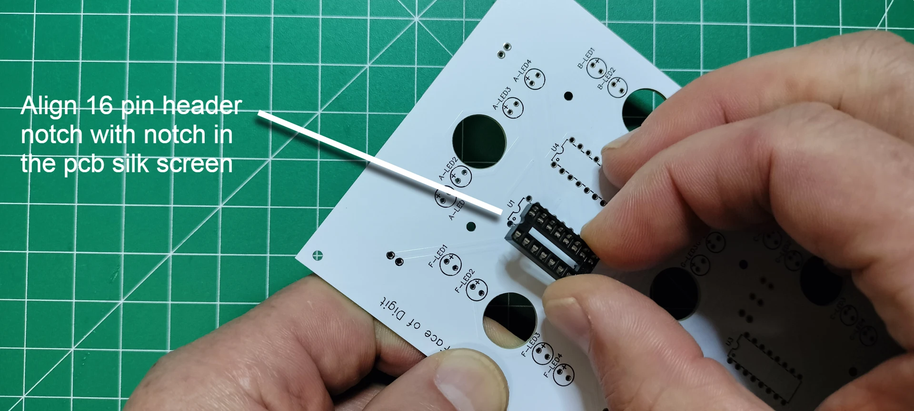
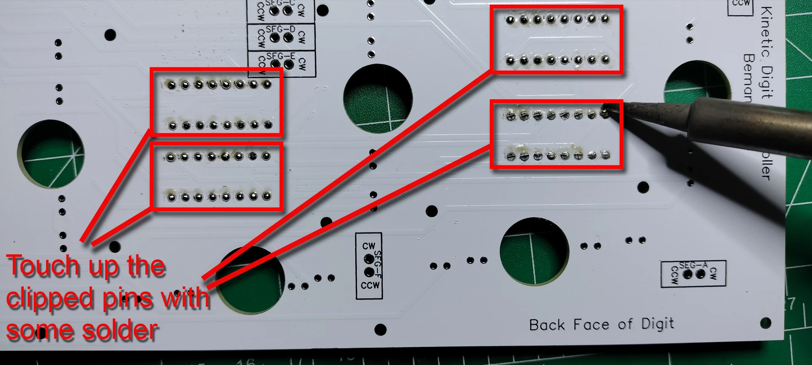
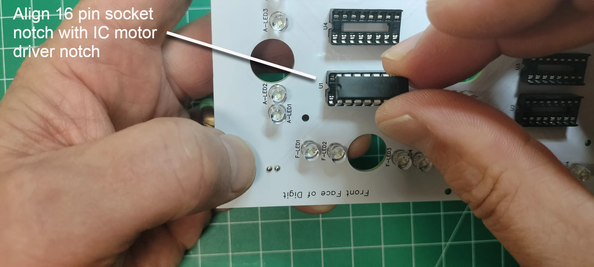
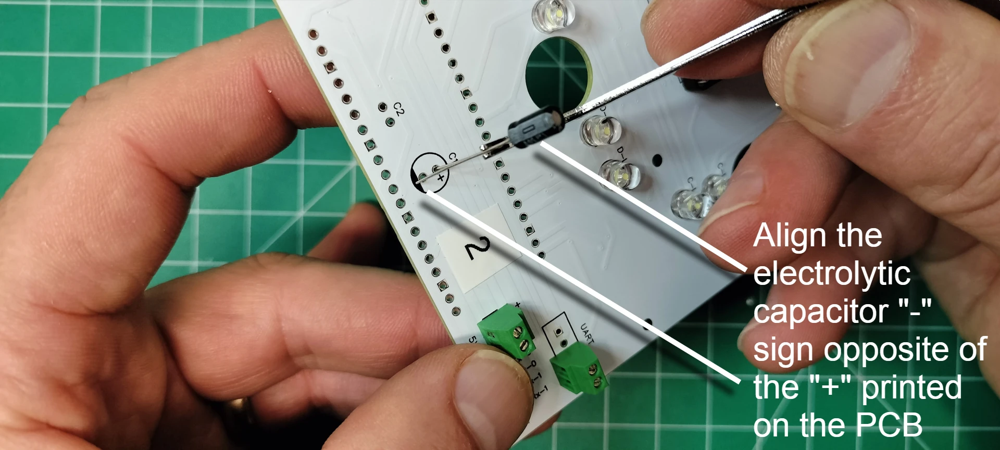

# Digit PCB Assembly

The display has 4 digits. The digits are numbered from right to left, 0-3, when looking at the front of display. The digit PCBs are digits 0, 2, and 3 whereas the controller PCB is digit 1 and includes the colons. This section details the building of digits 0, 2, and 3.

Components needed for this section.

## Label the front and back sides of the digit PCB

1. Using a label maker or piece of tape and pen, create two sets of 3 labels: "0", "2", and "3". Add the label to the FRONT FACING SIDE of each of the 3 digit PCBs as placed in the picture below. Note digit 0 is a completed digit PCB that is ready for the actuators.

2. Add the label to the BACK FACING SIDE of each of the 3 digit PCBs as placed in the picture below.

## Add the 16 pin headers

1. From the front facing side of the PCB, insert the 16 pin header into the through holes by aligning the notch with the PCB top silk layer outline of the 16 pins. The notch in the 16-pin header is used to ensure correct orientation when connecting the L293D motor driver. Carefully turn over the PCB while keeping the 16 pin header in the through holes.

1. Solder the 16 pins and repeat the previous step until all 4 of the 16 pin headers are soldered into place.

1. From the back face of the PCB, snip off the soldered pins.

1. Touch up the clipped pins with a small bit of solder to make smooth rounded beads instead of sharp points.

1. Clean up the soldered pins by removing the solder flux using a cotton pad dabbed with isopropyl alcohol. Repeat the previous step if you find your cotton pad is being torn from any protruding pins.

## Add the 28 LEDs

BEFORE SOLDERING LEDS ONTO YOUR DIGIT PCB, be sure to test your LEDs on a breadboard and use a digital camera to spot any variations in color when the LEDs are lit. Below is a photo showing the color variation of blue 5mm LEDs within the same batch using a breadboards power rail with 2.63v.

1. There are seven segments "A" through "G" each with four LEDs. From the front-facing side of the PCB, start with segment A by inserting the LED's long lead (anode) into the "+" through hole. Repeat the process for all segment-A LEDs.

1. Carefully turn over the PCB and rest it with the back facing up. Solder each of the LED leads onto the PCB.

1. Snip off the excess from the LED leads. Resolder all LEDs into place by repeating the previous step

1. Clean the flux off with a cotton pad soaked in isopropyl alcohol.

1. Repeat the previous steps for segments B through G until all 28 LEDs are soldered onto the PCB.

## Add the Motor Pins

1. The tools and components needed for this section includes 14, 2.54 mm male breakaway pins, needle nose pliers, soldering station and solder.

1. Break out 7 pairs of motor pins using needle nose pliers.

1. On the back side of the PCB, place the short end of the pin-pair into each actuator segment through hole (seg-A through seg-G).

1. On the front face of the digit, solder the reminder of the pins

1. Continuing on the front face of the digit, snip the pins to be flush on the pcb. Resolder the snipped pins to create smooth beads.

1. Clean off the flux residue using a cotton pad soaked in isopropyl alcohol.

## Mount the L293D 16-pin IC Stepper Motor Drivers

1. From the front face of the pcb, orient the motor driver so the notch (or pin 1) is aligned with the 16 pin header.

1. CAREFULLY insert the motor driver into the 16 pin header and ensure none of the pins on the motor driver are bent or protruding from the 16 pin header.

## Add the PCB Mount, 2 port Terminal Block Connectors

1. On the front side of the PCB, insert the PCB 2 port terminal block connector into the 5v through holes so the connector is facing toward the LEDs on the PCB.

1. Solder the block terminal connector pins on the back side of the PCB.

1. On the front side of the PCB position the 2 port terminal block connector facing away from the LEDs. For PCBs labelled "2" & "3", insert the connector pins into the UART Tx-1/Rx-1 through holes. For the PCB labelled "0", insert the connector into the Tx-0/Rx-0 through holes.

1. On the back side of the PCB, solder the remaining connector pins, snip the pins flush with the PCB, resolder to a smooth bead, then remove the flux wth a cotton dabbed with isopropyl alcohol.

## Add the Ceramic and Electrolytic Capacitors

1. On the front side of the PCB, align the electrolytic capacitor "-" sign opposite the "+" printed on the PCB for capacitor "c1". Insert the pins into the through holes, then turn the PCB over to the back side and solder the capacitor to the PCB.

1. On the front side of the PCB, insert the ceramic capacitor pins into the through holes titled "c2". Turn the PCB over to the back side and solder the capacitor to the PCB.

1. On the back side of the PCB, snip the pins flush with the PCB, resolder to a smooth bead, then remove the flux with a cotton dabbed with isopropyl alcohol.

## Add the 20 pin Headers and Install the Microcontroller

1. On the back side of the PCB, place the two 20 pin headers into the through holes for "RASP1". Carefully turn over the PCB while keeping the 20 pin headers in the through holes.

1. Level the PCB and adjust the two 20 pin headers so they are perpendicular to the PCB. Solder the pins once in place. Snip all 40 of the pins flush with the PCB, resolder each to a smooth bead, then remove the flux with a cotton dabbed with isopropyl alcohol.

1. Orient the Raspberry Pi Pico microcontroller so the USB port is facing in the same direction as the PCB silk screen, then gently mount the microcontroller onto the header.

## Digits 0, 2, & 3 Schematics

