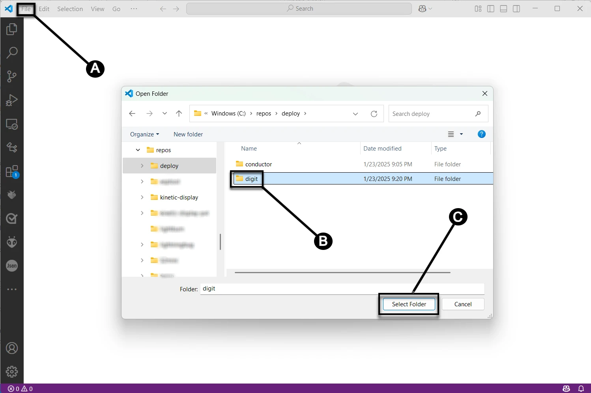

# Digit PCB Test

Run the tests in this section after assembling each digit PCB to ensure all the components on the PCB are soldered and functional. Any defective electronic component on the digit PCB will need to be replaced before completing the project.

## Prerequisites

- [Completed digit PCB ready for actuators](./digitpcbassembly.md)
- Computer and microcontroller with the [prerequisite software](../prerequisitesoftware.md)
- An [assembled actuator](actuatorassembly.md)

## PCB Test

1. From Visual Studio Code, open the deployed "digit" project by following the steps in the screen capture below: (**A**) click the file menu, (**B**) select the "digit" folder, then (**C**) click the **Select Folder** button.

1. Following the picture below, plug a USB cable connected to your computer into the Raspberry Pi Pico's USB port on the Digit PCB. Connect your Raspberry Pi Pico to Visual Studio Code by opening the **MicroPico vREPL** in the terminal dropdown, see the prerequisite software section [Verify Micropython on your Raspberry Pi Pico](../prerequisitesoftware.md/#verify_micropython_on_your_raspberry_pi_pico).

1. Following the picture below, plug the dupont connector from the actuator into the **SEG-A** pins with the white wire connected to the CW pin and the black wire to the CCW pin.

[def]: ./actuatorassembly.md