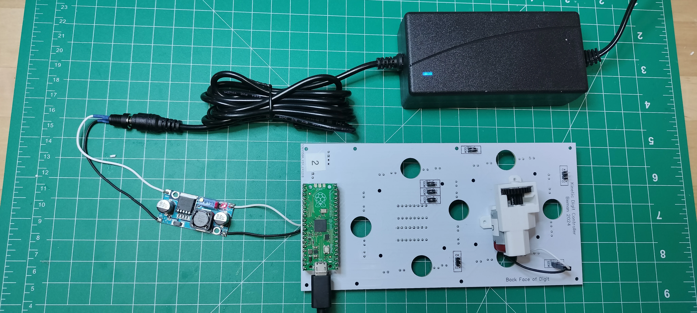
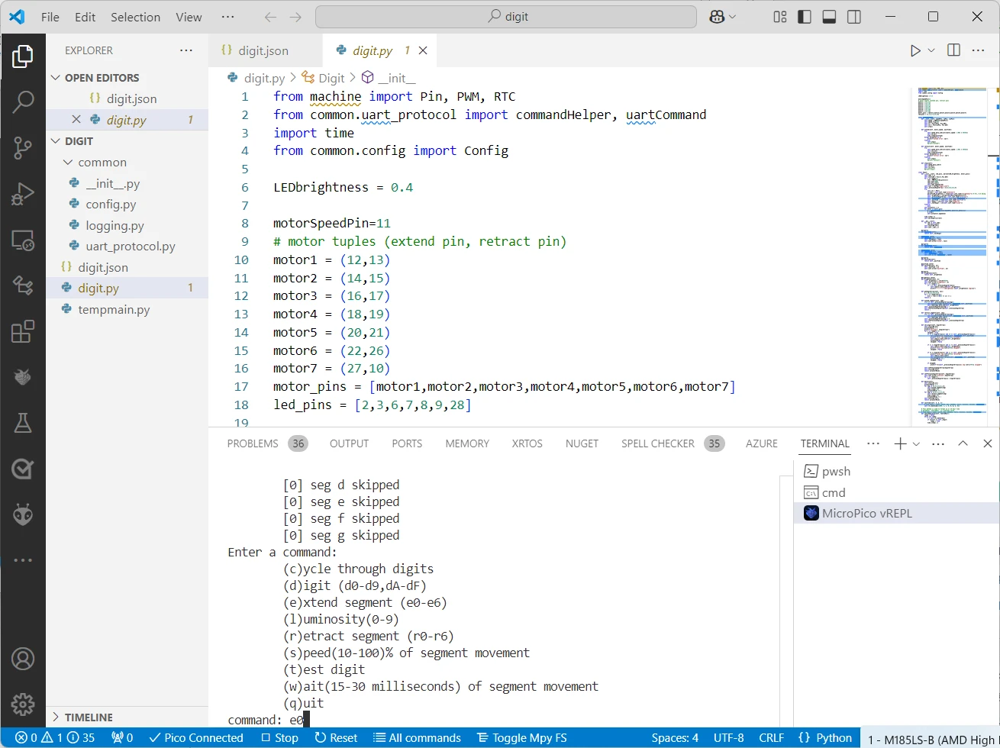
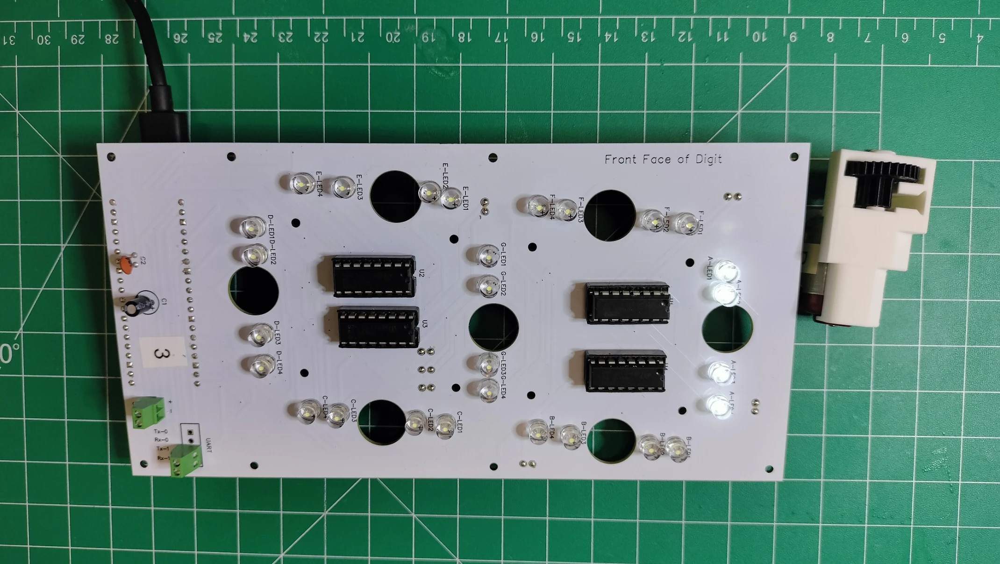
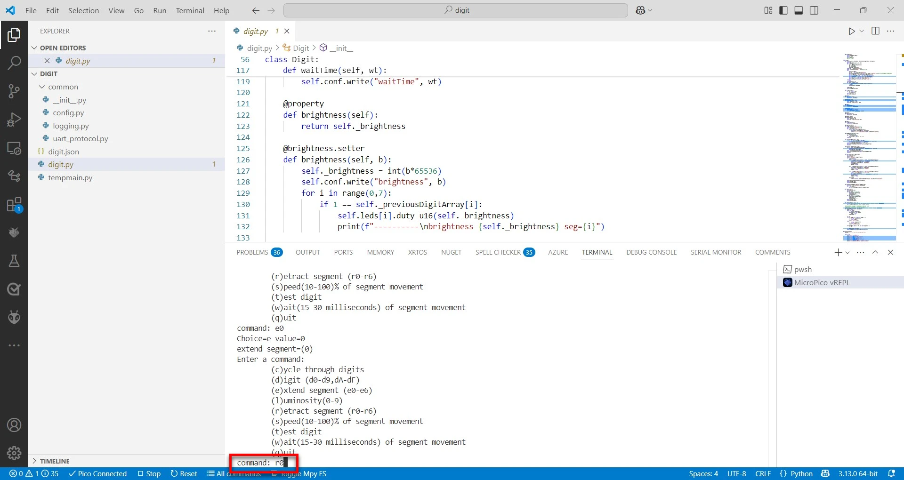
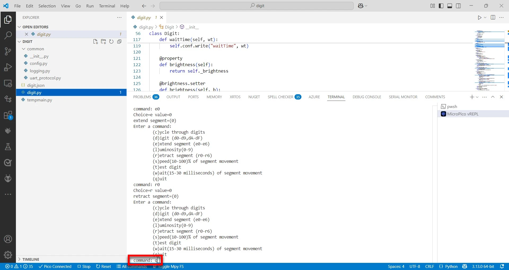

# Digit PCB Test

Run the tests in this section after assembling each digit PCB to ensure all the components on the PCB are soldered and functional. Any defective electronic component on the digit PCB will need to be replaced before completing the project.

## Prerequisites

- [Completed digit PCB ready for actuators](digitpcbassembly.md).
- Computer and microcontroller with the [prerequisite software](../prerequisitesoftware.md).

