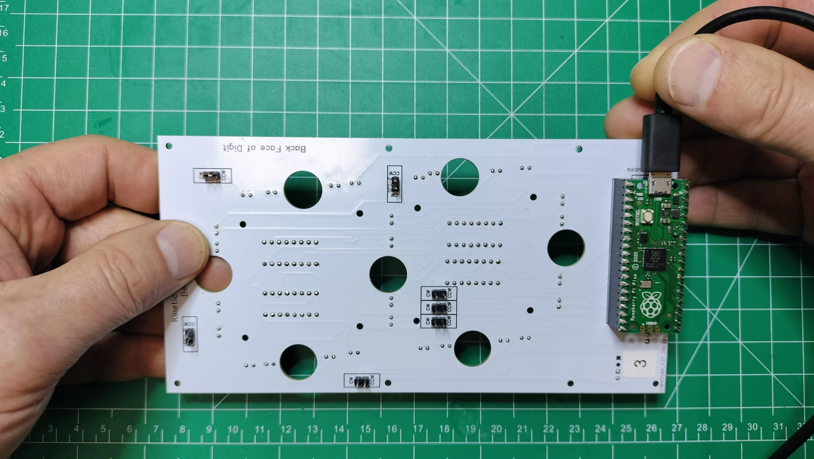
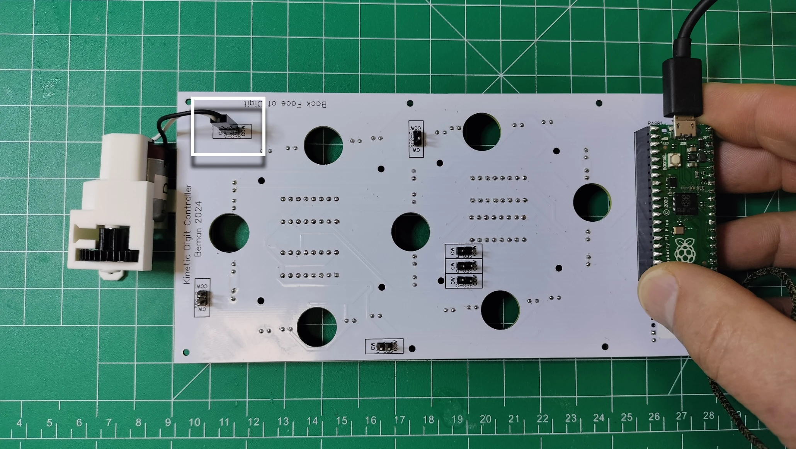
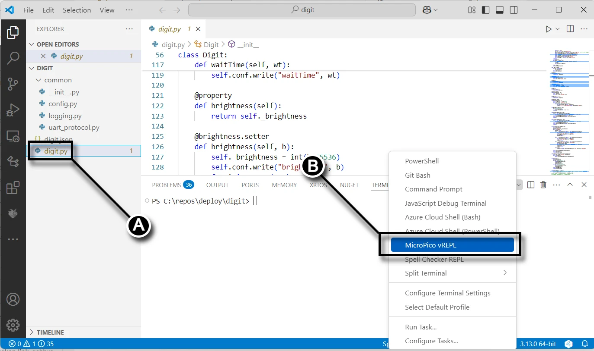
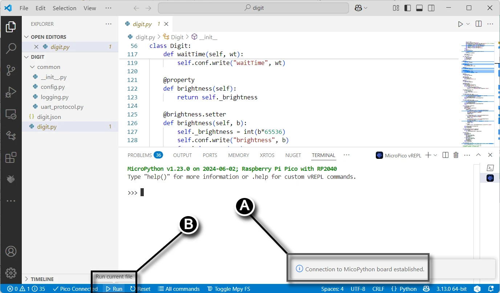
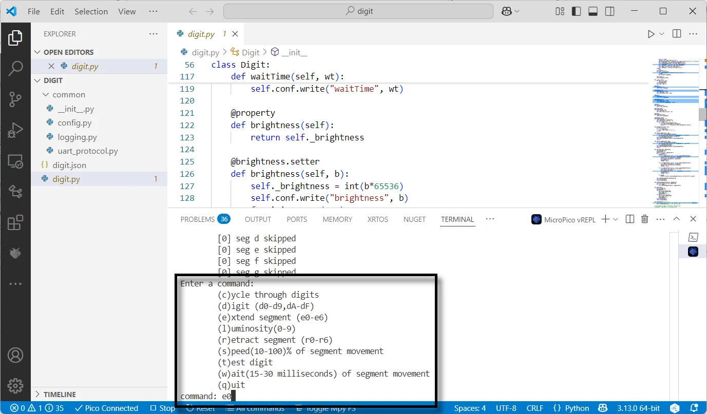
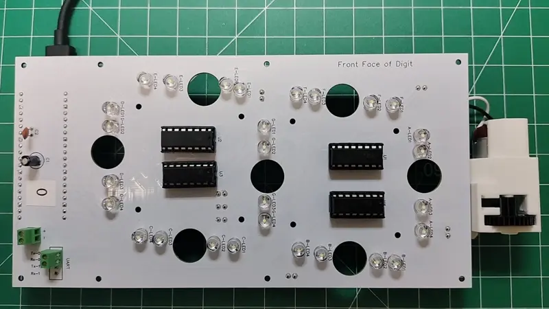

# Digit PCB Test

Run the tests in this section after assembling each digit PCB to ensure all the components on the PCB are soldered and functional. Any defective electronic component on the digit PCB will need to be replaced before completing the project.

## Prerequisites

- [Completed digit PCB ready for actuators](./digitpcbassembly.md)
- Computer and microcontroller with the [prerequisite software](../prerequisitesoftware.md)
- An [assembled actuator](actuatorassembly.md)

## Test the Motor and LED Segments

1. From Visual Studio Code, open the deployed `digit` project by following the steps in the screen capture below: **(A)** click the file menu, **(B)** select the `digit` folder, then **(C)** click the **Select Folder** button.

1. Following the picture below, plug a USB cable connected to your computer into the Raspberry Pi Pico's USB port on the controller PCB. Connect your Raspberry Pi Pico to Visual Studio Code by opening the **MicroPico vREPL** in the terminal dropdown, see the prerequisite software section [Verify Micropython on your Raspberry Pi Pico](../prerequisitesoftware.md/#verify_micropython_on_your_raspberry_pi_pico).

1. Following the picture below, plug the dupont connector from the actuator into the `SEG-A` pins with the white wire connected to the `CW` pin and the black wire to the `CCW` pin.

1. From Visual Studio Code, **(A)** click on the `digit.py` file then **(B)** select the MicroPico vREPL from the menu in the Terminal pane.

1. From Visual Studio Code **(A)** verify the connection from your computer to the Raspberry Pi Pico, then **(B)** click the **Run** button to run the test application for the digit.

1. The console test application shows various options that relate to segments 0-6 which correspond to segments A-G. For example, segment A is 0, B is 1, until G which is 6. Extend `SEG-A` by typing **e0** in the console.

1. Following the picture below, the 4 `SEG-A` LEDs light up and the motor briefly turns on. From the terminal session, type **r0** to retract the segment. 

1. Repeat steps 6 and 7 to verify the remaining `SEG-B` through `SEG-G` work as expected. Repeat the test for all digit PCBs 0-3.
