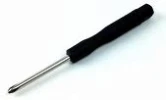
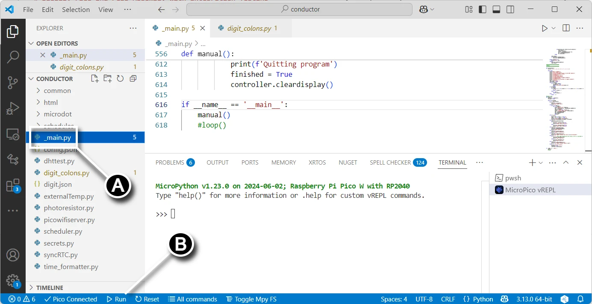
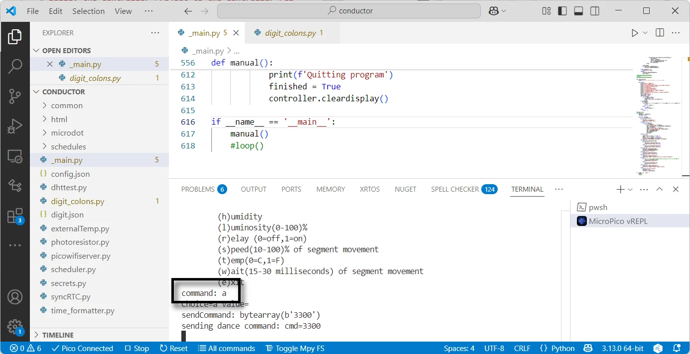
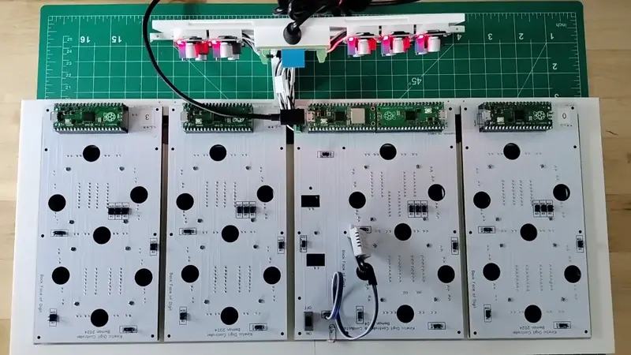
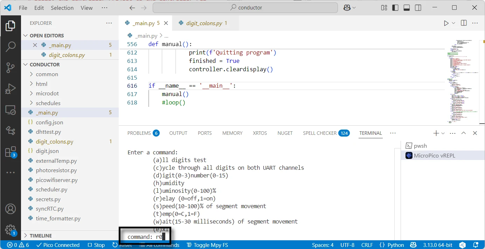
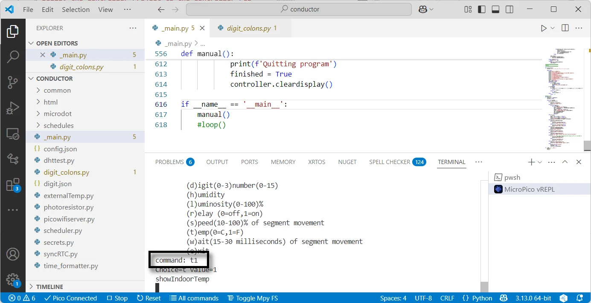
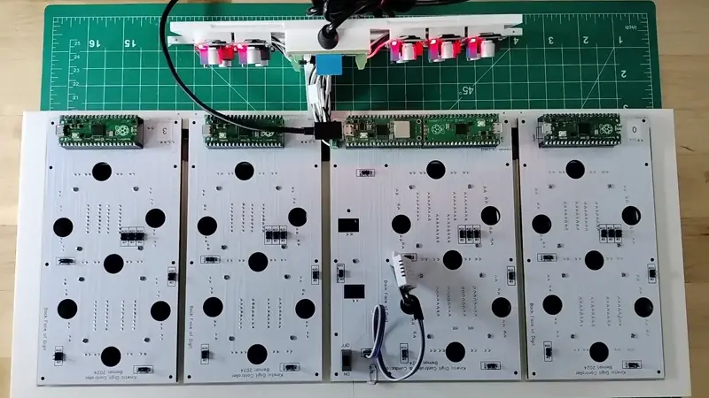
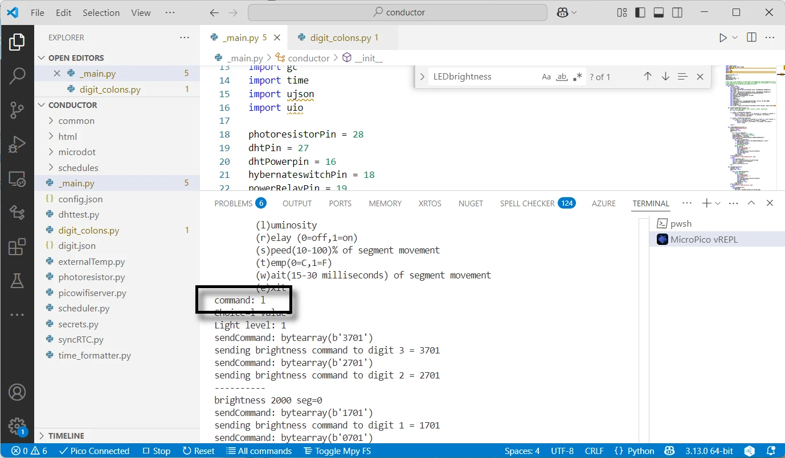
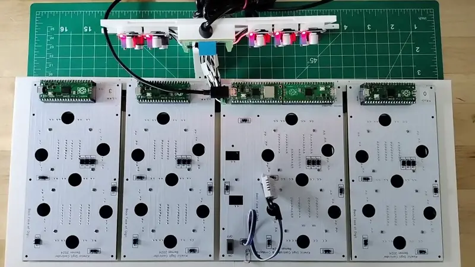

# Display Face and PCBs Assembly with Integration Testing

This guide details assembling the PCBs onto the display face, and includes integration testing of the electronic components that make the Kinetic Display function.

## Prerequisites

***Table of components***

| Quantity | Component | Image |
| :--: | :------| :-----: |
| 30 | M1.7x6mm Cross Round Head with Washer Self Tapping Screw 304 Stainless Steel Screws |  |

***Table of tools***

| Required | Tool | Image |
| :---: | :------- | :---: |
| Yes | Fine tipped philips head screwdriver   | |

## Display Face and PCBs Assembly

1. Connect the two 3d printed sides of the display face with the front facing down onto your workbench. The cove on the backside of the display face should be on the top, furthest from you. See the picture in the next step with the controller PCB tilted upward to unveil the position of the cove.
1. Position the stand and PCBs atop of the display face as shown in the picture below. The wiring should fit in the cove and the gaskets of the PCBs flush against the display face without any wires protruding out.

1. Using a small philips head screwdriver, secure the PCBs with M1.7x6mm self tapping screws in the locations as highlighted below.

1. Following the picture below, **(A)** connect the DHT22 sensor to the controller PCB, **(B)** plug in the 12v power supply into the power management PCB's barrel jack. Note the DHT22 sensor connection is temporary and will be perminantly installed later.

## Integration Test

1. From Visual Studio Code on your computer, **(A)** click the `_main.py` file in the explorer pane, then **(B)** run the program. Make sure you have a connection via your computer's USB cable to the controller PCB Raspberry Pi Pico W 2040.

1. From Visual Studio Code on your computer, type the `(a)ll digits test` in the command terminal to check the UART connections across the digits. See the video below to verify the segments animate from digit 3 to digit 0.

1.

1.

1.

