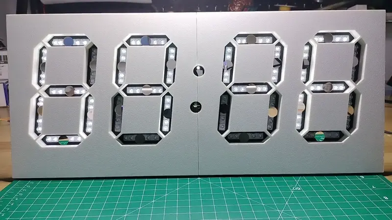

# Display Face and PCBs Assembly with Integration Testing

This guide details assembling the PCBs onto the display face, and includes integration testing of the electronic components that make the Kinetic Display function.

## Prerequisites

***Table of components***

| Quantity | Component | Image |
| :--: | :------| :-----: |
| 30 | M1.7x6mm Cross Round Head with Washer Self Tapping Screw 304 Stainless Steel Screws |  |

***Table of tools***

| Required | Tool | Image |
| :---: | :------- | :---: |
| Yes | Fine tipped philips head screwdriver   | |

## Display Face and PCBs Assembly

1. Connect the two 3d printed sides of the display face with the front facing down onto your workbench. The cove on the backside of the display face should be on the top, furthest from you. See the picture in the next step with the controller PCB tilted upward to unveil the position of the cove.
1. Position the stand and PCBs atop of the display face as shown in the picture below. The wiring should fit in the cove and the gaskets of the PCBs flush against the display face without any wires protruding out.

1. Using a small philips head screwdriver, secure the PCBs with M1.7x6mm self tapping screws in the locations as highlighted below.

1. Following the picture below, **(A)** connect the DHT22 sensor to the controller PCB, **(B)** plug in the 12v power supply into the power management PCB's barrel jack. Note the DHT22 sensor connection is temporary and will be perminantly installed later. **(C)** Connect your computer's USB cable to the controller PCB Raspberry Pi Pico W 2040

!!! warning
    ONLY connect your computer's USB cable to the conductor and controller Raspberry Pi Pico W 2040 AFTER plugging in the 12v power supply. Plugging in your computer's USB cable BEFORE your 12v power supply is plugged in will burn out the sensitive circuitry within the Pico W.

## Integration Test

1. From Visual Studio Code on your computer, **(A)** click the `_main.py` file in the explorer pane, then **(B)** run the program. Make sure you have a connection via your computer's USB cable to the controller PCB Raspberry Pi Pico W 2040.

1. From Visual Studio Code on your computer, type the `(a)ll digits test` in the command terminal to check the UART connections across the digits. See the video below to verify the segments animate from digit 3 to digit 0.

1. From the command terminal pane, use the `(r)elay (0=off,1=on)` command by typing `r0` (off) then `r1` (on) to check the relay functionality. See the video below with the LEDs on the buck converters turning on and off.

1. From the command terminal pane, use the `(t)emp(0=C,1=F)` command by typing `t0` or `t1` to display the temperature (respectively) in celius or fehrenheit. You'll need to tip the display up on one side to view the front of the display as shown in the video below.

1. From the command terminal pane, use the `(l)uninosity` command while shielding the LDR with your hand (or tuning off the light in your room). You won't see any command output, only a change in the brightness of the display. Should the LED colons be brighter or dimmer than the digit LEDs, then be sure to change the `LEDbrightnessFactor` setting found in the `digit_colons.py` file. Presently the LED colons are set to about 1/3rd the power as the digit LEDs. Should you change the controller's `LEDbrightnessFactor`, then be sure to upload the changes to the controller's Raspberry Pi Pico W 2040.

1. From your Visual Studio Code file explorer pane, open the `secrets.py` file and change the usr and pwd to your network SSID and password so the Kinetic Display can connect to your local wifi network. This is an optional step as you will be able to change this at a later date.
1. At the bottom of the `_main.py` file, comment out the `manual()` call and uncomment the `loop()` call. **Rename `_main.py` to `main.py`**. Then upload the project to the controller's Raspberry Pi Pico W 2040.

!!! warning
    Forgetting to upload the renamed `main.py` file to the controller's Raspberry Pi Pico W 2040 will cause the Kinetic Display to be unresponsive.
