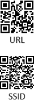
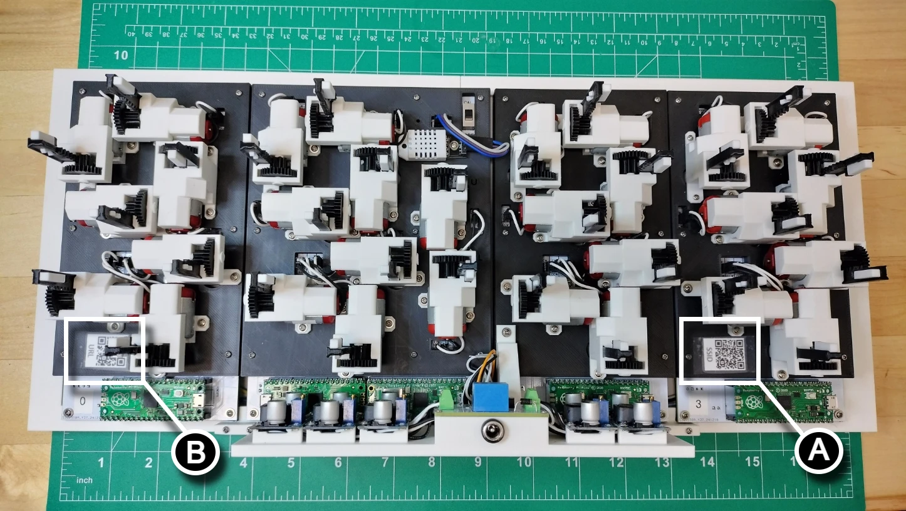

# Finishing Touch

## QR Code Installation

1. Print the following QR codes found from your forked repo at [../img/QRcodes/qrcode.png](../img/QRcodes/qrcode.png).

    

2. Separate and trim the QR codes. Using a piece of celophane tape to adhere each at the following location. Place the SSID QR code **(A)** on the  digit 3 backplate between segments D and C.  Place the URL QR code to the `admin.html` settings web page **(B)** on the digit 0 backplate also between segements D and C.

    

3. Turn the **On/Off** switch to the **Off** position.
4. Plug the 12v power supply into the barrel jack then follow the user's guide to [configure the kinetic display settings](../userguide/websettings.md).
