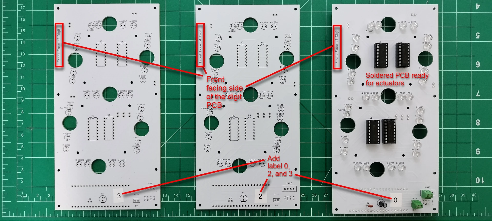
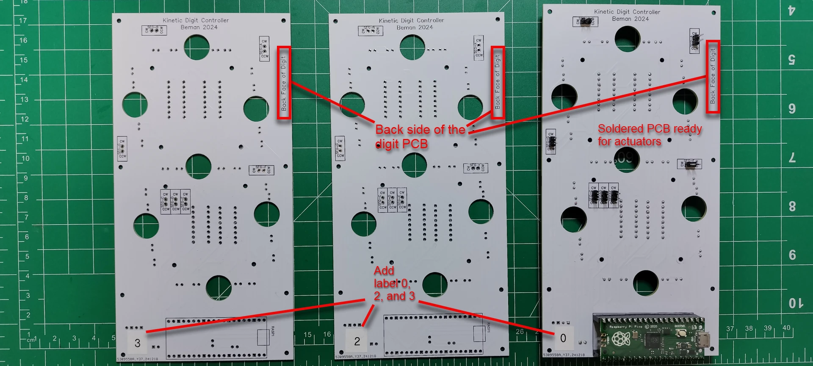
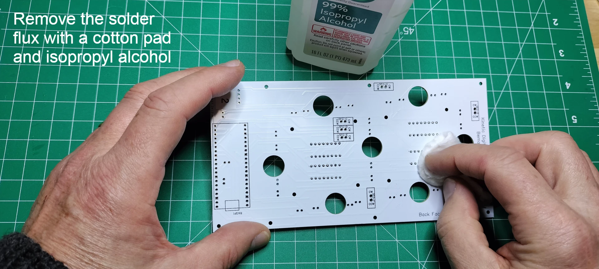

# PCBs Assembly

## Digit PCBs

The display has 4 digits. The digits are numbered from right to left, 0-3, when looking at the front of display. The digit PCBs are digits 0, 2, and 3 whereas the controller PCB is digit 1 and includes the colons. This section details the building of digits 0, 2, and 3.

Components needed for this section.

### Solder the four, 16 pin headers for the L293D motor drivers

1. From the front facing side of the PCB, insert the 16 pin header into the through holes by aligning the notch with the PCB top silk layer outline of the 16 pins. The notch in the 16-pin header is used to ensure correct orientation when connecting the L293D motor driver. Carefully turn over the PCB while keeping the 16 pin header in the through holes.

1. Solder the 16 pins and repeat the previous step until all 4 of the 16 pin headers are soldered into place.

1. From the back face of the PCB, snip off the soldered pins.

1. Touch up the clipped pins with a small bit of solder to make smooth rounded beads instead of sharp points.

1. Clean up the soldered pins by removing the solder flux using a cotton pad dabbed with isopropyl alcohol.
