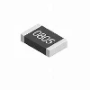
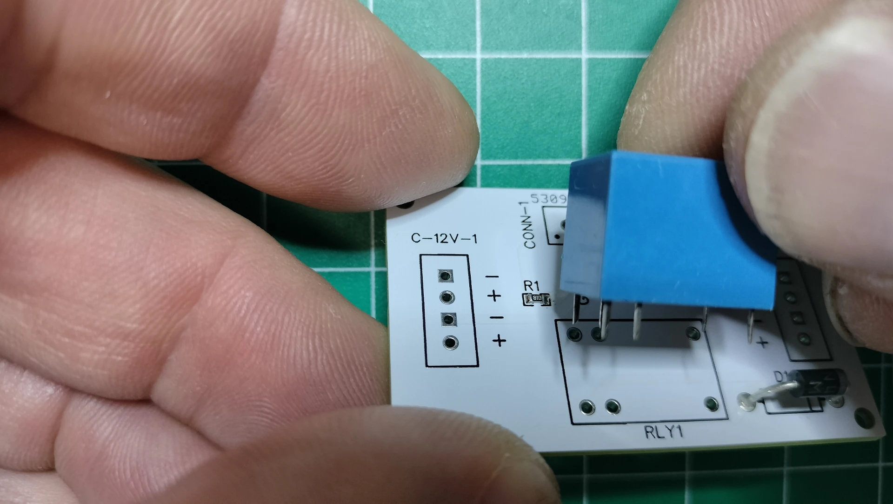

# Power Management PCB Assembly

There are several choices of power supplies available in the market. Why not simply use a retail 5V power supply? A few important reasons for building a custom power management system for the display include:

- **Stable Voltage**: A drop in voltage occurs in a poor power supply when the heavy-duty 103 electric toy motor starts up because each motor requires a high inrush of current to extend or retract the display's segments. Most retail power supplies cannot provide sufficient current, causing a dramatic voltage drop leading to instability. The power supply setup in this section ensures the components receive a consistent 5V power, preventing malfunctions or damage to the more sensitive electronic components like the microcontrollers and sensors.
- **Current Requirements**: The display has colons with two motors and four digits, each with seven independent electric motors. There can be up to five electric motors running simultaneously to extend or contract the segments or colons. Note there are also additional power requirements for lighting the LEDs. The power system you'll build in this section provides sufficient current to power all motors, sensors, and controllers simultaneously.
- **Safety**: Protects the system from overvoltage, short circuits, or power surges.
- **Customization**: Tailors the power supply to meet the specific needs of the kinetic display's design and components.
- **Efficiency**: Reduces energy loss and improves the overall performance of the display. An old-school coil-driven relay is used to shut off power to the digits when in low-power mode and not active. There are other ways to accomplish the same functionality with solid-state relays or a FET. However, the display is kinetic by design, and the use of a coil relay enhances its sound, feel, and aesthetics.

## Prerequisites

- [Fabrication of the power management PCB](../createandorder/pcb.md).
- 3D print of the display stand and power management components, `powerbank.stl`.

***Table of components***

| Quantity | Component | Image |
| :--: | :------ | :-----: |
| 2 | 2 Pin PCB Mount Screw Terminal Block Connector Straight Pin |  |
| 1 | 3 Pin PCB Mount Screw Terminal Block Connector Straight Pin |  |
| 2 | 4 Pin PCB Mount Screw Terminal Block Connector Straight Pin |  |
| 1 | SONGLE SRS-05VDC-SL 05VDC-SL 4100 Blue 5V 6PIN Power Relay |  |
| 1 | 1N4001 Diode, standard, 1A, 50V, DO-41 |  |
| 1 | S8050 TO-92 TH PNP Transistor |  |
| 2 | 1K ohm 0805 Resistor 1/2w Metal Film Fixed Resistor |  |
| 1 | 2.1mm Barrel Jack 5.5x2.1mm Female DC Power Jack 2.1 X 5.5mm DC Jack Connector 6V 9V 12V DC Jack Panel Mount |  |
| 10M | White 28 AWG Gauge Flexible Silicone Rubber Electric Wire |  |
| 10M | Black 28 AWG Gauge Flexible Silicone Rubber Electric Wire |  |
| 50cm | (optional) 28 AWG Gauge heat shrink |  |
| 4 | M1.7x6mm Cross Round Head with Washer Self Tapping Screw 304 Stainless Steel Screws |  |

***Table of tools***

| Required | Tool | Image |
| :------: | :------- | :---: |
| Yes | Soldering station |  |
| Yes | 0.8mm 1.76oz RoHS flux core solder |  |
| Yes | Mini flush cutters |  |
| Yes | Isopropyl Alcohol |  |
| Yes | Cotton Facial Pads |  |
| No | Heat gun |  |

## Power Management PCB Components

In this section, you'll assemble the power management system PCB.

Top view of the power management PCB:  
  
Bottom view of the power management PCB:  

1. Following the picture below on the TOP side of the PCB, solder the `1kΩ 0805` surface mount resistor onto `R1`.  
   
1. Following the picture below on the TOP side of the PCB, solder the `s8050` through-hole transistor into `Q1`. Be sure to align the pins according to the silk screen outline.  
   
1. Following the picture below on the TOP side of the PCB, solder the `1N4001` diode into `D1`. Be sure to align the anode band with the silk screen outline.  
   
1. Following the picture below on the TOP side of the PCB, solder the 6 pins of the Songle relay into `RLY1`.  
   

## Power Management PCB Block Connectors

Top view of the power management PCB with arrows pointing in the direction of the connected wire.  

Bottom view of the power management PCB with the arrow pointing in the direction of the [Barrel Jack Panel Mount](#barrel_jack_panel_mount) wires.

1. Following the picture below on the TOP side of the PCB, hold the PCB so the silk screen `C-12V-1` is to your left. Solder the 4 pin terminal block connector into the `C-12V-1` through holes so the connection to the wires faces out to the left.  
   
1. Following the picture below on the TOP side of the PCB, hold the PCB so the silk screen `C-12V-2` is to your right. Solder the 4 pin terminal block connector into the `C-12V-2` through holes so the connection to the wires faces out to the right.  
   
1. Following the picture below on the TOP side of the PCB, hold the PCB so the silk screen `CONN-1` is to your left. Solder the 2 pin terminal block connector into the `5v+ 5v-` through holes of the `CONN-1` silk screen so the connection to the wires faces out to the left.  
   
1. Following the picture below on the TOP side of the PCB, continue to hold the PCB so the silk screen `CONN-1` to your left. Solder the 3 pin terminal block connector into the `GPIO19 12v+ 12v-` through holes of the `CONN-1` silk screen so the connection to the wires faces out to the left.  
   
1. Following the picture below on the BOTTOM side of the power management PCB, solder the two pins of the terminal block connector into the through holes marked as `12v(in)`.  
   

## Barrel Jack Panel Mount

1. Cut a black and white 28 AWG wire 4cm in length.  
   
1. Strip about 3mm off the ends of each wire, then tin the stripped ends with a bit of solder.  
   
1. Using a multimeter, locate the positive and negative pins on the barrel jack. In this case, the longer pin is negative.  
   
1. Based on the results from the previous step, solder the white wire onto the positive pin and black onto the negative pin.  
   
1. Add heat shrink to protect exposing the soldered pin locations. Wrap the exposed soldered pin with a piece of electrical tape if you don't have any heat shrink.  
   
    Secure the heat shrink with a heat gun.  
   
1. Insert the barrel jack into the display stand as shown in the picture below. Note the barrel jack has opposing flat sides that will need to align with the display stand hole.  
   
1. Add the jack nut onto the backside of the barrel jack. Tighten with a wrench so the nut is snug. Don't over tighten as you may damage the stand.  
   
1. Position the bottom side of the power management PCB so the 2 pin terminal block connector is facing toward the mounted barrel jack. Insert and tighten the white wire to the positive (+) terminal and the black wire to the negative (-) terminal.  
   
1. Use two M1.7x6mm self tapping screws to tack the PCB down as later you'll need to remove the PCB to route the wiring.  
   
1. Plug the 12v power supply into the barrel jack. Verify the 12v `+` and `-` voltage by placing the probes from a multimeter onto the `+` and `-` terminals found on the 4 pin connectors titled `C-12V-1` and `C-12V-2`.  
   

!!! warning
    Verifying the 12v `+` and `-` voltage with a multimeter is an important step to ensure the correctness of your connections. If you discover the `+` and `-` are reversed, then change the connections from the barrel jack and re-verify using your multimeter.

## Schematic

The power management PCB is designed to provide stable and sufficient power to the kinetic display's motors, LEDs, and sensors. It incorporates protection mechanisms (diode, relay), current regulation (resistor, transistor), and secure connections (terminal blocks, barrel jack). The power management schematic with the buck converter modules ensure the system operates efficiently and safely under varying load conditions.

### Key Components

1. **1kΩ Resistor (R1)**:
    Used to limit current flow to the base of the transistor.
1. **S8050 PNP Transistor (Q1)**:
    Acts as a switch used to control the relay.
1. **1N4001 Diode (D1)**:
    Protects the circuit from reverse polarity or voltage spikes due to the coils in the relay.
1. **Songle Relay (RLY1)**:
    A mechanical switch controlled by an electrical signal. It is used to switch high-current loads (e.g., motors) on and off safely.
1. **PCB Mount Screw Terminal Blocks**:
    Provide secure connections for external wires to the PCB. These are used for power input and output connections.
1. **Barrel Jack Connector**:
    Used to connect the external 12V power supply to the PCB.

### Circuitry Explanation

1. **Power Input**. The 12V power supply is connected to the barrel jack. The positive and negative terminals are routed to the PCB through the terminal block connectors.
1. **C-12v-1** and **C-12v-2**. Terminal block connector through holes that route the incoming 12v to the assigned buck converter module. When the relay is switched off, the 12v power is cut to the buck converter modules.
1. **Relay Control**. The relay (RLY1) is controlled by the transistor (Q1). When the transistor is activated by the Raspberry Pi Pico W 2040 GPIO19 pin, it allows current to flow through the relay coil, switching the relay and enabling power to the connected load.
1. **Voltage Regulation**. The circuit routing 12v to the buck converter modules ensures stable 5V output for sensitive components like the micro controllers and sensors. This is critical to prevent malfunctions caused by voltage drops during high-current motor operations.
1. **Protection**. The diode (D1) protects the circuit from voltage spikes generated by the relay coil when it is de-energized. This prevents damage to other components.
1. **Current Distribution**. The terminal blocks distribute power to various parts of the display, including the microcontrollers, motors, LEDs, and sensors. The 4-pin connectors (`C-12V-1` and `C-12V-2`) handle the 12V power.

