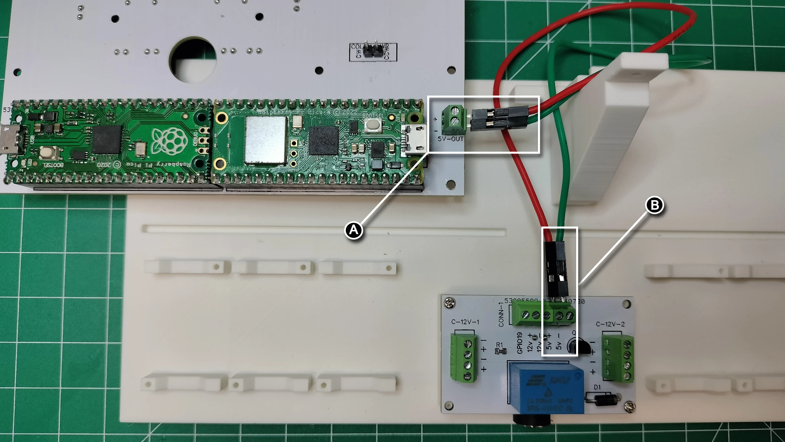
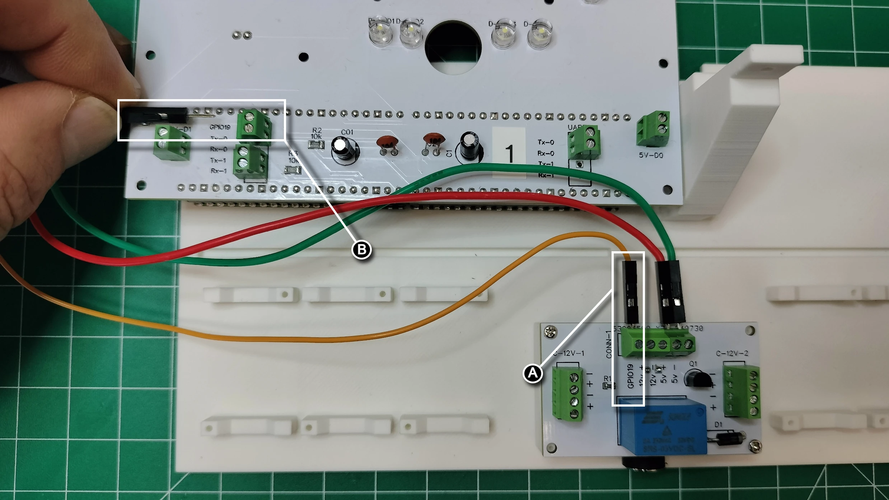
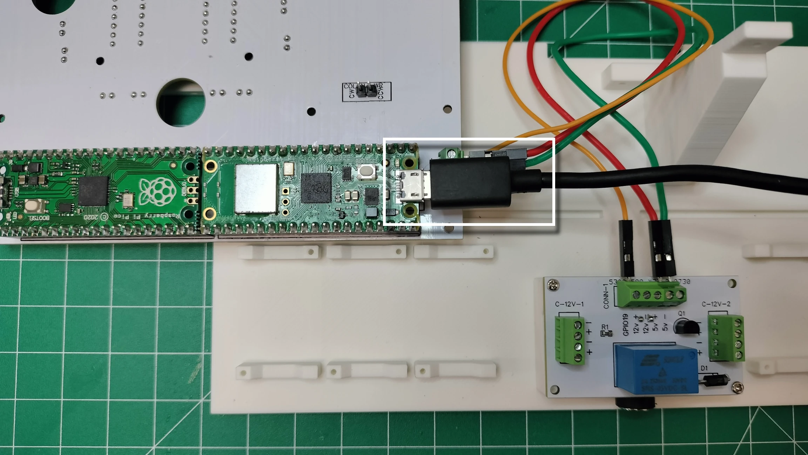
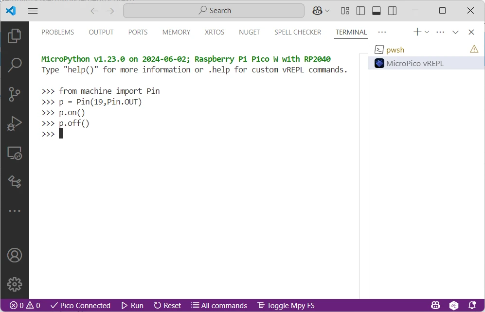

# Power Management PCB Test

Run the tests in this section after assembling the power management PCB. Any defective electronic component on the digit PCB will need to be replaced before completing the project.

## Prerequisites

- [Completed the controller and digit 1 PCB assembly](./controllerpcbassembly.md)
- [Completed power management PCB](./powermanagementpcb.md)
- Computer and microcontroller with the [prerequisite software](../prerequisitesoftware.md)
- 3 male-male jumpers (or wires with the ends stripped in tinned with solder)

## Test Relay

1. Following the picture below on the BACK face of the controller and digit 1 PCB, **(A)** using a pair of jumper wires, connect the positive (+) and negative (-) ports of the terminal block connector `5v-OUT` to the **(B)** positive (+) and negative (-) ports on the corresponding terminal block connector marked `CONN-1` on the power management PCB.

1. Using a single jumper wire, **(A)** connect the `GPIO19` port of the terminal block connector in `CONN-1` on the power management PCB to **(B)** the `GPIO19` port of the terminal block connector on the FRONT face of the controller and digit 1 PCB.

1. Following the picture below, connect a USB cable from your computer to the Raspberry Pi Pico W on the BACK face of the controller and digit 1 PCB.

1. From your computer, open a terminal session using Visual Studio Code by selecting `MicroPico vREPL` from the terminal dropdown menu. Once connected, type (or copy/paste each line) the following code into the terminal window:

```python
from machine import Pin

p = Pin(19, Pin.OUT)
p.on()
```

Once you hear the relay click to connect the circuit, then type the following code into the terminal window:

```python
p.off()
```

Below is a screenshot of the terminal session:
