# Power Management PCB Assembly

There are several choices of power supplies available in the market. Why not simply use a retail 5v power supply? A few important reasons for building a custom power management system for the display include:

- **Stable Voltage**: A drop in voltage occurs in a poor power supply when the heavy duty 103 electric toy motor starts up because each motor requires a high inrush of current to extend or retract the display's segments. Most retail power supplies cannot provide sufficient current causing a dramatic voltage drop leading to instability. The power supply setup in this section ensures the components receive a consistent 5V power, preventing malfunctions or damage to the more sensitive electronic components like the microcontrollers and sensors.
- **Current Requirements**: The display has colons, with two motors; four digits, each with seven independent electric motors. There can be up to 5 electric motors running simultaneously to extend or contract the segment or colon. Note there are also additional power requirements for lighting the LEDs. The power system you'll build in this section provides sufficient current to power all motors, sensors, and controllers simultaneously.
- **Safety**: Protects the system from overvoltage, short circuits, or power surges.
- **Customization**: Tailors the power supply to meet the specific needs of the kinetic display's design and components.
- **Efficiency**: Reduces energy loss and improves the overall performance of the display. An old school coil-driven relay is used to shut off power to the digits when in low power mode and not displaying anything. There are other ways to accomplish the same thing with solid state relays or a FET. However, the display is kinetic by design and the use of a coil relay enhances its sound, feel, and aesthetics.

## Prerequisites

- 3D print of the Display stand

***Table of components***

| Quantity | Component | Image |
| :--: | :------ | :-----: |
| 2 | 2 Pin PCB Mount Screw Terminal Block Connector Straight Pin | |
| 1 | 3 Pin PCB Mount Screw Terminal Block Connector Straight Pin | |
| 2 | 4 Pin PCB Mount Screw Terminal Block Connector Straight Pin | 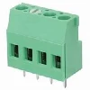|
| 1 | SONGLE SRS-05VDC-SL 05VDC-SL 4100 Blue 5V 6PIN Power Relay | 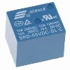|
| 1 | 1N4001 Diode, standard, 1A, 50V, DO-41 | |
| 1 | S8050 TO-92 TH PNP Transistor |  |
| 2 | 1K ohm 0805 Resistor 1/2w Metal Film Fixed Resistor |  |
| 1 | 2.1mm Barrel Jack 5.5x2.1mm Female DC Power Jack 2.1 X 5.5mm DC Jack Connector 6V 9V 12V DC Jack Panel Mount | 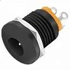 |
| 10M | White 28 AWG Gauge Flexible Silicone Rubber Electric Wire |   |
| 10M | Black 28 AWG Gauge Flexible Silicone Rubber Electric Wire |   |
| 50cm | (optional) 28 AWG Gauge heat shrink |   |

***Table of tools***

| Required | Tool | Image |
| :------: | :------- | :---: |
| Yes | Soldering station    | |
| Yes | 0.8mm 1.76oz RoHS flux core solder | |
| Yes | Mini flush cutters   | |
| Yes | Isopropyl Alcohol | |
| Yes | Cotton Facial Pads | |
| No | Heat gun | |

## Power Management PCB Components

In this section you'll assemble the power management system PCB.

Top view of the power management PCB.
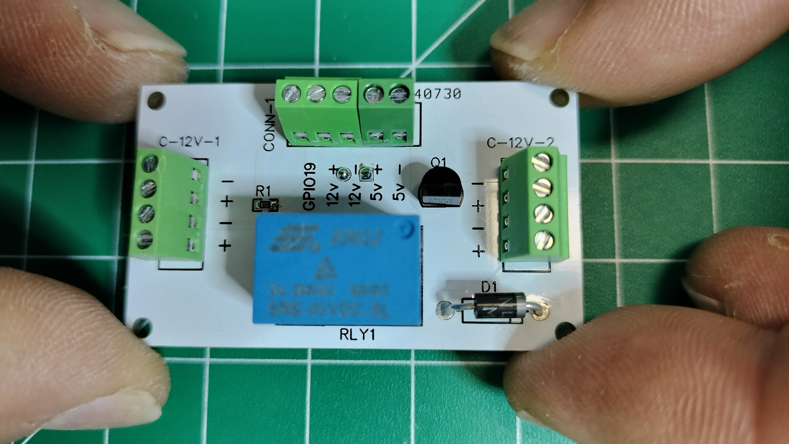
Bottom view of the power management PCB.
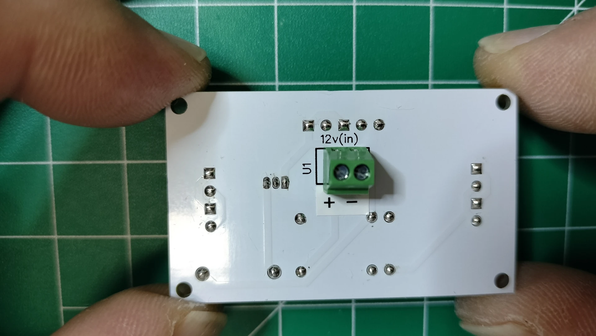

1. Following the picture below on the TOP side of the PCB, solder the `1kΩ 805` surface mount resistor onto `R1`.

1. Following the picture below on the TOP side of the PCB, solder the `s8050` through hole transistor into `Q1`. Be sure to align the pins according to the silk screen outline.
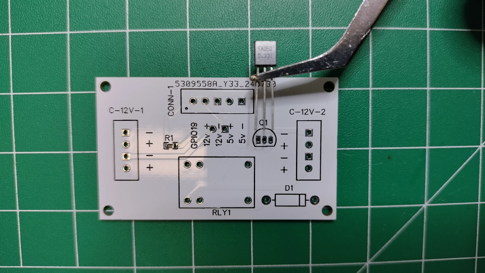
1. Following the picture below on the TOP side of the PCB, solder the `1N4001` diode into `D1`. Be sure to align the anode band, with the silk screen outline.
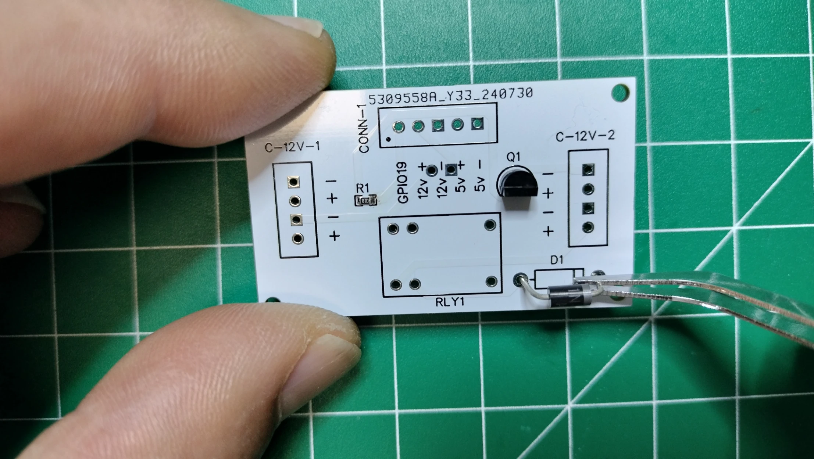
1. Following the picture below on the TOP side of the PCB, solder the 6 pins of the Songle relay into `RLY1`.

## Power Management PCB Block Connectors

Top view of the power management PCB with arrows pointing in the direction of the connected wire.
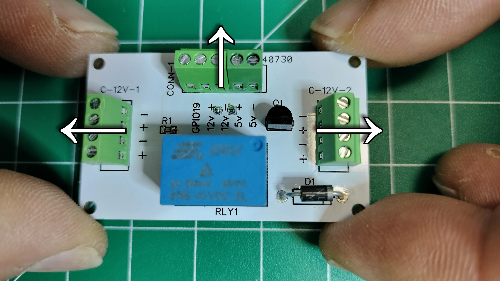

1. Following the picture below on the TOP side of the PCB, hold the PCB so the silk screen `C-12V-1` is to your left. Solder the 4 pin terminal block connector into the `C-12V-1` through holes so the connection to the wires faces out to the left.
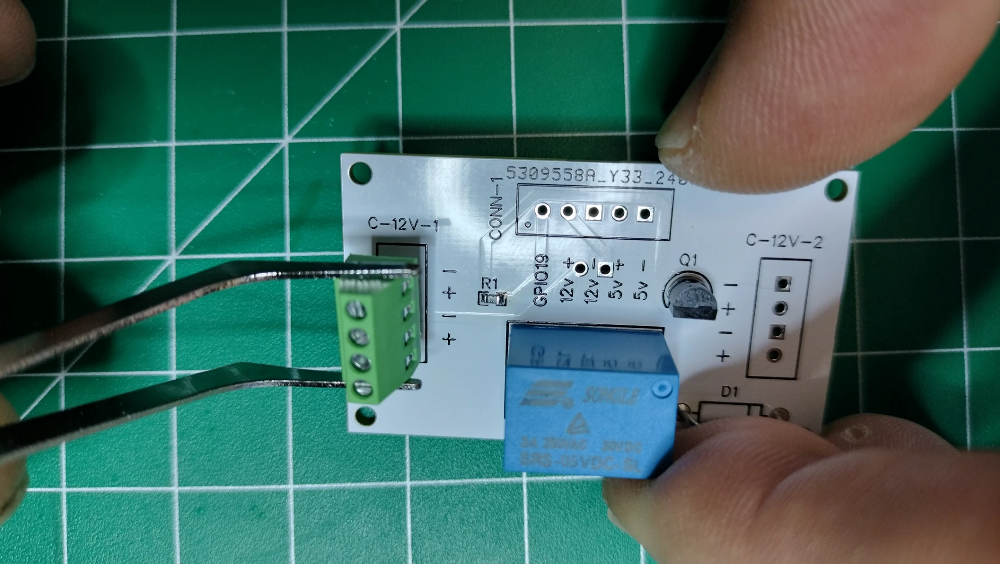
1. Following the picture below on the TOP side of the PCB, hold the PCB so the silk screen `C-12V-2` is to your right. Solder the 4 pin terminal block connector into the `C-12V-2` through holes so the connection to the wires faces out to the right.

1. Following the picture below on the TOP side of the PCB, hold the PCB so the silk screen `CONN-1` is to your left. Solder the 2 pin terminal block connector into the `5v+ 5v-` through holes of the `CONN-1` silk screen so the connection to the wires faces out to the left.
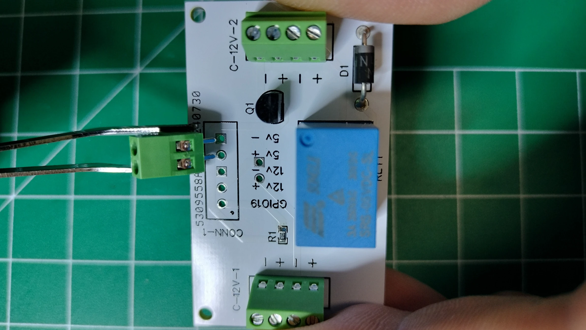
1. Following the picture below on the TOP side of the PCB, continue to hold the PCB so the silk screen `CONN-1` to your left. Solder the 3 pin terminal block connector into the `GPIO19 12v+ 12v-` through holes of the `CONN-1` silk screen so the connection to the wires faces out to the left.
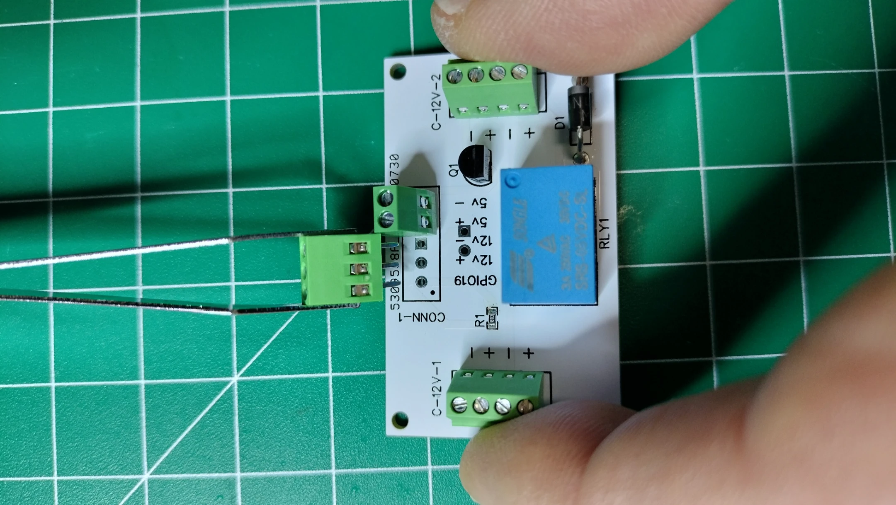
1. Note the arrows pointing in the direction of the connected wire on the BOTTOM side of the power management PCB.

    Following the picture below on the BOTTOM side of the power management PCB, solder the two pins of the terminal block connector into the through holes marked as `12v(in)`.

## Barrel Jack Panel Mount

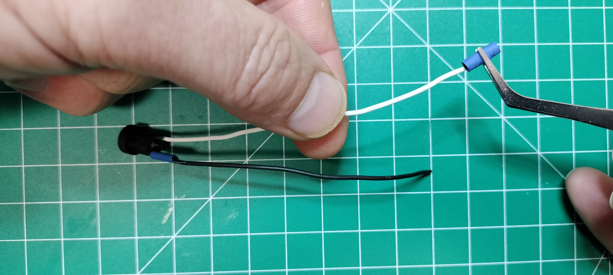

## LM2596 Adjustable Buck Converters and Wiring

!!! warning
    Use anti static mats and ESD wristband and grounding wire for the remainder of the Kinetic Display electronics assembly.
