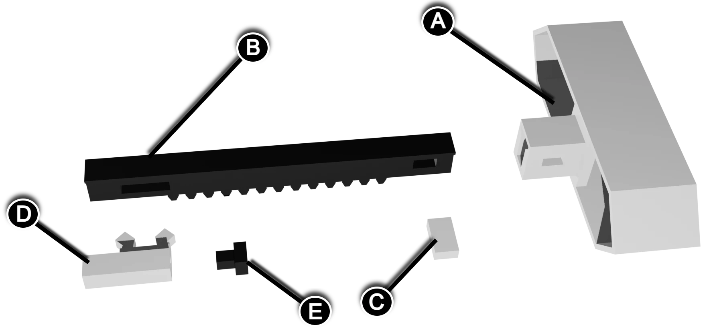
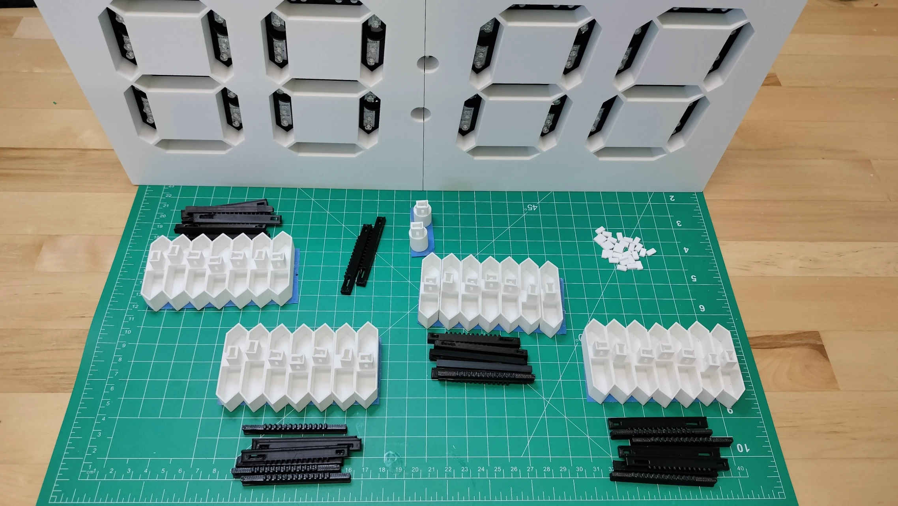
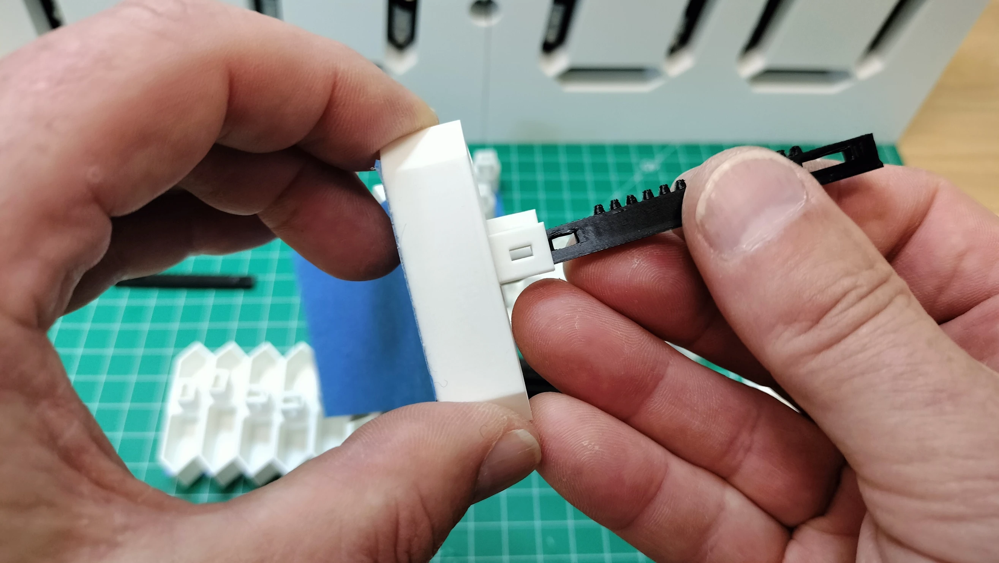
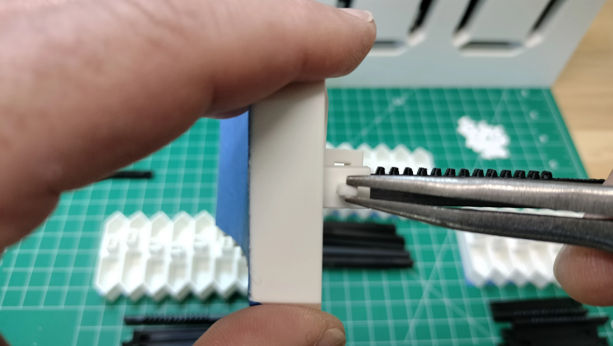
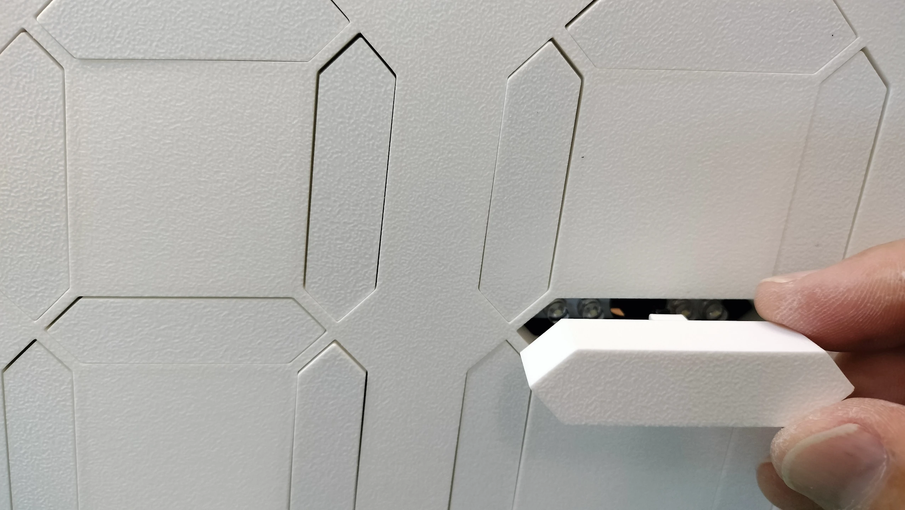
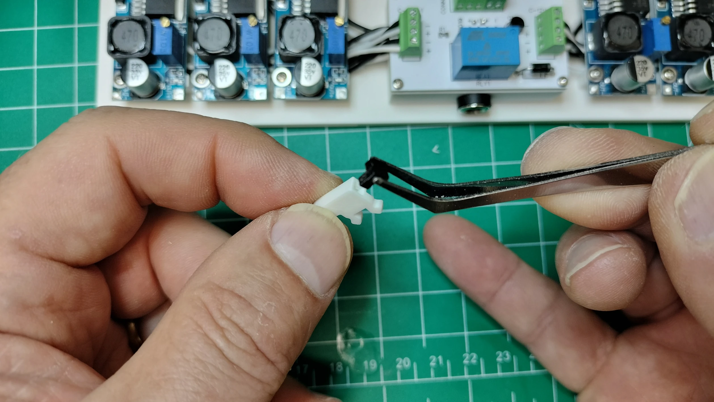
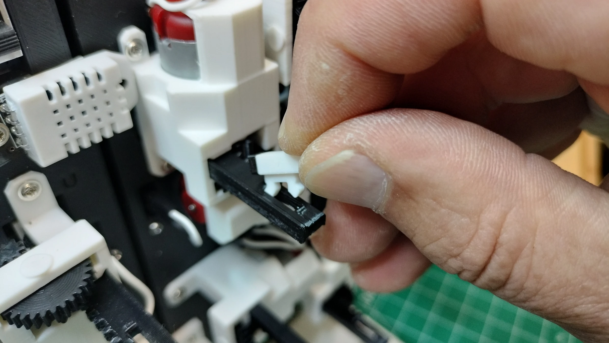
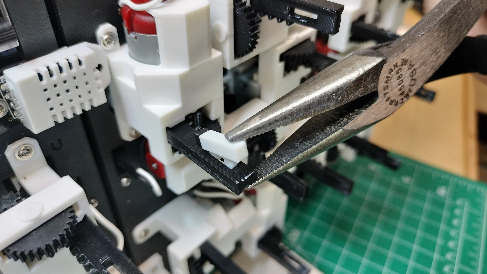
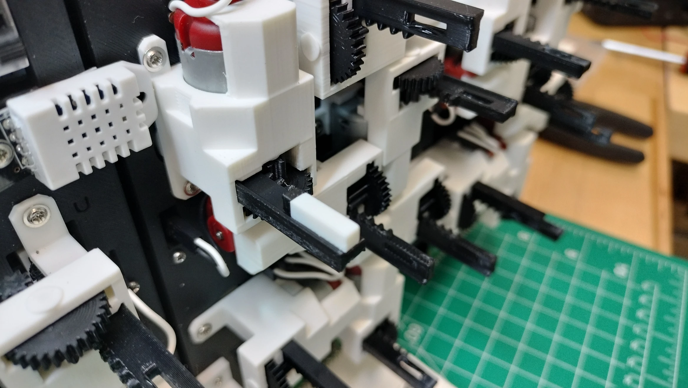

# Segment Assembly and Installation

The digit segments and colons give the display its distinctive design. Each hollow segment lights up when extended and turns off when retracted, creating a satisfying clacking sound with every movement. Like a traditional seven-segment display, the segments are tilted at a 5-degree angle for a sleek appearance.

| Ref | File |
| :---: | :---|
| **A** | `seg-a.stl` through `seg-g.stl` and `colon-seg.stl` |
| **B** | `rack-gear.stl` |
| **C** | `seg-pin.stl` |
| **D** | `rackgear-bumper.stl` |
| **E** | `rackgear-bumper-gasket.stl` |

## Assemble and Install Segments

This section guides you through assembling and installing all segments on the display. The image below shows the 3D-printed parts required for segment assembly.

1. **Insert the Rack Gear**. Slide the end of the rack gear with the smallest rectangular hole into the segment sleeve, as shown below.
   

1. **Secure the Rack Gear**. Use needlenose pliers to hold the segment pin. Insert the pin through the small rectangular hole in the segment sleeve and rack gear to secure it, as shown below.
   
1. **Install the Segment**. Place the segment into its designated location on the display. Ensure the segment slides easily into its bay. If it does not, ***do not force it into place***. Try a different location for the segment.
   
1. **Repeat for All Segments**. Follow the above steps to install all digit and colon segments.

## Assemble and Install the Rackgear Bumpers

1. **Attach the Gasket**. Push the rackgear bumper gasket into the square hole on the face of the rackgear bumper, as shown below.
   
2. **Position the Bumper**. Slide the front peg of the rackgear bumper into the rectangular hole on the rackgear ***opposite the pinion gear***. Installing it on the same side as the pinion gear will cause the actuator to jam when extended.
   
3. **Secure the Tail End**. Use needlenose pliers to gently push the tail end of the rackgear bumper into the rectangular hole, as shown below.
   
4. **Repeat for All Bumpers**. Follow the above steps to install all rackgear bumpers.
   
