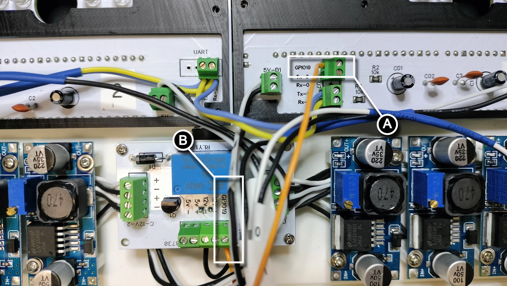

# UART and Relay Wiring

UART (Universal Asynchronous Receiver-Transmitter) facilitates communication between the controller and the digit PCBs. The controller acts as the central hub, transmitting commands and receiving status updates from the digits.

1. **Controller (Transmitter and Receiver)**:
      - The controller's UART `Tx` (transmit) pin sends data to the digits, such as display commands and brightness levels.
      - The controller's UART `Rx` (receive) pin listens for acknowledgment or status updates from the digits.
2. **Digits (Receivers and Transmitters)**:
      - Each digit PCB's UART `Rx` pin receives commands from the controller.
      - The digit PCBs' UART `Tx` pins send status updates or responses back to the controller.

This bidirectional communication ensures synchronized operation of the display, enabling the controller to manage all digits effectively.

## UART Wiring

The UART wiring diagram illustrates the communication connections between the controller and the digit PCBs. It shows how the UART `Tx` (transmit) and `Rx` (receive) pins are connected using the two UART channels 0 and 1:

      - The controller's channel 1 `Tx` pin is connected to the channel 1 `Rx` pin on the digit 2 PCB. The controller PCB has tracing that connects the controller's channel 0 `Tx` pin to channel 0 `Rx` pin on digit 1.
      - The controller's channel 1 `Rx` pin is connected to the channel 1 `Tx` pin of the digit 2 PCB. The controller PCB has tracing that connects the controller's channel 0 `Rx` pin to channel 0 `Tx` pin on digit 1.
      - Digit 2 and 3 PCB's `Tx` pins are connected and Digit 0 PCB and Digit 1 on the controller PCB's `Tx` pin are connected. The same is true for the `Rx` pins for Digits 0-3.

1. Digit 0 and 1 UART wiring.

1. Digit 2 and 3 UART wiring.

1. Controller to Digit 2 UART wiring.

## Relay Wiring

1. Follow the picture below starting from the back side of the controller PCB. Using any color 28 AWG wire, connect the **(A)** terminal block connector pin `GPIO19` from the controller PCB to the **(B)** terminal block connector pin `GPIO19` on the power management PCB.

1. Following the picture below, turn the controller PCB over so the front face is up. **(A)** Strip 3mm of insulation then tin the stripped end with solder. Connect the white wire to the `+` on the `5v-OUT` terminal block connector and the black wire onto the `-`. **(B)** Route the white wire to the `5v +` and the black wire to the `5v -` on the power management PCB, then cut the wires with at least 2cm of slack. Strip 3mm of insulation, tin the stripped end with solder, then connect each wire to the appropriate terminal block connector.

1. Following the picture below, position the heat shrink and apply heat with a heat gun. Add the two remaining M1.7x6mm self tapping screws to the power management PCB. Ensure all 4 screws securing the power management PCB are snug, but do not over tighten.

