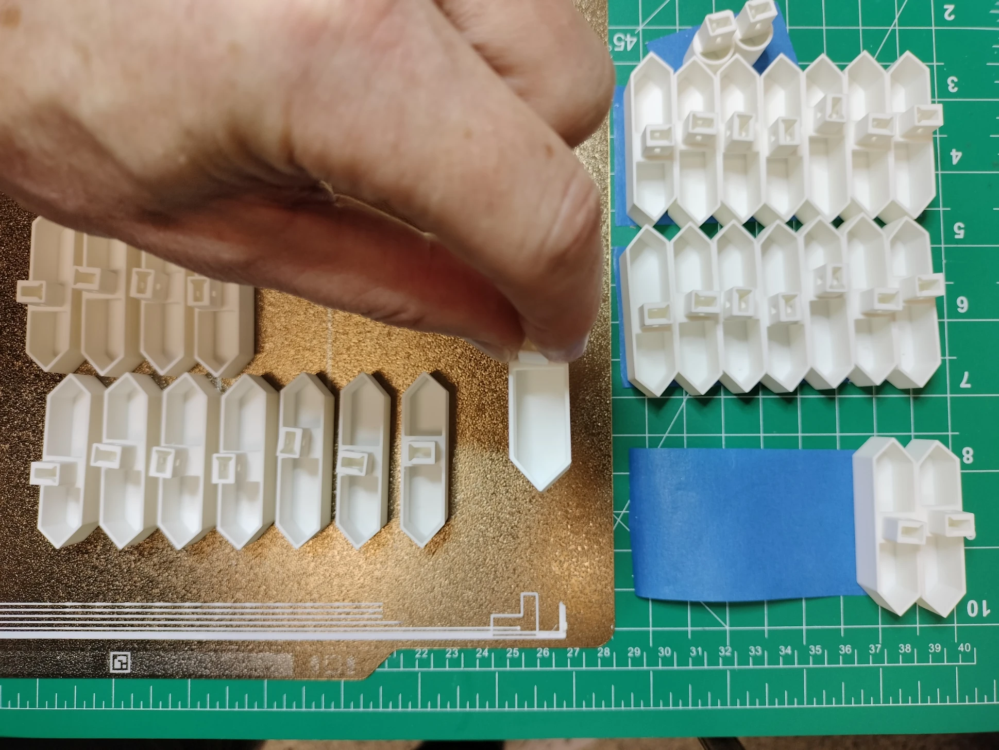

# 3D Print the Display Parts

## Filament Quantity

Below is a table of quantities of filament by weight. Since a roll of filament is generally 1000g (sometimes a bit less), you'll need two rolls of White Matte PLA.

| Type | Weight (g) |
| :--- | ---------: |
| Black Nylon | 77.1g |
| Black Matte PLA | 272.42g |
| White Matte PLA | 1535.44 |
| Black TPU | 115.15 |

## Parts

### **1. Black Nylon, Smooth Build Plate**

| File | Description | Density |&nbsp;Quantity&nbsp;| Per Unit (g) | Total (g) |
| :--- | :---- | ----: | ----: | ----: | ----: |
| **digit-gear30.stl**&nbsp;| Pinion gear for digits and colons  | 100% | 30 | 1.1 | 33 |
| **rack-gear.stl**&nbsp;| The arm of the actuator that extends and retracts the segment | 25% | 30 | 1.47 | 44.1 |

### **2. Black Matte PLA, Smooth Build Plate**

| File | Description | Density |&nbsp;Quantity&nbsp;| Per Unit (g) | Total (g) |
| :------ | :------ |  ----: |  ----: |  ----: |  ----: |
| **digit-back-plate.stl**&nbsp;| Back plates for digits 0 and 3 for mounting the actuators | 50% | 3 | 47.43 | 142.29 |
| **digit-gear10.stl**&nbsp;| Motor shaft gear mounted onto the heavy duty 103 motors | 100% | 30 | 0.5 | 15 |
| **digit1-back-plate.stl**&nbsp;| Conductor and digit 1 back plate for mounting the actuators | 50% | 1 | 67.7 | 67.7 |
| **digit2-back-plate.stl**&nbsp;| Back plate for digit 2 for mounting the actuators and powerbank/display stand | 50% | 1 | 47.43 | 47.43 |

### **3. White Matte PLA, Smooth Build Plate**

| STL | Description | Density |&nbsp;Quantity&nbsp;| Per Unit (g) | Total (g) |
| :---- | :---- | :---- |  ----: |  ----: |  ----: |
| **digit-motor-mount.stl**&nbsp;| Motor mount for digits and colons | 100% | 30 | 12.77 | 383.1 |
| **powerbank-cover.stl**&nbsp;| Cover for buck converters and powerbank PCB | 100% | 1 | 65.53 | 65.53 |
| **powerbank.stl**&nbsp;| Kinetic display stand, buck converter mounts, and powerbank PCB mount | 100% | 1 | 146.75 | 146.75 |
| **rackgear-bumper.stl**&nbsp;| Stops the segment or colon at the precise distance when extended | 100% | 30 | 0.61 | 18.3 |
| **seg-pin.stl**&nbsp;| Pin to hold the rack gear onto the segment and colons | 100% | 30 | 0.4 | 12 |

### **4. White Matte PLA, Textured Build Plate**

| STL | Description | Density |&nbsp;Quantity&nbsp;| Per Unit (g) | Total (g) |
| :---- | :---- | :---- |  ----: |  ----: |  ----: |
| **colon-seg.stl**&nbsp;| Colon, upper and lower | 100% | 2 | 1.88 | 3.76 |
| **digit0-1-face.stl**&nbsp;| Kinetic display face, right side (when facing the front, textured surface side) | 70% | 1 | 395 | 395 |
| **digit2-3-face.stl**&nbsp;| Kinetic display face, left side (when facing the front, textured surface side) | 70% | 1 | 399 | 399 |
| **seg-a.stl**&nbsp;| Digit 7-segment A | 100% | 4 | 4 | 16 |
| **seg-b.stl**&nbsp;| Digit 7-segment B | 100% | 4 | 4 | 16 |
| **seg-c.stl**&nbsp;| Digit 7-segment C | 100% | 4 | 4 | 16 |
| **seg-d.stl**&nbsp;| Digit 7-segment D | 100% | 4 | 4 | 16 |
| **seg-e.stl**&nbsp;| Digit 7-segment E | 100% | 4 | 4 | 16 |
| **seg-f.stl**&nbsp;| Digit 7-segment F | 100% | 4 | 4 | 16 |
| **seg-g.stl**&nbsp;| Digit 7-segment G | 100% | 4 | 4 | 16 |

### **5. Black TPU, Smooth Build Plate**
  
| STL | Description | Density |&nbsp;Quantity&nbsp;| Per Unit (g) | Total (g) |
| :---- | :---- | :---- |  ----: |  ----: |  ----: |
| **digit-gasket.stl**&nbsp;| Gaskets for digits 0 and 3 to cushion the PCB during segment retractions | 15% | 3 | 17.86 | 53.58 |
| **digit1-gasket.stl**&nbsp;| Gasket for the conductor and digit 1 to cushion the PCB during segment retractions | 15% | 1 | 31.71 | 31.71 |
| **digit2-gasket.stl**&nbsp;| Gasket for digits 2 to cushion the PCB during segment retractions | 15% | 1 | 17.86 | 17.86 |
| **rackgear-bumper-gasket.stl**&nbsp;| Provides some cushion for the rack gear when extended | 100% | 30 | 0.4 | 12 |

## Guidelines

Below are few guidelines to keep in mind when printing and assembling the display:

- Read all the assembly guides in this documentation before printing to ensure you have a clear understanding of the fabrication type and quality, positioning and assembly.
- The 3mf project files are included under the `./fdm/3mf` directory for Bambu Studio or Orca Slicer users. All necessary settings are included at an object level, not on a global level.
- The stl files are included under the `./fdm/stl` directory. You'll need to follow the table below for the settings to use.
- The display face uses over 2/3rds of the 1 KG roll of filament. Therefore, be sure to use the same roll of filament when printing both halves of the display face, segments, and colons. Also, have two 1 KG rolls of white filament from the same batch to avoid inconsistencies in your print color.
- Do not worry if your 3D printer and slicer cannot iron the top surfaces. Ironing the top surfaces is for fit and finish and will not affect the functionality of the display.
- Thoroughly dry your filament before use, especially the nylon and flexible filament types as they will not print properly and cause issue with being stringy and may have inexact gear teeth or hole sizes.
- Be sure you apply an adhesive to the printer plate bed otherwise the edges and corners of the display face may warp. I used all weather Aqua Net, super hold hair spray for my display faces which provided an even coating of adhesive across the entire surface of the bed plate and resulted in clean corners and edges.
- Use painter's tape to keep the pieces organized, see picture below. Note the segments a-g (left to right) are preserved the moment the bed plate is removed from the 3d printer.

