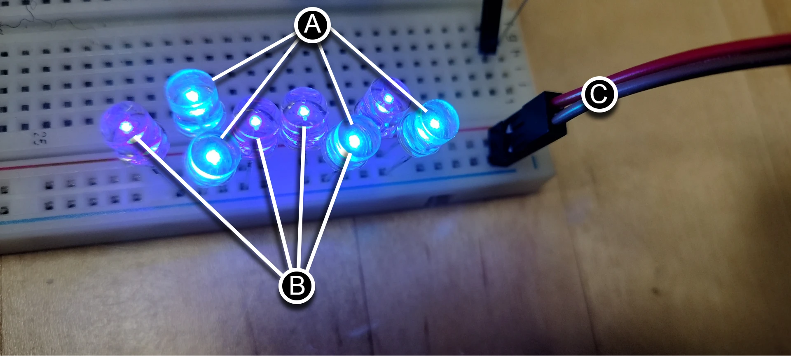

# Bill of Materials

| Item | Quantity |
|---------|---------|
| Single digit PCB for digits 0, 2, & 3 | 3 |
| Conductor PCB for digit 1 and the colons | 1 |
| Powerbank PCB | 1 |
| 2 Inch Jumbo Paper Clips (Smooth Big Paperclips) | 20 |
| M1.7 x 6mm Stainless Steel Phillips Round Head Self Tapping Screws | 200 |
| M1.7 x 8mm Stainless Steel Phillips Round Head Self Tapping Screws | 200 |
| M2 X 15mm Stainless Steel Phillips Round Head Self Tapping Screws | 50 |
| Micro 130 DC Motor Strong Magnetic Brushed Electric DC 3V -12V 25000 RPM Cars Toys Electric Motor, High Speed Torque | 30 |
| Black 28 AWG Gauge Flexible Silicone Rubber Electric Wire | 10M |
| White 28 AWG Gauge Flexible Silicone Rubber Electric Wire | 10M |
| Male Breakout Pin Connector 2.54mm | 100 |
| 2.54mm 0.1" Pitch PCB Mount Screw Terminal Block Connector, 2P 3P 4P Terminals for 26-18AWG Cable | 50 |
| Dupont Jumper Wire Cable Female Pin Connector 2.54mm | 100 |
| 2.54mm 1x2p Dupont Connector Housing Female for Dupont Cable and Jumper Wire | 100 |
| Digital Temperature and Humidity Sensor DHT22 Module, 3 pin | 1 |
| 5mm 0.5 Ω ohm Photoresistor Resistor 5516 GL5516 | 1 |
| 5mm Flat Top LED Diode Lights[^1] (Clear Transparent Lens) Bright Lighting Bulb Lamps Electronics Components Indicator Light Emitting Diodes | 112 |
| 3mm Flat Top LED Diode Lights[^1] (Clear Transparent Lens) Bright Lighting Bulb Lamps Electronics Components Indicator Light Emitting Diodes | 2 |
| Vertical Slide Switches Micro High Knob 3 Pin 2 Position 1P2T SPDT Panel Mount AC 125V 2A | 1 |
| LM2596 DC-DC Step Down Variable Volt Regulator Input 3.2V-40V Output 1.25V-35V Adjustable Buck Converter Electronic Voltage Stabilizer Power Supply Module | 5 |
| 2.1mm Barrel Jack 5.5x2.1mm Female DC Power Jack 2.1 X 5.5mm DC Jack Connector 6V 9V 12V DC Jack Panel Mount | 1 |
| 12V 5A Power Supply, AC DC Converter 100-220V to 12 Volt 5 Amp Transformer 5.5x2.1mm Plug | 1 |
| S8050D S8050 NPN Transistor TO-92 20V 700MA 1W | 1 |
| 1N4001 Diode, standard, 1A, 50V, DO-41 | 1 |
| (optional) 20pin x 10pcs Female Headers Pins Straight Single Row Gold Plated Pitch 2.54mm 0.1 inch for PCB Connector Machine Breadboard Electronic Circuit Board | 10 |
| SONGLE SRS-05VDC-SL 05VDC-SL 4100 Blue 5V 6PIN Power Relay | 1 |
| L293D 16-pin IC Stepper Motor Drivers Controller | 17 |
| 0.1uF Ceramic Disc Capacitor - 50 Volts | 5 |
| 1uF Electrolytic Capacitor 1UF-50V-5X11 | 5 |
| S8550 TO-92 PNP Transistor | 1 |
| 2N2222 TO-92 NPN Transistor | 1 |
| 10K ohm 0805 Resistor 1/4w Metal Film Fixed Resistor | 2 |
| 1K ohm 0805 Resistor 1/4w Metal Film Fixed Resistor | 1 |
| Raspberry pi 2040 Pico | 4 |
| Raspberry pi 2040 Pico-W | 1 |
| Superglue (small tube) | 1 |
| White PLA 1KG | 2 |
| Black PLA 1 KG | 1 |
| Black Nylon, 1 KG | 1 |
| Black TPU, 1 KG | 1 |

## Tools

- 3D printer
- Wire Stripper for 28 AWG stranded wire
- Small Philips head screwdriver
- Dupont connector tool
- Soldering station with solder/flux
- Needle nose pliers
- Tweezers
- Clamping tweezers
- Zinc strip or thin metal strip (for melting PLA)
- Wire snipper
- Multimeter
- Breadboard and jumpers for testing electronics
- Label maker (optional)
- Computer with USB connector

[^1]: You can choose any color of LED that you would like for your display. White LEDs are the easiest to work with as they may have minor color variation within the same batch. Colored LEDs like blue or warm white may greatly vary in color within the same batch. Therefore, you may need to order more than the quantity listed in the BOM to get enough LEDs of the same color. Be sure to test your LEDs by using your phone's digital camera to see if there are any variations in color when the LEDs are lit. Below is a photo showing the color variation of blue 5mm LEDs within the same batch using a breadboard's power rail with 2.63v. In this case, I used the purple-hued LEDs because there were 112 of the same color.  

