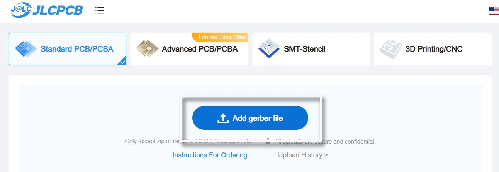
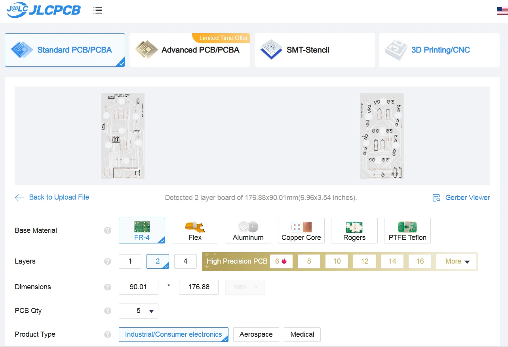
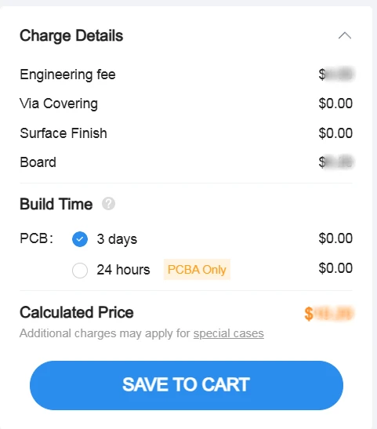

# Fabricate the Printed Circuit Boards (PCBs)

This guide will help you order the fabrication of your PCBs. The PCB files are located in your fork at `kinetic-display\pcb`. Follow the instructions below to place a separate order for each of the three Gerber files:

- `Gerber_KineticDisplay-Controller`
- `Gerber_KineticDisplay-PowerSystem`
- `Gerber_KineticDisplay-SingleDigit`

You will need to order more PCBs than required for this project because most PCB fabrication facilities have a minimum order quantity of five. Be sure to also order the remaining components and materials from the [Bill of Materials (BOM)](bom.md).

## Steps to Order PCBs

1. Open your browser and navigate to [https://jlcpcb.com/](https://jlcpcb.com/). Create an account if you do not already have one, then click the **Order now** button.  
   
2. Upload the Gerber file by clicking the **Add Gerber file** button. Repeat this step through step 4 for each of the three Gerber files found under the `kinetic-display\pcb` directory.  
   
3. Use all the default settings except change the PCB color to **white** to enhance the luminosity of the LEDs.  
   
4. Click the **SAVE TO CART** button and complete the order by following the shipping and payment steps in the wizard.  
   

## Notes

- **PCB Color**: White PCBs are recommended to maximize LED brightness and improve the overall aesthetic of the display.
- **Minimum Order Quantity**: Most PCB manufacturers require a minimum order of five PCBs per design. This means you will receive extra PCBs, which can be used as spares or for future projects.
- **Shipping and Lead Time**: Be sure to check the estimated shipping time and lead time for fabrication when placing your order.

Congratulations on ordering your PCBs!
