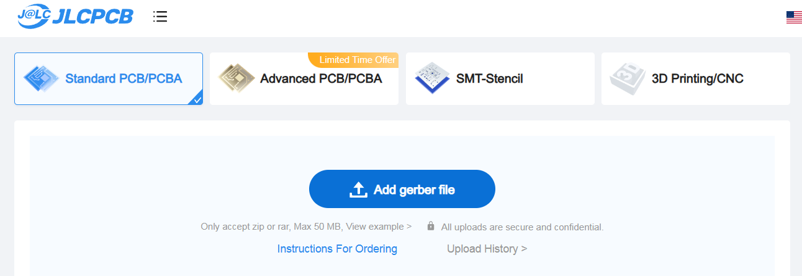
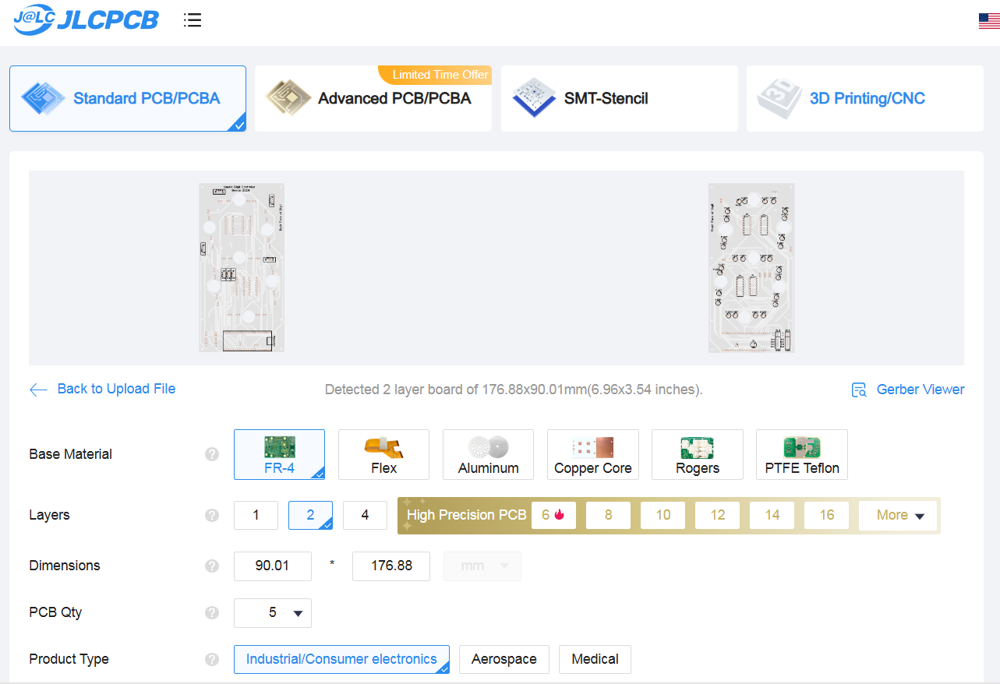

# Fabricate the Printed Circuit Boards (PCBs)

For this task you will order the fabrication of your PCBs. The PCB files are in your fork at ```kinetic-display\pcb```. See the instructions below to place a separate order for each of the 3 files that begin with the following names:

- Gerber_KineticDisplay-Controller
- Gerber_KineticDisplay-PowerSystem
- Gerber_KineticDisplay-SingleDigit

You will need to order more PCBs than required for this project because the minimum order is five for most PCB fabrication facilities. Be sure to order the remaining components and materials from the bill of materials (BOM).

1. From your browser open [https://jlcpcb.com/](https://jlcpcb.com/) and create an account if you do not have one, then click the “Order now” button. See the figure below.

1. Open the Gerber file by clicking the “Add Gerber file” button. Repeat this step through step 4 for each of the three Gerber files found under the ```kinetic-display\pcb directory```. See the figure below.

1. Use all the default settings except change the PCB color to white to give the LEDs more luminosity.

1. Click the “SAVE TO CART” and finish the order by completing the shipping and payment part of the wizard.


Congratulations for getting all PCBs ordered!

[Previous](./forkandclone.md) | [Next](./3dprints.md)
