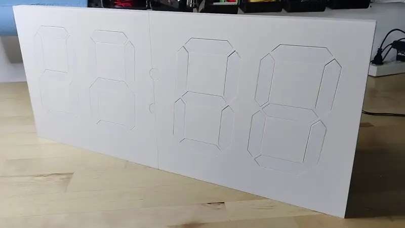
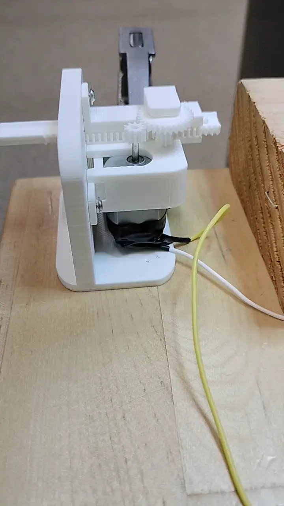
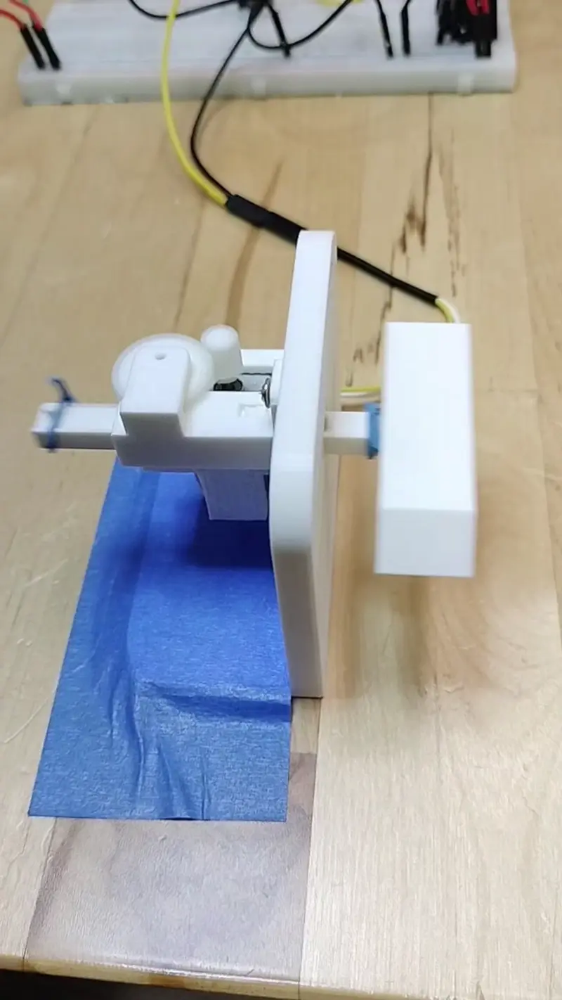
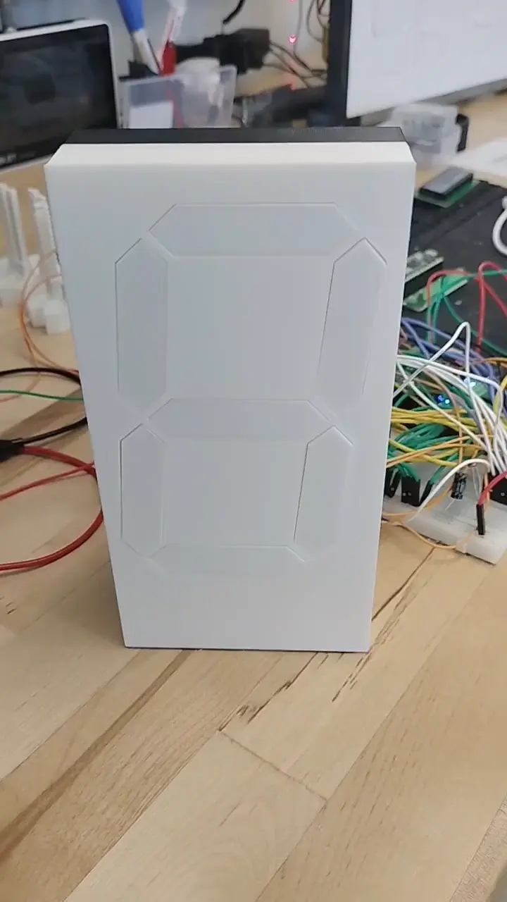
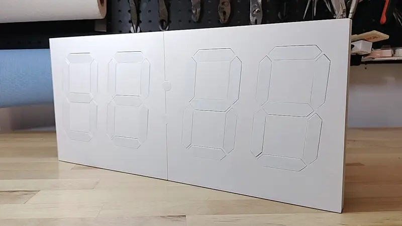

# Kinetic Display

gobbyo | jbeman@hotmail.com

## Introduction

The Kinetic Display is an innovative and engaging way to showcase the current time, date, indoor temperature and humidity, and outdoor temperature and humidity. Watch the feature summary video below to see it in action. This robotic seven-segment clock-like display consists of 4 digits and 2 colons, totaling 30 actuators that extend and retract segments. Each segment lights up when extended and turns off when retracted, creating a satisfying clacking sound with every movement, adding a unique auditory experience.

**Feature Summary**

The display features a built-in web service with adjustable settings that allow you to easily configure and personalize your display using any device with Wi-Fi and a web browser.

Having adjustable settings for your kinetic display offers several advantages:

- **Personalization**: Tailor the display's schedule, time format, temperature units, and digit style to match your preferences and environment.
- **Convenience**: Make changes from your phone or computer without needing to reprogram or physically access the device.
- **Adaptability**: Quickly update Wi-Fi credentials, time zones, or schedules if you move the display or your needs change.
- **Reliability**: Built-in test and recovery options help ensure the display operates correctly after power loss or network changes.
- **Energy Efficiency**: Schedule sleep and wake times to save power and extend the life of your display.

Optional startup animation whenever the power is turned on or the display wakes up from low power mode.

Designed for durability, the display is built to last for years when assembled correctly by following the detailed documentation. Below is an overview of the iterative design process that led to the creation of a robust, reliable, and cost-effective display, fully 3D-printable on a 256mm x 256mm x 256mm build plate.

**Actuator Prototype**

The actuators are the heart of the display, and getting their design right was critical. Early prototypes revealed issues such as gear tooth breakage due to improper sizing, material selection, and abrupt stops during operation. Adjustments to gear dimensions and the use of heavy-duty 103 motors significantly improved performance, enabling smooth operation with lower voltage requirements.

**Segment Prototype**

Multiple iterations of the segment design ensured the robustness of the segment head and its attachment to the rack gear. Experiments also determined the best cushioning material to absorb the impact of constant actuator movement.

**Digit Prototype**

The first digit prototype provided valuable insights into PCB design, software requirements, and the optimal dimensions for positioning the seven actuators within a single digit.

**First Prototype**

The prototype below has been running continuously since April 2024, demonstrating the reliability and durability of the design.
