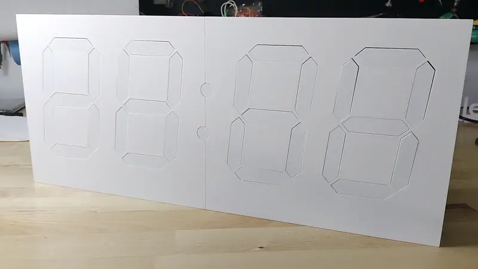

# Kinetic Display

gobbyo | jbeman@hotmail.com

## Introduction

The Kinetic display is a unique and entertaining way to view the current time, date, indoor temperature and humidity, and outdoor temperature and humidity, see the feature summary short clip video below. The robotic device is a seven-segment clock-like display with 4 digits and 2 colons, totalling 30 actuators that extend and retract the segments. Each segment lights up when extended then turns off when retracted. A clacking sound is made each time the actuator extends or retracts the segment, making satisfying percussive sound tapistry while in operation.

**Feature Summary**

The display is robust and designed to last for years when made properly by following the extensive and detailed assembly documentation. Below is the evolution of experiments needed to design the display.

**Actuator Prototype**

The display started with the goal of making an inexpensive, robust, and reliable actuator that is 3D printable. Early experiments of the original design caused the teeth on the rack and pinion gear to break after several minutes of continuous use because of several issues: gear tooth size, type of filament used for fabrication, size of the gear, and the jarring stops when extending or retracting. For example, the size and number of teeth on each gear was tuned to balance the transmission of stress equitably across the gears. Use of 103 motor made a big difference in the amount of voltage draw that was required to make the actuator work properly. Cheap 103 motors could barely make the actuator move with 5v, whereas heavy duty 103 motors worked fine with only 3v.

**Segment Prototype**

Iterations of the segment design were needed to see how robust the head of the segment was able to stay attached to the rack gear. The kind of material needed to cushion the constant banging of the actuator was also determined during these experiments.

**Digit Prototype**

The first digit prototype provided insights into the digit's PCB design, software that needed to be written, and the minimum size of the digit given the dimensions and positioning of the seven actuators.

**First Prototype**

The prototype below has been running 24x7 without issue since its birth in April of 2024.

