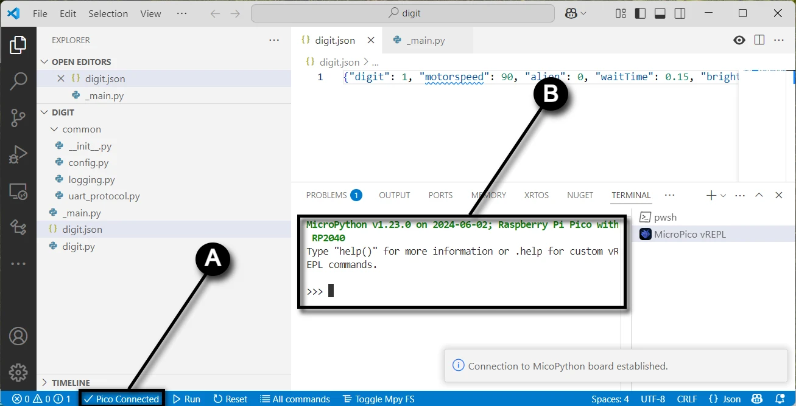
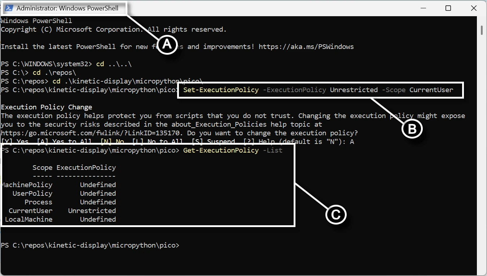
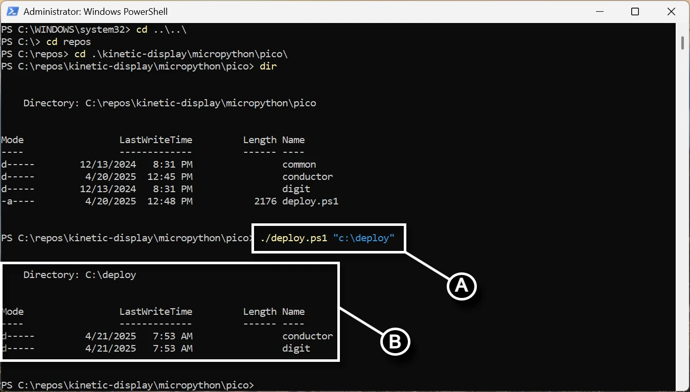

# Software and Microcontroller Preparation

If you have any problems with this documentation or the code, please create a [new issue](https://github.com/gobbyo/kinetic-display/issues/new/choose) on the Kinetic-Display GitHub site.

## Prerequisites

Before you begin, please:

- Read and bookmark the [MicroPython installation guide for Raspberry Pi Pico](https://www.raspberrypi.com/documentation/microcontrollers/micropython.html#what-is-micropython).

### 1. Install Required Software

1. [Download and install Visual Studio Code](https://code.visualstudio.com/download).
2. Open VS Code and click the **Extensions** icon on the [Activity Bar](https://code.visualstudio.com/docs/getstarted/userinterface#_basic-layout).
3. Search for and install these extensions from the [Marketplace](https://code.visualstudio.com/docs/editor/extension-marketplace):
    - **Python** by Microsoft
    - **MicroPico** by paulober

### 2. Prepare Your Raspberry Pi Pico

1. Download the [flash_nuke UF2 file](https://github.com/Pwea/Flash-Nuke).
2. Clear your Raspberry Pi Pico before flashing a new build:
    - Unplug your Pico from USB if it is connected.
    - Press and hold the **BOOTSEL** button on your Pico while plugging it into your computer's USB port.
    - Wait for the **RPI-RP2** storage device to appear on your computer.
    - Drag and drop the **flash_nuke.uf2** file onto the RPI-RP2 drive.
3. Download the MicroPython UF2 file for your device:
    - [Raspberry Pi Pico](https://micropython.org/download/RPI_PICO/)
    - [Raspberry Pi Pico W](https://micropython.org/download/RPI_PICO_W/)

---

## Verify MicroPython on Your Raspberry Pi Pico

1. Open Visual Studio Code.
2. On the top menu, select the **ellipsis ...** (if present), then **Terminal → New Terminal**.
   
3. In the terminal pane, select the terminal menu, then the MicroPico vREPL sub-menu.
   
4. Plug your Raspberry Pi Pico into the USB port. The [Status bar](https://learn.microsoft.com/en-us/visualstudio/extensibility/vsix/recipes/notifications?view=vs-2022#status-bar) will show your Pico as connected.
   
5. Verify your Pico's onboard LED turns on and off by typing the following code in the terminal pane (copy/paste each line separately):

```python
from machine import Pin
p = Pin(25, Pin.OUT)
p.on()
p.off()
```

---

## Fork and Clone the Repository

1. [Install Git](https://git-scm.com/downloads) for Windows.
2. Go to the [Kinetic-Display GitHub repository](https://github.com/gobbyo/kinetic-display).
3. [Create a fork](https://docs.github.com/en/pull-requests/collaborating-with-pull-requests/working-with-forks/fork-a-repo) of the repository.
4. If you have never used PowerShell before:
    - Open a new **PowerShell** terminal as administrator (search for "Windows PowerShell" in the Start menu).
    - Run: `Set-ExecutionPolicy -ExecutionPolicy Unrestricted -Scope CurrentUser`
    - Verify with: `Get-ExecutionPolicy -List` (ensure `CurrentUser` is set to `Unrestricted`).
    - 
5. Otherwise, open a new **PowerShell** terminal (no admin needed).
   
6. Change directory to your cloned repo's `kinetic-display\micropython\pico` folder.
7. Run the command: `./deploy.ps1 <directorypath>` (replace `<directorypath>` with your desired folder, e.g., `./deploy.ps1 "c:\deploy"`).
   

!!! warning
    The folder you provide for `<directorypath>` will be deleted along with all its contents when you run the `deploy.ps1` script. Be sure to save or rename the folder if you want to preserve any changes you made.

If successful, you should see output like this, and the `conductor` and `digit` folders should exist in your deployment directory:

```dos
Directory: C:\deploy

Mode                 LastWriteTime         Length Name
----                 -------------         ------ ----
d-----         1/31/2025   8:30 PM                conductor
d-----         1/31/2025   8:30 PM                digit
```
