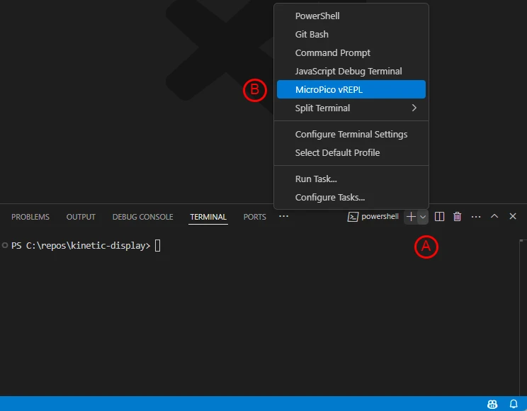
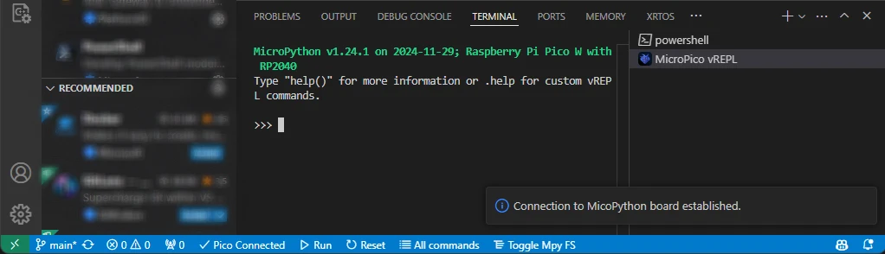

# Software and Microcontroller Preparation

## Prerequisites

1. [Install Visual Studio Code](https://code.visualstudio.com/download)
1. With VS Code installed and open, click on the extensions icon on the "Activity bar" (leftmost panel in the window) and install the following [extensions from Marketplace](https://code.visualstudio.com/docs/editor/extension-marketplace):
    1. **Python** by Microsoft
    1. **MicroPico** by paulober
1. Download the [flash_nuke Uf2 file](https://github.com/Pwea/Flash-Nuke)
1. Clear your Raspberry Pi Pico before flashing a new build:
    1. Plug a USB cable into your Raspberry Pi Pico's USB port
    1. Press and hold the **BOOTSEL** button on your Raspberry Pi Pico while plugging your USB cable into your computer
    1. Verify an **RPI-RP2** storage device appears
    1. Drag and drop the **flash_nuke.uf2** file into the RPI-RP2 storage
1. Download the micropython Uf2 file for the [Raspberry Pi Pico](https://micropython.org/download/RPI_PICO/) and [Raspberry Pi PicoW](https://micropython.org/download/RPI_PICO_W/)
1. Install [Micropython onto your Raspberry Pi Pico](https://www.raspberrypi.com/documentation/microcontrollers/micropython.html#what-is-micropython)

## Verify Micropython on your Raspberry Pi Pico

1. Open Visual Studio Code
1. On the top menu select **Terminal->New Terminal**
1. In the terminal pane, select the terminal menu **"A"** followed by **"B"** the MicroPico vREPL sub-menu

1. The "MicroPico vREPL" terminal will show your Pico is disconnected

1. Plug your Raspberry Pi Pico into the USB port and the terminal will show your Pico as connected

1. Type the following code in the terminal window, copy/paste each line separately:

```python
from machine import Pin
p = Pin(25,Pin.OUT)
p.on()
p.off()
```

Verify your Pico's onboard LED turns on and off.
