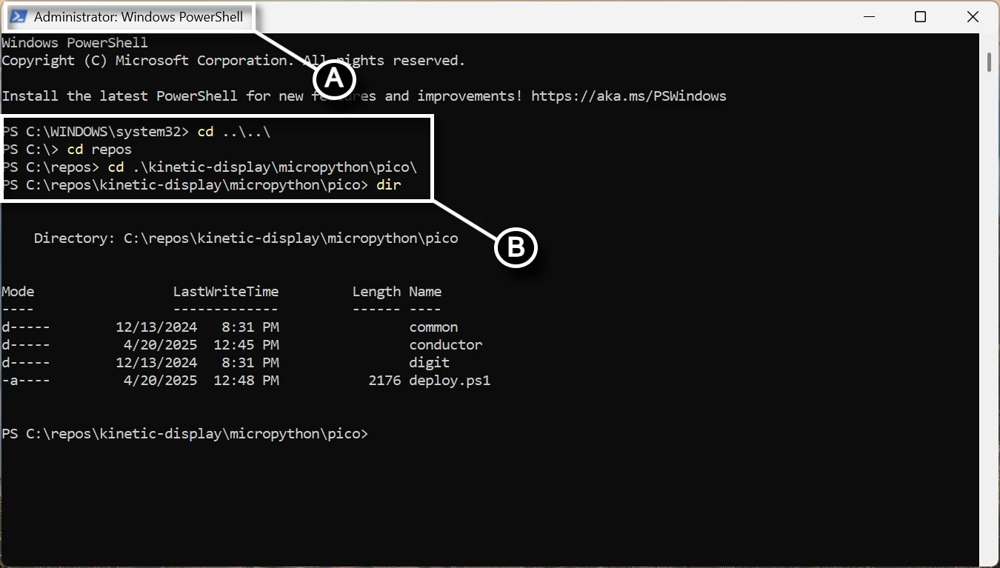

# Software and Microcontroller Preparation

If you have any problems with this documentation or the code, please create a [new issue](https://github.com/gobbyo/kinetic-display/issues/new/choose) on the Kinetic-Display GitHub site.

## Prerequisites

Read and bookmark the instructions to install [MicroPython onto your Raspberry Pi Pico](https://www.raspberrypi.com/documentation/microcontrollers/micropython.html#what-is-micropython).

1. [Install Visual Studio Code](https://code.visualstudio.com/download).
2. With VS Code installed and open, click on the extensions icon on the [Activity bar](https://code.visualstudio.com/docs/getstarted/userinterface#_basic-layout) and install the following [extensions from Marketplace](https://code.visualstudio.com/docs/editor/extension-marketplace):
    1. **Python** by Microsoft.
    2. **MicroPico** by paulober.
3. Download the [flash_nuke UF2 file](https://github.com/Pwea/Flash-Nuke).
4. Clear your Raspberry Pi Pico before flashing a new build:
    1. Plug a USB cable into your Raspberry Pi Pico's USB port.
    2. Press and hold the **BOOTSEL** button on your Raspberry Pi Pico while plugging your USB cable into your computer.
    3. Verify an **RPI-RP2** storage device appears.
    4. Drag and drop the **flash_nuke.uf2** file into the RPI-RP2 storage.
5. Download the MicroPython UF2 file for the [Raspberry Pi Pico](https://micropython.org/download/RPI_PICO/) and [Raspberry Pi Pico W](https://micropython.org/download/RPI_PICO_W/).

## Test Rest API Dependencies using a Web Browser

Code in the Kinetic Display relies on the use of several Rest APIs to obtain local time and weather information. Follow the steps below to ensure the Kinetic Display will function properly before you order materials or begin 3D printing parts.

1. **External IP Address**. Obtain the extenal IP address of your computer by pasting [http://api.ipify.org](http://api.ipify.org) into the address bar of your browser and hit the return key. The result from calling the URL will be the external IP address of your computer, for example `11.115.204.194`. Save your external IP address for the next step.
2. **Latitude and Longitude**. Using the external IP address you obtained in the previous step, change the `{0}` value in `http://ip-api.com/json/{0}` with your external IP address then paste the URL into the address bar of your browser and hit the return key. For example, [http://ip-api.com/json/11.115.204.194](http://ip-api.com/json/11.115.204.194). Verify the resulting JSON is contains `lat`, `lon`, and `timezone`. For example,

```json

    {"status":"success","country":"United States","countryCode":"US","region":"OH","regionName":"Ohio","city":"Whitehall","zip":"43218","lat":39.9747,"lon":-82.8947,"timezone":"America/New_York","isp":"DoD Network Information Center","org":"DoD Network Information Center","as":"AS749 DoD Network Information Center","query":"11.115.204.194"}
   
```

3. **Weather**. Using the **"lat"** and **"lon"** values you obtained in the previous sep, use the api [https://api.open-meteo.com/v1/forecast?latitude={0}&longitude={1}&current_weather=true&hourly=relativehumidity_2m](https://api.open-meteo.com/v1/forecast?latitude={0}&longitude={1}&current_weather=true&hourly=relativehumidity_2m) and change the `{0}` with the **"lat"** value and `{1}` with the **"lon"** value. for example, [https://api.open-meteo.com/v1/forecast?latitude=39.9747&longitude=-82.8947&current_weather=true&hourly=relativehumidity_2m](https://api.open-meteo.com/v1/forecast?latitude=39.9747&longitude=-82.8947&current_weather=true&hourly=relativehumidity_2m). Paste the modified URL into your browser address bar and hit the return or enter key. Verify the resulting JSON is contains `temperature` and `relativehumidity_2m`. For example,

```json

    {"latitude":39.986526,"longitude":-82.90847,"generationtime_ms":0.058770179748535156,"utc_offset_seconds":0,"timezone":"GMT","timezone_abbreviation":"GMT","elevation":242.0,"current_weather_units":{"time":"iso8601","interval":"seconds","temperature":"°C","windspeed":"km/h","winddirection":"°","is_day":"","weathercode":"wmo code"},"current_weather":{"time":"2025-05-13T19:30","interval":900,"temperature":21.3,"windspeed":5.5,"winddirection":122,"is_day":1,"weathercode":3},"hourly_units":{"time":"iso8601","relativehumidity_2m":"%"},"hourly":{"time":[],"relativehumidity_2m":[]}}

```

## Verify MicroPython on your Raspberry Pi Pico

1. Open Visual Studio Code.
1. On the top menu, select the **(A) ellipsis ...** (if present), then **(B) Terminal -> New Terminal**.  
   
1. In the terminal pane, select the terminal menu **(A)** followed by the MicroPico vREPL sub-menu **(B)**.  
   
1. Plug your Raspberry Pi Pico into the USB port, and the **(A)** [Status bar](https://learn.microsoft.com/en-us/visualstudio/extensibility/vsix/recipes/notifications?view=vs-2022#status-bar) will show your Pico as connected.  
   
1. Verify your Pico's onboard LED turns on and off by typing the following code in the **(B) Terminal pane** (screen capture above). Copy/paste each line separately:

```python
   from machine import Pin
   p = Pin(25, Pin.OUT)
   p.on()
   p.off()
```

## Fork and Clone the Repository

1. [Install Git](https://git-scm.com/downloads) for Windows.
2. Open a browser and follow the link to the [Kinetic-Display](https://github.com/gobbyo/kinetic-display) repository.
3. [Create a fork](https://docs.github.com/en/pull-requests/collaborating-with-pull-requests/working-with-forks/fork-a-repo) from the `kinetic-display` repository.
4. Run this step if you have never used or run PowerShell on your computer:
       - Open a new **PowerShell** terminal by clicking on the Windows icon in the bottom taskbar and searching for "Windows PowerShell," then run the application as administrator. See **(A)** in the screenshot below.
       - **(B)** Type `Set-ExecutionPolicy -ExecutionPolicy Unrestricted -Scope CurrentUser` in the PowerShell terminal and press Enter.
       - **(C)** Verify the command by typing `Get-ExecutionPolicy -List` and ensure the `CurrentUser` is set to `Unrestricted`.  
    
5. If you did not need to run the previous step, then open a new **PowerShell** terminal by clicking on the Windows icon in the bottom taskbar and searching for "Windows PowerShell," then run the application. See **(A)** in the screenshot below.  
   
6. Change the directory to `kinetic-display\micropython\pico` in your cloned fork. See **(B)** in the previous screenshot.
7. Run the command `./deploy.ps1 <directorypath>` where `<directorypath>` is replaced with a quoted path to a folder, for example, `./deploy.ps1 "c:\deploy"`. See **(A)** in the screenshot below.  
   

!!! warning
    The folder you provide for **`<directorypath>`** will be deleted along with all its contents when you run the `deploy.ps1` script. Be sure to save or rename the folder if you want to preserve any changes you made.

You'll get the following example output when successful. Also, see **(B)** in the previous screenshot. Verify the **conductor** and **digit** folders exist under the folder you provided in the parameter for the `./deploy.ps1`. You'll use the code in the **conductor** and **digit** folders to test and load onto your Raspberry Pi 2040 Picos and Pico W.

```dos
    Directory: C:\deploy

Mode                 LastWriteTime         Length Name
----                 -------------         ------ ----
d-----         1/31/2025   8:30 PM                conductor
d-----         1/31/2025   8:30 PM                digit
```
