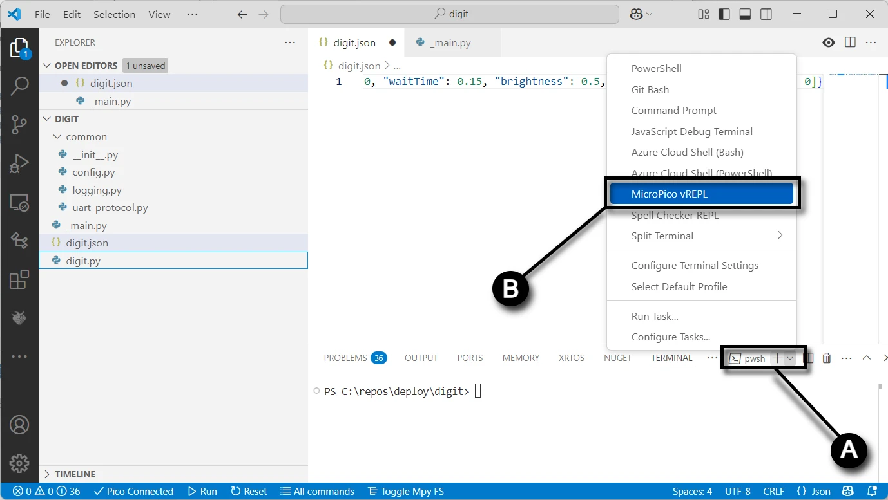

# Software and Microcontroller Preparation

If you have any problems with this documentation or the code, please create a [new issue](https://github.com/gobbyo/kinetic-display/issues/new/choose) on the Kinetic-Display GitHub site.

## Prerequisites

Before you begin, please:

- Read and bookmark the [MicroPython installation guide for Raspberry Pi Pico](https://www.raspberrypi.com/documentation/microcontrollers/micropython.html#what-is-micropython).

### 1. Install Required Software

1. [Download and install Visual Studio Code](https://code.visualstudio.com/download).
2. Open VS Code and click the **Extensions** icon on the [Activity Bar](https://code.visualstudio.com/docs/getstarted/userinterface#_basic-layout).
3. Search for and install these extensions from the [Marketplace](https://code.visualstudio.com/docs/editor/extension-marketplace):
    - **Python** by Microsoft
    - **MicroPico** by paulober

### 2. Prepare Your Raspberry Pi Pico

1. Download the [flash_nuke UF2 file](https://github.com/Pwea/Flash-Nuke).
2. Clear your Raspberry Pi Pico before flashing a new build:
    - Unplug your Pico from USB if it is connected.
    - Press and hold the **BOOTSEL** button on your Pico while plugging it into your computer's USB port.
    - Wait for the **RPI-RP2** storage device to appear on your computer.
    - Drag and drop the **flash_nuke.uf2** file onto the RPI-RP2 drive.
3. Download the MicroPython UF2 file for your device:
    - [Raspberry Pi Pico](https://micropython.org/download/RPI_PICO/)
    - [Raspberry Pi Pico W](https://micropython.org/download/RPI_PICO_W/)

---

## Test REST API Dependencies

The Kinetic Display uses several REST APIs to obtain local time and weather information. Use your computer's web browser to verify these APIs work for your location **before** ordering materials or 3D printing parts. Some APIs are used as backups for reliability, as they may be throttled or temporarily unavailable.

### Step 1: Get Your External IP Address

- Visit [http://api.ipify.org](http://api.ipify.org) in your browser. The page will display your external IP address (e.g., `11.115.204.194`). Save this address for the next steps.

### Step 2: Get Latitude, Longitude, and Time Zone

- Replace `{0}` in `http://ip-api.com/json/{0}` with your external IP address from Step 1.
- Example: [http://ip-api.com/json/11.115.204.194](http://ip-api.com/json/11.115.204.194)
- The JSON response should include `lat`, `lon`, and `timezone` fields. Example:

```json
{
  "status": "success",
  "country": "United States",
  "countryCode": "US",
  "region": "OH",
  "regionName": "Ohio",
  "city": "Whitehall",
  "zip": "43218",
  "lat": 39.9747,
  "lon": -82.8947,
  "timezone": "America/New_York",
  "isp": "DoD Network Information Center",
  "org": "DoD Network Information Center",
  "as": "AS749 DoD Network Information Center",
  "query": "11.115.204.194"
}
```

### Step 3: Get Weather Data

- Use the `lat` and `lon` values from Step 2 in the following API:
  `https://api.open-meteo.com/v1/forecast?latitude={0}&longitude={1}&current_weather=true&hourly=relativehumidity_2m`
- Example: [https://api.open-meteo.com/v1/forecast?latitude=39.9747&longitude=-82.8947&current_weather=true&hourly=relativehumidity_2m](https://api.open-meteo.com/v1/forecast?latitude=39.9747&longitude=-82.8947&current_weather=true&hourly=relativehumidity_2m)
- The JSON response should include `temperature` and `relativehumidity_2m` fields. Example:

```json
{
  "latitude": 39.986526,
  "longitude": -82.90847,
  "generationtime_ms": 0.0587701797485352,
  "utc_offset_seconds": 0,
  "timezone": "GMT",
  "timezone_abbreviation": "GMT",
  "elevation": 242,
  "current_weather_units": {
    "time": "iso8601",
    "interval": "seconds",
    "temperature": "°C",
    "windspeed": "km/h",
    "winddirection": "°",
    "is_day": "",
    "weathercode": "wmo code"
  },
  "current_weather": {
    "time": "2025-05-13T19:30",
    "interval": 900,
    "temperature": 21.3,
    "windspeed": 5.5,
    "winddirection": 122,
    "is_day": 1,
    "weathercode": 3
  },
  "hourly_units": {
    "time": "iso8601",
    "relativehumidity_2m": "%"
  },
  "hourly": {
    "time": [],
    "relativehumidity_2m": []
  }
}
```

### Step 4: Get World Time by IP

- Use your external IP address in the following API:
  `http://worldtimeapi.org/api/ip/{ip}`
- Example: [http://worldtimeapi.org/api/ip/11.115.204.194](http://worldtimeapi.org/api/ip/11.115.204.194)
- The JSON response should include a `datetime` field. Example:

```json
{
  "utc_offset": "-05:00",
  "timezone": "America/Chicago",
  "day_of_week": 2,
  "day_of_year": 133,
  "datetime": "2025-05-13T16:42:11.694884-05:00",
  "utc_datetime": "2025-05-13T21:42:11.694884+00:00",
  "unixtime": 1747172531,
  "raw_offset": -21600,
  "week_number": 20,
  "dst": true,
  "abbreviation": "CDT",
  "dst_offset": 3600,
  "dst_from": "2025-03-09T08:00:00+00:00",
  "dst_until": "2025-11-02T07:00:00+00:00",
  "client_ip": "45.115.204.194"
}
```

### Step 5: Get Time API by IP

- Use your external IP address in the following API:
  `https://www.timeapi.io/api/Time/current/ip?ipAddress={ip}`
- Example: [https://www.timeapi.io/api/Time/current/ip?ipAddress=11.115.204.194](https://www.timeapi.io/api/Time/current/ip?ipAddress=11.115.204.194)
- The JSON response should include `year`, `month`, `hour`, `minute`, `seconds`, and `date`. Example:

```json
{
  "year": 2025,
  "month": 5,
  "day": 13,
  "hour": 15,
  "minute": 39,
  "seconds": 36,
  "milliSeconds": 804,
  "dateTime": "2025-05-13T15:39:36.8047099",
  "date": "05/13/2025",
  "time": "15:39",
  "timeZone": "America/New_York",
  "dayOfWeek": "Tuesday",
  "dstActive": true
}
```

### Step 6: Get World Time by Time Zone

- Use the `timezone` value from Step 2 in the following API:
  `http://worldtimeapi.org/api/timezone/{timezone}`
- Example: [http://worldtimeapi.org/api/timezone/America/New_York](http://worldtimeapi.org/api/timezone/America/New_York)
- The JSON response should include a `datetime` field. Example:

```json
{
  "utc_offset": "-05:00",
  "timezone": "America/Chicago",
  "day_of_week": 2,
  "day_of_year": 133,
  "datetime": "2025-05-13T16:42:11.694884-05:00",
  "utc_datetime": "2025-05-13T21:42:11.694884+00:00",
  "unixtime": 1747172531,
  "raw_offset": -21600,
  "week_number": 20,
  "dst": true,
  "abbreviation": "CDT",
  "dst_offset": 3600,
  "dst_from": "2025-03-09T08:00:00+00:00",
  "dst_until": "2025-11-02T07:00:00+00:00",
  "client_ip": "45.115.204.194"
}
```

### Step 7: Get Time API by Time Zone

- Use the `timezone` value from Step 2 in the following API:
  `https://www.timeapi.io/api/Time/current/zone?timeZone={timezone}`
- Example: [https://www.timeapi.io/api/Time/current/zone?timeZone=America/New_York](https://www.timeapi.io/api/Time/current/zone?timeZone=America/New_York)
- The JSON response should include `year`, `month`, `hour`, `minute`, `seconds`, and `date`. Example:

```json
{
  "year": 2025,
  "month": 5,
  "day": 13,
  "hour": 15,
  "minute": 39,
  "seconds": 36,
  "milliSeconds": 804,
  "dateTime": "2025-05-13T15:39:36.8047099",
  "date": "05/13/2025",
  "time": "15:39",
  "timeZone": "America/New_York",
  "dayOfWeek": "Tuesday",
  "dstActive": true
}
```

---

## Verify MicroPython on Your Raspberry Pi Pico

1. Open Visual Studio Code.
2. On the top menu, select the **ellipsis ...** (if present), then **Terminal → New Terminal**.
   
3. In the terminal pane, select the terminal menu, then the MicroPico vREPL sub-menu.
   
4. Plug your Raspberry Pi Pico into the USB port. The [Status bar](https://learn.microsoft.com/en-us/visualstudio/extensibility/vsix/recipes/notifications?view=vs-2022#status-bar) will show your Pico as connected.
   
5. Verify your Pico's onboard LED turns on and off by typing the following code in the terminal pane (copy/paste each line separately):

```python
from machine import Pin
p = Pin(25, Pin.OUT)
p.on()
p.off()
```

---

## Fork and Clone the Repository

1. [Install Git](https://git-scm.com/downloads) for Windows.
2. Go to the [Kinetic-Display GitHub repository](https://github.com/gobbyo/kinetic-display).
3. [Create a fork](https://docs.github.com/en/pull-requests/collaborating-with-pull-requests/working-with-forks/fork-a-repo) of the repository.
4. If you have never used PowerShell before:
    - Open a new **PowerShell** terminal as administrator (search for "Windows PowerShell" in the Start menu).
    - Run: `Set-ExecutionPolicy -ExecutionPolicy Unrestricted -Scope CurrentUser`
    - Verify with: `Get-ExecutionPolicy -List` (ensure `CurrentUser` is set to `Unrestricted`).
    - 
5. Otherwise, open a new **PowerShell** terminal (no admin needed).
   
6. Change directory to your cloned repo's `kinetic-display\micropython\pico` folder.
7. Run the command: `./deploy.ps1 <directorypath>` (replace `<directorypath>` with your desired folder, e.g., `./deploy.ps1 "c:\deploy"`).
   

!!! warning
    The folder you provide for `<directorypath>` will be deleted along with all its contents when you run the `deploy.ps1` script. Be sure to save or rename the folder if you want to preserve any changes you made.

If successful, you should see output like this, and the `conductor` and `digit` folders should exist in your deployment directory:

```dos
Directory: C:\deploy

Mode                 LastWriteTime         Length Name
----                 -------------         ------ ----
d-----         1/31/2025   8:30 PM                conductor
d-----         1/31/2025   8:30 PM                digit
```
