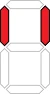
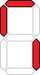
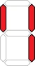

# User Guide - Table of Human and Alien Digit Type

| Human | Alien |
| :---: | :--- |
|  |  |
|  |  |
|  |  |
|  |  |
|  |  |
|  |  |
|  |  |
|  |  |
|  |  |
|  |  |
|  |  |
|  |  |
|  |  |
|  |  |
|  |  |