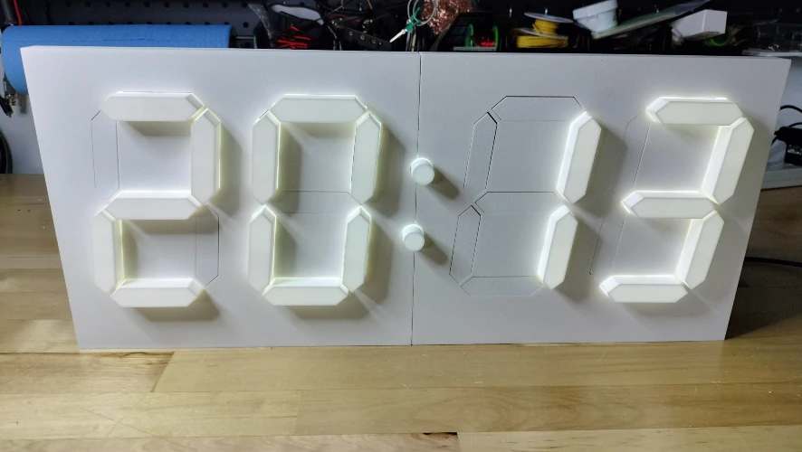
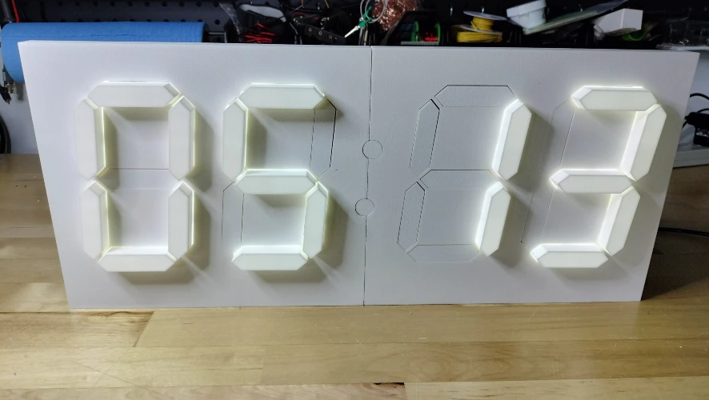
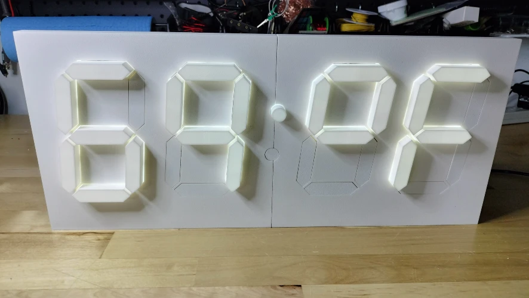
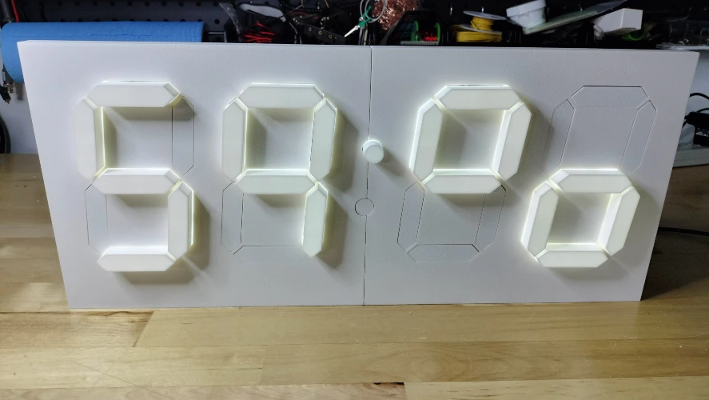
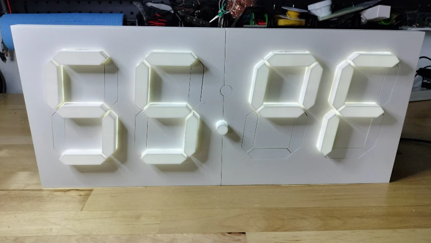
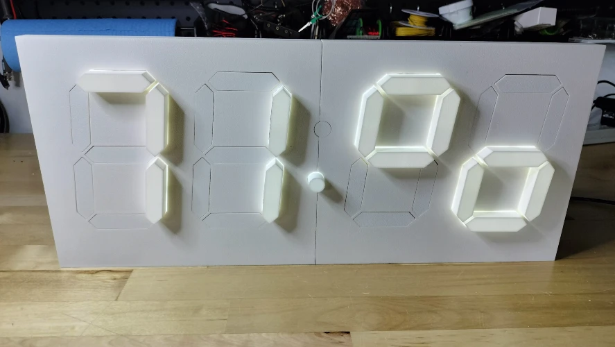
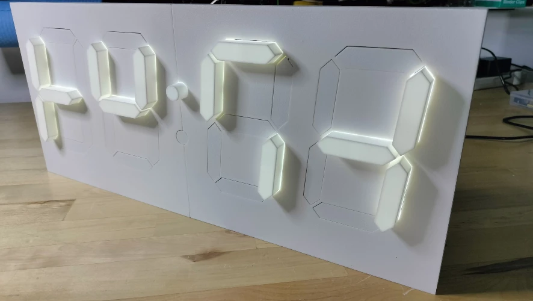
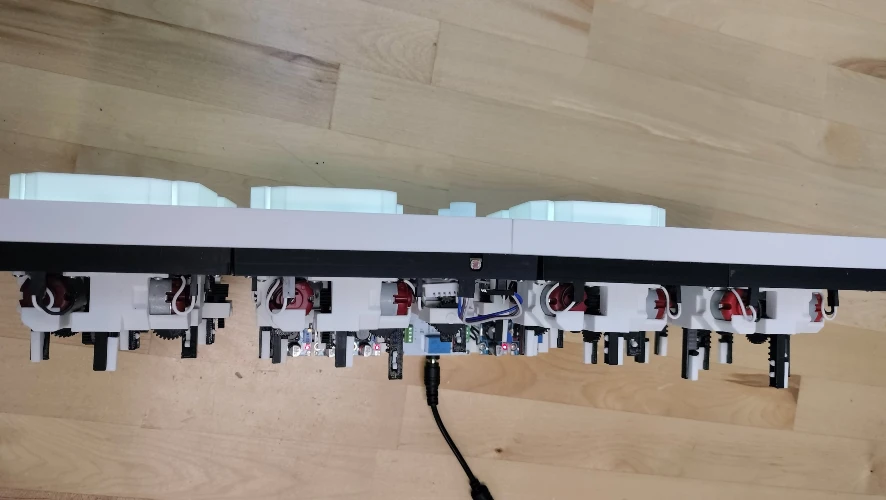
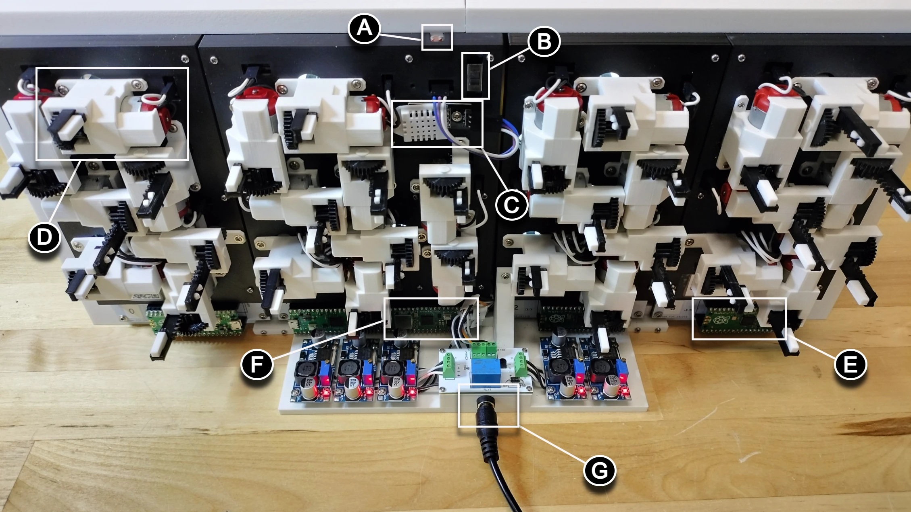

# User Guide - Orientation

This guide provides a visual and descriptive overview of the Kinetic Display, helping you identify and understand each of its key components and features. You'll learn how to recognize the display's front, top, and back, and discover the function of each labeled part. The main sections include:

- **Front of Display:** Learn about the digit layout, segment actions, and how the display shows time, date, temperature, humidity, and digit styles.
- **Top of Display:** See the stand options and how the top profile is designed for stability and protection.
- **Back of Display:** Identify all major components, including sensors, microcontrollers, actuators, and power connections, with clear explanations of their roles.

By the end of this guide, you'll be able to confidently orient the Kinetic Display, understand its capabilities, and know where to find each important feature for setup, troubleshooting, or customization.

---

## Front of Display

Refer to the diagram below to identify the main features on the front of the display:

- **A**: Digit 0
- **B**: Digit 1
- **C**: Upper and lower colons
- **D**: Digit 2
- **E**: Digit 3

Each digit consists of seven segments (A-G) that can extend or retract to form numbers or symbols. When a segment extends, LEDs behind it provide a uniform glow. The Light Dependent Resistor (LDR) above Digit 1 (on the back) senses ambient light and automatically adjusts the LED brightness for optimal visibility. LEDs turn off when the segment retracts to save power.

### Display Modes and Scheduler Actions

The Kinetic Display can be customized to show different information at scheduled times, see the user guide on [Schedule Creation and Management](schedule.md) for details. The scheduler determines which of the following modes is active:

1. **Local Time** (12 or 24 hour): Both colons extended. Shows the current time.
    
2. **Date** (Month and Day): Both colons retracted. Shows the current date.
    
3. **Internal Temperature** (°C or °F): Upper colon extended, lower colon retracted. Shows the room temperature.
    
4. **Internal Humidity** (%): Upper colon extended, lower colon retracted. Shows the room humidity.
    
5. **External Temperature** (°C or °F): Lower colon extended, upper colon retracted. Shows the outdoor temperature.
    
6. **External Humidity** (%): Lower colon extended, upper colon retracted. Shows the outdoor humidity.
    
7. **Digit Type**: Choose between human or alien digit styles. See the [translation table for alien digits](../userguide/digittype.md). Example of the alien digit type:
    

---

## Top of Display

The top profile of the display is shown below with the short-form stand. For added stability or to protect the power management system from pets, you can install a long-form stand with a protective guard.

---

## Back of Display

Refer to the labeled picture below to identify the main components on the back of the display:

**A** = **Light Dependent Resistor (LDR):** Senses ambient light and adjusts LED brightness automatically.

**B** = **On/Off Switch:** Controls power and has different functions depending on its position. See the On/Off switch guide for details.

**C** = **Digital Humidity Temperature (DHT-22) Sensor:** Measures internal room temperature and humidity.

**D** = **Segment Actuator:** There are 30 actuators in total, including those for the colons, responsible for moving the segments.

**E** = **Digit Raspberry Pi Pico 2040 Microcontroller:** Four Picos (one per digit, labeled 0-3) act as CPUs for each digit, handling:

- Motor driver control for segment movement
- LED control for segment illumination
- Communication with the main conductor PCB via UART

**F** = **Conductor and Colon Raspberry Pi Pico 2040 W Microcontroller:** The Pico W (conductor) operates the colons and acts as the central command for the display, handling:

- Sending display and brightness commands to digits
- Broadcasting its own Wi-Fi service for wireless settings changes (Admin mode)
- Managing the scheduler for time, date, and weather display
- Setting local time and weather by connecting to Wi-Fi and external APIs
- Managing low-power mode by controlling power to digits 0-3

**G** = **Barrel Jack for 12V Power Supply:** The stand with the barrel jack also houses the power management system. The On/Off switch has different modes depending on the power connection. See the [On/Off switch user guide](spdtswitch.md) for more details.

!!! note
    Plug the 12V power supply into the barrel jack **before** plugging the power supply into the wall outlet.

