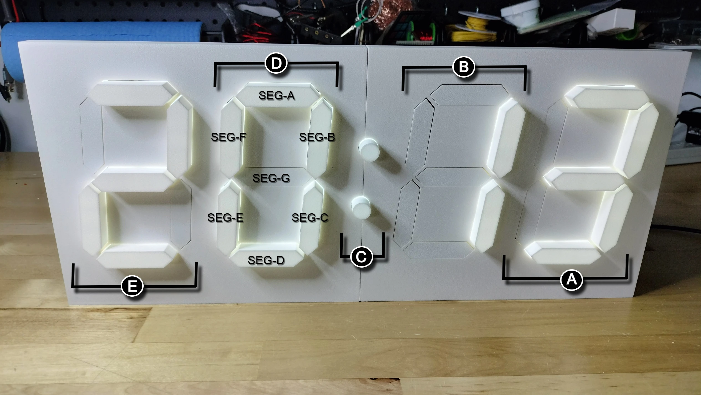

## Orientation

## Front of Display

Following the diagram below.

- **A**. Digit 0
- **B**. Digit 1
- **C**. Upper and lower colons
- **D**. Digit 2
- **E**. Digit 3

Each digit has seven segments A-G that extend or contract depending on the action.

When the segment extends there are LEDs that provide lighting for each segment. A Light Dependent Resistor (LDR) above Digit 1 in the back, senses the ambient light in the room causing the LEDs to adjust from (1) minimum  to (9) maximum brightness. Note that (0) means the LEDs are turned off. All extended segments with lit LEDs adjust to the given light level.

## Back of Display