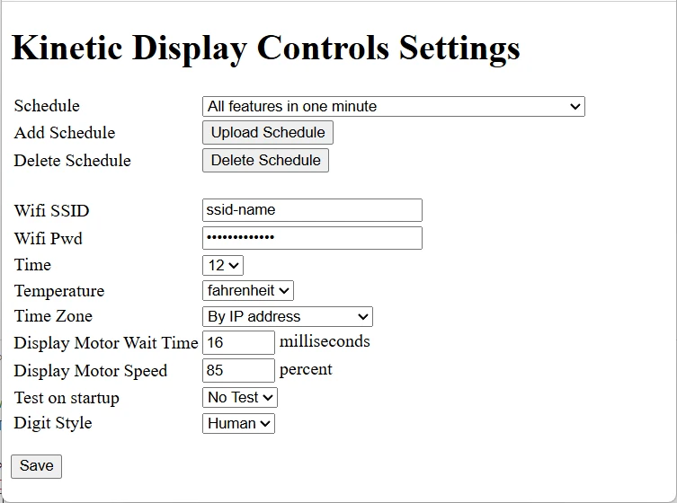
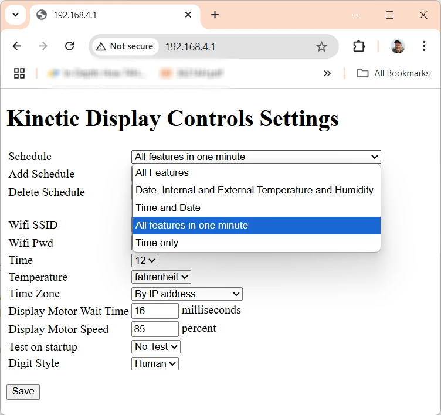
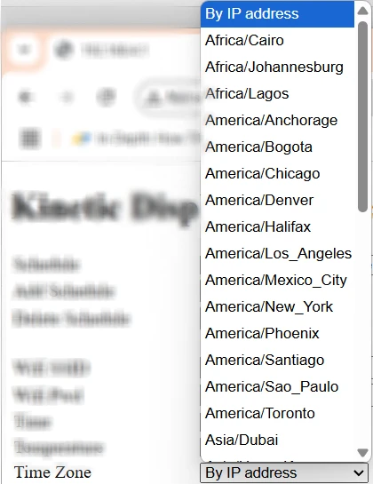
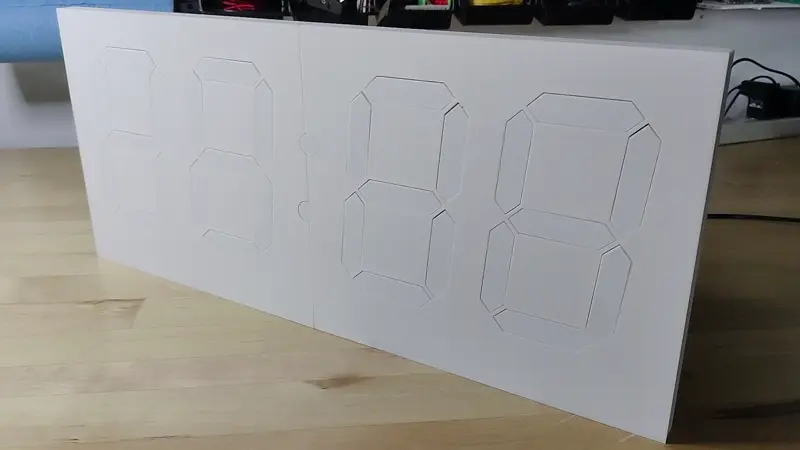
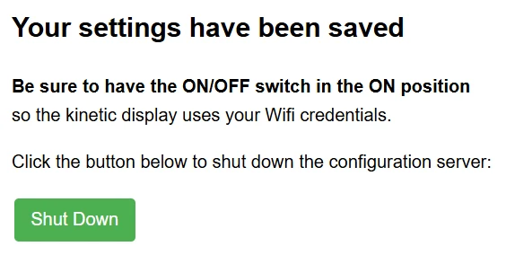

# Web Service and Settings

The Kinetic Display features a built-in web service that allows you to easily configure and personalize your display using any device with Wi-Fi and a web browser. This guide will walk you through connecting to the display's Wi-Fi access point, accessing the web-based settings page, and understanding each available setting.

## Why Adjustable Settings Matter

Having adjustable settings for your kinetic display offers several advantages:

- **Personalization:** Tailor the display's schedule, time format, temperature units, and digit style to match your preferences and environment.
- **Convenience:** Make changes from your phone or computer without needing to reprogram or physically access the device.
- **Adaptability:** Quickly update Wi-Fi credentials, time zones, or schedules if you move the display or your needs change.
- **Reliability:** Built-in test and recovery options help ensure the display operates correctly after power loss or network changes.
- **Energy Efficiency:** Schedule sleep and wake times to save power and extend the life of your display.

This guide provides step-by-step instructions for connecting to the web service, adjusting settings, and saving your configuration for a seamless and customized kinetic display experience.

## 1. Start the Kinetic Display's Wifi Access Point

1. **Unplug** the display's 12V power supply.
2. Set the switch on the back of the display to the **Off** position.
3. **Plug in** the display's 12V power supply.

---

## 2. Connect Your Device to the **kinetic-display** Wifi Access Point (AP)

!!! note 
    Complete the previous step to start the Kinetic Display's Wifi Access Point before proceeding.

### Connect from a Mobile Device

1. Open a QR code reader app on your mobile device.
2. Scan the QR code labeled **"SSID"** on the back of the display, or scan the image below:

    

3. Tap **"kinetic-display"** in the list of Wifi access points.

    

### Connect from a Computer

1. Open your computer's Wifi settings.
2. Select **"kinetic-display"** from the list of Wifi access points.
3. Enter the password: **12oclock**
4. Click **Connect**.

---

## 3. Access the Web Service Settings Page

!!! note
    You must be connected to the Kinetic Display's Wifi Access Point before continuing.

### Access from a Mobile Device

1. Open a QR code reader app on your phone.
2. Scan the QR code labeled **"URL"** on the back of the display, or scan the image below:

    

3. Open the URL: [http://192.168.4.1](http://192.168.4.1)

    

### Access from a Computer

1. Open a web browser.
2. Type `192.168.4.1` into the address bar and press **Enter** or **Return**.

---

## 4. Settings Overview

The screenshot below shows the Kinetic Display Control Settings page when opened for the first time.

### Key Settings

1. **Schedule**
    - **Dropdown selection:** Choose from 5 prebuilt schedules, or add your own to customize sleep/wake times.
    - 
    - **Add Schedule** and **Delete Schedule** buttons are available.
2. **Wifi SSID and Wifi PWD**
    - Enter your home Wifi network name (SSID) and password (PWD).
    - The default values are `SSID` and `Password`. Change these to your actual Wifi credentials.
3. **Time**
    - Select **12** or **24** hour time display (default: 12 hour).
4. **TempCF**
    - Choose to display temperature in **Celsius** or **Fahrenheit** (default: Fahrenheit).
5. **TimeZone**
    - Select your time zone. By default, **By IP Address** is selected, which uses your external IP to determine local time. Selecting a named time zone will use that for time retrieval.
    - 
6. **Display Motor Wait Time**
    - Set a value between **15** and **30** milliseconds (default: 16 ms). This controls how long the motor is on when a segment moves.
7. **Display Motor Speed**
    - Set a value between **50** and **99** percent (default: 85%). Higher values make segments move faster.
8. **Test on Startup**
    - Choose **Test** or **No Test**.
    - **Test:** Each digit and colon will extend and retract all segments on startup, then begin scheduled actions. Useful for ensuring all segments are working.
      
    - **No Test:** The display resumes from its last known state after power loss.
9. **Digit Style or Type**
    - Choose **Human** or **Alien**. See the [Digit Type Table](./digittype.md) for details.

---

## 5. Save and Apply Settings

1. Click the **Save** button.
2. When prompted, click the **Shut Down** button. This will turn off the kinetic-display Wifi and web service, and switch the display to use your home Wifi credentials.

    

3. Set the switch on the back of the display to the **On** position.
4. Close the browser window when you see the following screen:

    

!!! note
    It can take up to a minute for the display to begin showing scheduled actions after saving settings.
