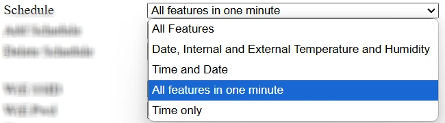

# Web Service and Settings

## Start the Kinetic Display's Wifi Access Point

1. **Unplug** the display's 12v power supply
1. Set the switch on the back of the display to the **Off** position
1. **Plug in** the display's 12v power supply

## Connect your Mobile device or Computer to the **kinetic-display** Wifi Access Point (AP)

You must complete the previous step to start the Kinetic Display's Wifi Access Point before proceeding with this section.

From your Mobile device, follow the video below:

1. Open a QR code reader application on your mobile device
2. Scan the QR Code on the back of the display titled **"SSID"**, or scan the following image:

    

3. Click the **"kinetic-display"** in the list of Wifi access points


From your computer:

1. Open your computer's Wifi settings
2. Click the **"kinetic-display"** in the list of Wifi access points and use **"12oclock"** as the password
3. Click connect

## Connect your Mobile device or Computer to the Web Service Settings Page

You must complete the previous step to connect your mobile device or computer to the Kinetic Display's Wifi Access Point before proceeding with this section.

From a mobile device, follow the animated video below:

1. Open a QR code reader application on your phone
1. Scan the QR Code on the back of the display titled **"URL"**, or scan the following image:

    

1. Open the URL http://192.168.4.1


From your computer:

1. Open a web browser
2. Type 192.168.4.1 into the browser address bar and click `enter` or `return`

## Settings

The screen capture below is the Kinetic Display Control Settings when opened for the first time.


1. **Schedule**.
    1. **Dropdown selection**. The Kinetic Display comes with 5 prebuilt schedules. Feel free to build and add your own schedule, especially if you want the display to go to sleep and wakeup at your preferred times.

    

    1. Add Schedule button
    1. Delete Schedule button

1. **Wifi SSID and Wifi PWD**. Your home wifi network name and password. SSID = ssid-name, PWD = wifi-password When the settings page is opened for the first time, the default Wifi SSID and Wifi PWD are set to ```SSID``` and ```Password```. You'll need to change the ```SSID``` and ```Password``` to your home network wifi name and password.
1. **Time**. Dropdown selection of **12** or **24** hour display of time. The default is set to **12** hour.
1. **TempCF**. Dropdown selection to display the temperature in **Celcius** or **Fahrenheit**. The default is set to **Fahrenheit**.
1. **TimeZone**. Dropdown selection of time zones for the local time display. When the settings page is opened for the first time, **By IP Address** is selected, the display will obtain its external-facing IP address, then use the IP address to obtain your local time. The when a named time zone is selected, the display uses the time zone name to obtain your local time.

    

1. **Display Motor Wait Time**. A value between **15** and **30** milliseconds.  The default is **16** milliseconds. It is the length of time in milliseconds the motor is on when a segment extends or retracts.
1. **Display Motor Speed**. A value between **50** and **99** percent. The default is **85** percent. It is the amount of power the motor is provided when extending or retracting. Reducing the motor speed slows the extension and retraction of the display segments. Conversely, increasing the motor speed quickens the extension and retraction of the segments.
1. **Test on startup**. A dropdown selection of **Test** or **No Test**.
    - **Test** this setting causes each digit from 3 through 0 to extend each segment in order of A-G, then retract each segment A-G. The scheduled actions for display begin when all digits and colons fully retracted. For example, suppose the display is showing **10:30** and the power unexpectedly goes out, then the power is restored 11 minutes later. The display will immediately light up showing its last knowns state of **10:30**, then each digit will extend and retract its segments until the entire display is cleared before showing the time of **10:41**.
    - **No Test** this setting causes the display to resume from its last known state.  For example, suppose the display is showing **10:30** and the power unexpectedly goes out, then the power is restored 11 minutes later. The display will immediately light up showing its last knowns state of **10:30**, when the time is retrieved from the internet, the **10** and **:** will remain and only the **30** changes to the number **41**.
1. **Digit Style or Type**. Dropdown selection of **Human** or **Alien**. See the [Table of Human and Alien Digit Type](./digittype.md) at the end of this guide.

## Save

1. Click the **Save** button
1. The following browser screen appears, click the **Shut Down** button. Clicking the button turns off the kinetic-display wifi and settings web service, and turns the display into a client that uses your home wifi credentials to access the internet.

    

1. Set the switch on the back of the display to the **On** position.
1. Close the following browser screen.

    

!!! note
    It can take up to a minute for the display to begin showing its scheduled actions.